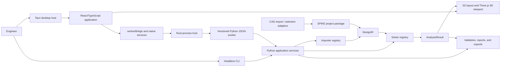
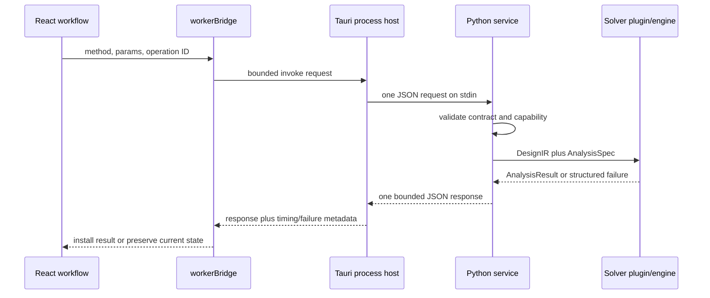
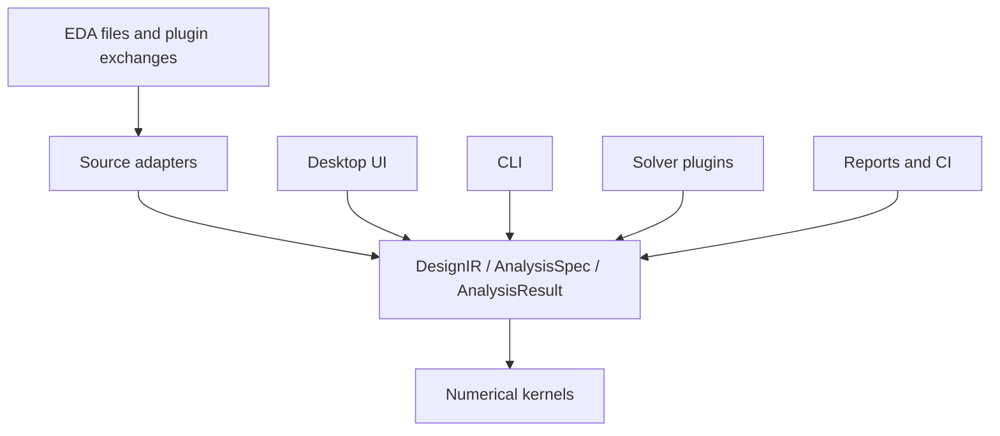
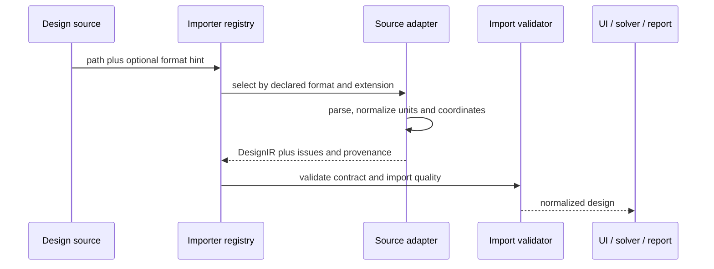

# SPIKE Architecture

This document is the canonical description of the current SPIKE runtime. It
describes implemented boundaries and names known debt explicitly. Product
plans and unimplemented solver modes are documented elsewhere and are not
presented here as current capability.

## How to use this document

- Start at `docs/README.md` for audience- and task-based documentation
  navigation.
- Use this file for runtime boundaries, dependency direction, and state
  authority.
- Use `docs/SUBSYSTEM_INDEX.md` for file ownership and
  `docs/DEVELOPER_GUIDE.md` for extension sequences.
- Use `docs/SOLVER_STATUS.md` for implemented and validated physics. An
  architecture target or registered plugin is not a capability claim.
- Record a boundary change in `docs/adr` and update the architecture guard in
  the same change.

## Architectural goals

SPIKE is an offline-first engineering application with these constraints:

- EDA-neutral analysis contracts. KiCad, IPC-2581, ODB++, Altium, Allegro,
  and Xpedition data must enter through importer adapters.
- One analysis model shared by the desktop UI, CLI, reports, tests, and future
  remote workers.
- Solvers are replaceable modules selected by declared capabilities.
- Unsupported physics remains unavailable or approximate; the UI cannot
  promote it to validated.
- Long-running numerical work never executes on the webview event thread.
- The repository is understandable and buildable without an AI service,
  prompt history, or generated hidden state.

## Runtime architecture

Large-scene resource ownership, batching, projection complexity, package
admission limits, and remaining scaling work are documented in
[Large scene performance](docs/LARGE_SCENE_PERFORMANCE.md). Cached assembly
geometry/textures have shared lifetimes; occurrence materials remain independent.
The desktop admits ZIP64 project paths up to 16 GiB while preserving bounded
legacy JSON and worker transport.

OS CPU/private RAM/GPU counters remain in the Rust host; normalization and
display remain in the frontend. CPU allocation and optional CUDA sparse
execution stay in the worker numerical boundary, as documented in
[Resource monitoring and compute allocation](docs/RESOURCE_MONITOR_AND_ACCELERATION.md).

Desktop persistence separates result payloads and imported PCB visuals from
control-plane metadata. Python `service_project_persistence.py` coordinates
`project_state_artifacts.py` and `project_visual_artifacts.py`; the native host
binds targeted artifact reads to the previously opened manifest. TypeScript
`projectPersistenceArtifacts.ts` restores results and materializes saved scenes;
it does not reinterpret manufacturing geometry. See
[ADR 0018](docs/adr/0018-portable-results-and-board-visuals.md).

Multi-board authoring uses `service_assembly_import.py` for manifest-bound
imports and `harness_authoring.py` / `harness_routing.py` for reviewable wiring
proposals. `assembly_exchange.py` imports bounded neutral ZIP assemblies;
FreeCAD's workbench exports placed STEP occurrences into that format.
Model-less `subassembly` parts are hierarchy containers. Other part model
references remain mandatory. See [assembly workflows](docs/MULTIBOARD_HARNESS_ASSEMBLIES.md)
for exchange units, limits and qualification boundaries.

FreeCAD collaboration uses `service_mcad_collaboration.py` for manifest-bound
session export, feedback preview and atomic placement updates. Stable occurrence
IDs survive the round trip; revised electrical/assembly baselines are rejected.
The optional workbench exchanges inert JSON and embedded STEP. Placement changes
archive old result context and clear active fields. See
[ADR 0019](docs/adr/0019-freecad-collaboration-sessions.md) and
[the collaboration workflow](docs/FREECAD_COLLABORATION.md).

Source/visual identity invariants (2026-09-05): imported KiCad text is encoded
once as UTF-8; temporary importer input and embedded source artifacts must use
the same bytes, including newlines. A new board import clears previous package
and board-bound assembly/results state. Verified visual-bundle `blob:` URLs
represent self-contained GLB scenes and must not be dispatched to VRML based on
their missing extension. Component-pick replacement is a single linear pass;
layer selectors expand against the physical copper stack before inventory counts.



The Tauri host owns operating-system integration and process isolation. React
owns interaction state and visualization. Python owns normalized application
services and solver orchestration. C++ kernels can accelerate numerical work,
but they do not define UI or EDA file semantics.

### Request lifecycle



The UI does not install partial output as a completed result. The native host
supervises process lifetime and transport limits but does not interpret
engineering data. The worker validates contracts and capabilities before a
solver receives the request. External engines remain child processes of an
adapter and must return through the same result/error boundaries.

### State authority

| State | Authority | Persisted form | Must not own |
|---|---|---|---|
| Imported design and provenance | Python import/application services | `DesignIR` inside the project package | Viewport-only selections or solver-private objects |
| Analysis setup and result | Versioned Python contracts | `AnalysisSpec` and `AnalysisResult` data in project/result records | UI-derived numerical claims |
| Dock, active view, and cameras | React composition and renderers | `spike/workspace-state/v1` in `workspace/state.json` | Solver validity or source geometry |
| Approved filesystem path and worker process | Tauri host | Native dialog grants and packaged resources | Domain, importer, or solver logic |
| Numerical implementation | Solver plugin or C++ kernel | Result fields plus provenance | EDA parser objects or presentation state |

When two layers cache the same information, the versioned contract remains
authoritative. Derived UI state must be reproducible from that contract or be
explicitly stored as workspace state.

## Language budget

SPIKE deliberately limits language ownership:

- TypeScript/TSX owns the desktop UI and visualization.
- Python owns contracts, importers, worker/CLI services, orchestration, and
  external-process adapters.
- C++ owns only performance-critical numerical kernels.
- Rust is a frozen thin Tauri host for OS integration, bounded IPC, process
  supervision, and packaging; it must not acquire domain or solver logic.
- PowerShell, Batch, and POSIX shell files remain thin platform shims. Shared
  build/release behavior belongs in Python.

No new implementation language is permitted without an accepted ADR and an
architecture-guard change. The legacy wxPython/VTK UI is frozen and is not a
supported runtime. See `docs/LANGUAGE_POLICY.md` and ADR 0007 for the reduction
and retirement plan. ADR 0008 permits a separate C++20 wxWidgets/VTK
engineering preview under `wx_desktop/`; it invokes the same JSON-lines worker
and does not link numerical kernels or duplicate importer/solver semantics in
its UI process.

## Dependency direction

Dependencies point inward toward versioned contracts:



Rules enforced by `scripts/check_architecture.py`:

- UI modules do not import EDA parsers directly.
- Python application services do not import source parsers outside registered
  adapter modules.
- Tauri invocation is contained in desktop bridge modules.
- large-array extrema do not use JavaScript spread arguments.
- new source modules stay below the module-size guard unless debt is recorded.
- required architecture decisions and maintainer documentation exist.
- production roots do not introduce an unapproved implementation language.
- supported Python services do not depend on the frozen wxPython/VTK UI.

Run the guard with:

```powershell
cd app
npm.cmd run check:architecture
```

## Versioned contracts

The Python definitions in `python/spike_core/contracts.py` are the current
worker-side source of truth:

- `DesignIR`: normalized layers, stackup, conductive geometry, components,
  component bonds, connectors, regions, bends, issues, and provenance. The
  component-bond handoff is documented in `docs/COMPONENT_BONDS.md`.
- `AnalysisSpec`: solver mode, nets, terminals, return path, probes, mesh,
  limits, frequency data, and transient options.
- `AnalysisResult`: status, model status, scalar/vector fields, networks,
  probes, issues, and provenance.

Contracts contain JSON-compatible values and carry `spike/v1`. New fields may
be added compatibly. Breaking semantic or unit changes require a new contract
version and migration code. UI-only state must not be inserted into solver
contracts.

## Import architecture

`python/spike_core/importers.py` defines the backend importer protocol and
registry. `app/src/designSourceRegistry.ts` provides the corresponding local
UI source dispatch. The implemented KiCad adapter is isolated in
`python/spike_core/kicad_importer.py`; downstream services receive `DesignIR`,
not parser objects.



Current support is intentionally explicit:

| Source | Status | Preferred path |
|---|---|---|
| KiCad PCB | Implemented | Native adapter |
| IPC-2581 | Planned | Standards-first adapter |
| ODB++ | Planned | Standards-first adapter |
| Gerber/drill/BOM/netlist | Planned fallback | Coordinated adapter set |
| Altium Designer | Planned | IPC-2581/ODB++ first, native only for gaps |
| Cadence Allegro | Planned | IPC-2581/ODB++ first, native only for gaps |
| Siemens Xpedition | Planned | ODB++/IPC-2581 first, native only for gaps |

An unsupported format must fail with a useful diagnostic. It must never be
silently treated as KiCad or imported as a partial valid design.

## Solver architecture

`python/spike_core/solver_plugins.py` owns solver registration, cataloging,
capability matching, and execution. Solvers consume `DesignIR` and
`AnalysisSpec`, then return `AnalysisResult`. The public SDK lives in
`solver_sdk/`.

Each solver descriptor declares:

- supported modes and required geometry;
- approximation or validation status;
- frequency and geometry limits;
- mesh or formulation support;
- version and provenance.

The registry is the extension point. UI conditionals that identify a solver
by implementation name are a design smell; UI behavior should depend on
capabilities and result fields.

## Worker and process isolation

The desktop sends one JSON request through `app/src/workerBridge.ts`. The Rust
host in `app/src-tauri/src/lib.rs` launches the Python worker without a console
window, caps request and output sizes, drains output concurrently, applies a
watchdog, and keeps heavy work off the UI thread. One heavy operation is
admitted at a time in both the frontend and native host.

The Python worker returns structured errors and response metadata including
operation duration. It does not keep numerical state in the KiCad plugin.
Packaged worker resources are preferred, with source-tree execution retained
as a development fallback.

Cancellation is scoped to the admitted operation ID. The host polls a cancellation
flag during request writes and execution and terminates the owned worker tree.
The frontend retains the busy state until native settlement and discards late
results after Stop. This is process cancellation, not solver checkpoint/resume.
See `docs/SHARED_MESH_SOLVE_WORKSPACE.md` for the shared PI/SI control surfaces.

## Rendering architecture

The desktop has two related but independent views:

- `LayoutViewport.tsx`: deterministic 2D vector layout and selection.
- `BoardViewport.tsx`: native Three.js/WebGL 3D board, models, result fields,
  probes, mesh overlays, and selection.

Both consume normalized board data and share selection/result state through
the application composition root. Renderers must not parse source files or
derive numerical claims. Result visualization uses solver-provided scalar,
vector, and mesh envelopes; absent fields remain unavailable.

Large-result safeguards include iterative numeric range calculation rather
than spread calls, capped native messages, and renderer-side decimation. More
work remains on spatial indexing, instancing, geometry tiling, and explicit
GPU-budget policies for workstation-class boards.

## Project and result persistence

The SPIKE project package is defined in `docs/PROJECT_FORMAT.md`. A project may
embed the source board plus normalized data, analysis definitions, probes,
result references, and provenance. Opening a project must not depend on the
original EDA application being installed. Source round-tripping is adapter
specific and never changes the normalized analysis contract.

Exact desktop recall is carried by the separate
`spike/workspace-state/v1` contract in `workspace/state.json`. The React shell
owns dock layout and 2D/3D camera state; the canonical package service only
preserves the validated member. Renderers publish view state and consume an
explicit restore command. They do not read package files or infer solver
state. Malformed optional view data falls back to fit-to-design without
weakening package integrity or numerical validity.

Reports consume saved project and result data. A report is a presentation of
recorded numerical output, not an independent solver.

## Stability boundaries

- `AppErrorBoundary.tsx` provides root UI recovery and crash diagnostics.
- worker requests have operation IDs, activity events, size limits, and
  structured failures.
- the Rust host uses `spawn_blocking`, concurrent pipe readers, and watchdogs.
- parser syntax errors fail import instead of yielding a partially valid board.
- import diagnostics remain attached to `DesignIR`.
- tests cover importer dispatch, parser failure, 32-layer ordering, rigid-flex
  metadata, and native worker limits.

See `docs/STABILITY_AND_RECOVERY.md` for operational details.

## Repository map

| Path | Responsibility |
|---|---|
| `app/src` | React application, workflows, reports, and visualization |
| `app/src-tauri` | Native window, dialogs, file permissions, worker process host |
| `python/spike_core` | Contracts, importers, orchestration, solver plugins, CLI services |
| `python/core` | Current low-level KiCad parser implementation |
| `src` | Native C++ numerical kernels and bindings |
| `solver_sdk` | Public solver plugin contract and examples |
| `extension_sdk` | General extension contract |
| `kicad_plugin` | Thin KiCad launch and exchange bridge |
| `tests/python` | Contract, numerical, importer, and workflow regression tests |
| `docs` | Indexed user, developer, validation, security, and subsystem records |

The detailed file ownership map is in `docs/SUBSYSTEM_INDEX.md`.

## Known architecture debt

The current codebase is not claimed to be fully SOLID. These large composition
modules predate the current boundaries and need staged extraction:

- `app/src/App.tsx`: application composition, workflows, and substantial UI
  state are still coupled.
- `app/src/BoardViewport.tsx`: scene construction, interaction, selection, and
  result rendering remain in one module.
- `app/src/LayoutViewport.tsx`: 2D scene construction and interaction are
  still coupled.
- `python/spike_core/cli.py` and `transient_peec.py`: command/formulation
  responsibilities should be decomposed as their contracts stabilize.
- `python/spike_core/hybrid_mesh.py`: topology construction and discretization
  should separate after hybrid-geometry regression coverage is broader.

New functionality must not expand these modules without a documented reason.
Refactoring should proceed behind tests and stable contracts, not as a full
rewrite.

## Architecture decisions

- `docs/README.md` (documentation entry point)
- `docs/adr/0001-normalized-design-ir.md`
- `docs/adr/0002-worker-process-isolation.md`
- `docs/adr/0003-importer-registry.md`
- `docs/adr/0007-language-budget-and-runtime-boundaries.md`
- `docs/SOLVER_PLUGIN_ARCHITECTURE.md`
- `docs/VISUALIZATION_ARCHITECTURE.md`
- `docs/EXTENSION_ARCHITECTURE.md`

Architectural changes require an ADR when they alter a dependency direction,
public contract, process boundary, persistence format, or plugin interface.

## Documentation map

Use this page for runtime boundaries and dependency direction.
[DEVELOPMENT.md](DEVELOPMENT.md) covers setup, execution, checks, and
engineering workflows. [docs/USER_TASK_SEQUENCES.md](docs/USER_TASK_SEQUENCES.md)
contains evidence-bound user task sequences. Structured failure navigation
starts in [TROUBLESHOOTING.md](TROUBLESHOOTING.md), with immutable code metadata
in [docs/ERROR_CODE_CATALOG.md](docs/ERROR_CODE_CATALOG.md).
