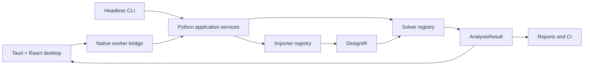

# SPIKE: Signal, Power, and Integrity Knowledge Engine

**Version:** 0.2.0-alpha.3

SPIKE is an offline-first PCB power-integrity workbench with a Tauri desktop
host, React/TypeScript interface, native 2D/3D visualization, a versioned local
Python worker, and replaceable solver modules. It uses normalized design and
result contracts so the desktop, CLI, reports, CAD adapters, and future EDA or
remote adapters share one engineering model.

SPIKE is under active development. The exact implemented and validated physics
is listed in [Solver Status](docs/SOLVER_STATUS.md). An available UI control is
not evidence that a solver is validated; approximate and unsupported states are
preserved in results and reports.

## Supported workflow

- Import KiCad PCB designs into normalized `DesignIR`.
- Preserve ordered copper layers, stackup, tracks, vias, pads, zones,
  components, rigid-flex regions, and import diagnostics.
- Define sources, loads, return paths, probes, mesh settings, and limits.
- Preview and validate solver geometry.
- Run installed DC/PEEC-related capabilities through the local worker or CLI.
- Inspect native layout/3D geometry and solver-provided result fields.
- Save a SPIKE project package and generate engineering reports.

KiCad is the implemented native importer. IPC-2581, ODB++, Gerber packages,
Altium, Cadence Allegro, and Siemens Xpedition are architectural targets, not
current native-import claims. See [Importer Architecture](docs/IMPORTER_ARCHITECTURE.md).

## Reference board


Documentation and current visual-import checks use the public Berkeley Lab
Marble v1.4.4 dual-FMC FPGA carrier as the consistent reference board. The
image above is a SPIKE 0.2.12 local browser capture after source import, with
procedural component models and no native desktop worker. It is not a solver
result. The pinned revision, source hash,
import counts, limits, and license provenance are recorded in
[the Marble qualification plan](docs/MARBLE_CLI_QUALIFICATION_PLAN.md) and
[third-party notices](THIRD_PARTY_NOTICES.md). The bundled E-brake and
MODULAR-BUS-NIB files remain parser/regression fixtures and are not the
documentation reference design.

## Architecture



Read [ARCHITECTURE.md](ARCHITECTURE.md) before making cross-cutting changes.
The repository intentionally supports conventional human development without
an AI runtime or prompt history.

## Repository layout

| Path | Purpose |
|---|---|
| `app/src` | React UI, workflows, 2D/3D rendering, reports |
| `app/src-tauri` | Native desktop window, dialogs, process isolation |
| `python/spike_core` | Contracts, importers, CLI/services, solver plugins |
| `python/core` | Current low-level KiCad parser |
| `src` | C++ numerical kernels and bindings |
| `solver_sdk` | Solver plugin interface |
| `extension_sdk` | General extension interface |
| `kicad_plugin` | Legacy/source-specific KiCad import and launch adapter scaffold; never a solver boundary |
| `tests/python` | Contract, importer, workflow, and numerical tests |
| `docs` | User, developer, validation, security, and architecture records |

See [Subsystem Index](docs/SUBSYSTEM_INDEX.md) for file-level ownership.

## Headless CLI

```powershell
.\spike.cmd --help
.\spike.cmd --output-format text inspect board.kicad_pcb
.\spike.cmd --output result.json analyze-dc board.kicad_pcb `
  --net VCC `
  --source 10,10,F.Cu,5 `
  --load 50,20,F.Cu,1
```

The CLI supports design import and validation, solver discovery, geometry
extraction, saved requests, project execution, batches, reports, and regression
gates. See [CLI Reference](docs/CLI.md).

## Development

Core checks on Windows:

```powershell
python -m unittest discover -s tests\python -v
cd app
npm.cmd ci
npm.cmd run check:architecture
npm.cmd exec tsc -- --noEmit
npm.cmd run test:parser
npm.cmd run build
cd src-tauri
cargo test
```

Use `npm` only for the locked frontend build graph. It is not a runtime network
dependency: packaged SPIKE runs offline with compiled frontend assets. Release
security depends on lockfile review, dependency scanning, a restrictive Tauri
capability/CSP policy, and bundled dependency verification. See
[Security Model](docs/SECURITY_MODEL.md).

For setup and extension instructions, read [Developer Guide](docs/DEVELOPER_GUIDE.md)
and [Contributing](CONTRIBUTING.md). Linux requirements are in
[Linux Support](docs/LINUX.md).

## Accuracy and validation

Numerical changes require analytical or measured fixtures, tolerances,
convergence/conditioning evidence, and documented validity limits. SPIKE
distinguishes `validated`, `approximate`, `unsupported`, and
`failed_to_converge`. Public validation artifacts live in `docs/validation`.

See [Validation Program](docs/VALIDATION_PROGRAM.md),
[Engineering Governance](docs/ENGINEERING_GOVERNANCE.md), and
[Test Fixtures](docs/TEST_FIXTURES.md).

## Stability

Heavy worker calls run outside the UI thread with operation IDs, size caps,
single-job admission, concurrent output draining, and watchdog termination.
Malformed parser input fails explicitly, and the UI has a root recovery
boundary. Cooperative cancellation and broader process-failure tests remain
planned. See [Stability and Recovery](docs/STABILITY_AND_RECOVERY.md).

## License

This is a mixed-license workspace, not a blanket MIT repository. Existing MIT
grants and all third-party terms remain in force; commercial binaries and future
proprietary modules use a separate EULA only after ownership and release review.
See [LICENSING.md](LICENSING.md), [the repository licensing notice](LICENSE),
and [third-party notices](THIRD_PARTY_NOTICES.md).
