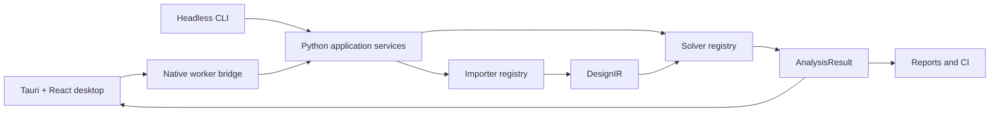

# SPIKE: Signal, Power, and Integrity Knowledge Engine


**Desktop/CLI version:** 0.3.0 (engineering preview)

The separately versioned SPIKES circuit engine has a `0.3.0-beta.1` release
candidate. See [public release readiness](docs/PUBLIC_RELEASE_READINESS.md) for
its distribution status.

SPIKE is an offline-first PCB power-integrity workbench with a Tauri desktop
host, React/TypeScript interface, native 2D/3D visualization, a versioned local
Python worker, and replaceable solver modules. It uses normalized design and
result contracts so the desktop, CLI, reports, CAD adapters, and future EDA or
remote adapters share one engineering model.

SPIKE is under active development. The exact implemented and validated physics
is listed in [Solver Status](docs/SOLVER_STATUS.md). An available UI control is
not evidence that a solver is validated; approximate and unsupported states are
preserved in results and reports.

**Engineering preview:** Treat simulation output as a research and diagnostic
result until the specific solver, geometry, units, convergence, and comparison
evidence have been reviewed for your application. Do not use this preview alone
for safety, compliance, fabrication, or production signoff. Check the result's
validity state and warnings, and verify critical conclusions independently.
Current release evidence and open checks are recorded in the
[0.3.0 candidate verification](docs/RELEASE_0_3_0_VERIFICATION.md).

**0.3.0 Windows package disclosure:** The current community-preview MSI is
unsigned and requests all-user privileges. Its contents and checksum are in
the [0.3.0 verification](docs/RELEASE_0_3_0_VERIFICATION.md). The older local
NSIS/MSI candidate and its self-signed copies predate the current source and
must not be used as release artifacts. Clean-machine installation, upgrade,
uninstall, and artifact-specific license/notice review remain open. This
preview is not qualified for production or engineering signoff.

The [illustrated thermal user guide](docs/THERMAL_USER_GUIDE.md) walks through
board import, heat-path setup, local solves, layer maps, and analysis using a
pinned open-source Marble board and a bundled layered development fixture.
Its [transient example](docs/validation/EBRAKE1_LAYERED_TRANSIENT_20260928.md)
includes a saved board-temperature animation and numerical checks. The
[SI user guide](docs/SI_USER_GUIDE.md) covers the executable S-parameter,
reflection/VSWR, NEXT/FEXT, TDR/TDT, and eye workflow with Marble board
context and a separate analytical four-port channel.

Local LM Studio and Ollama models can operate an allowlisted SPIKE MCP tool set.
The desktop bridge is enabled from **Settings → LLM / MCP**; see the
[offline LLM and MCP guide](docs/LOCAL_LLM_MCP.md) for setup and limits.

The [ESP32 worked example](examples/esp32/README.md) records board import,
PI/SI/thermal runs, antenna plots, viewport captures, inputs, and result
limitations. The [simulation studies guide](docs/SIMULATION_STUDIES.md)
explains how to keep multiple analysis cases and conditions in one project.

## Screenshots

### Circuit simulation and trace inspection


SPIKES Studio shows recorded signals from an illustrative RC circuit simulation.
This is a circuit-workflow example, not a PCB field result or validation of PCB
power-integrity accuracy. SPIKES is separately versioned from the SPIKE desktop.

### Simulated board temperature (illustrative inputs)


This solved eBrake1 temperature grid uses assumed material, cooling, and
component-power inputs. It is labeled `approximate` and has not been correlated
to a measured board. The [reproducible input, units, numerical checks, and
limits](docs/validation/EBRAKE1_BOARD_THERMAL_20260928.md) accompany the image.

### KiCad board import and project report


These SPIKE 0.2.12 development captures show the public Marble v1.4.4 board
after import. The components are procedural and the report explicitly says
**ANALYSIS NOT RUN**. They do not show a native-worker result. Board revision,
hash, import limits, and image provenance are recorded in the
[Marble qualification plan](docs/MARBLE_CLI_QUALIFICATION_PLAN.md) and
[third-party notices](THIRD_PARTY_NOTICES.md).

## Supported workflow

- Import KiCad PCB designs into normalized `DesignIR`.
- Preserve ordered copper layers, stackup, tracks, vias, pads, zones,
  components, rigid-flex regions, and import diagnostics.
- Define sources, loads, return paths, probes, mesh settings, and limits.
- Preview and validate solver geometry.
- Run installed DC/PEEC-related capabilities through the local worker or CLI.
- Inspect native layout/3D geometry and solver-provided result fields.
- Save a SPIKE project package and generate engineering reports.

KiCad is the implemented native importer. IPC-2581, ODB++, Gerber packages,
Altium, Cadence Allegro, and Siemens Xpedition are architectural targets, not
current native-import claims. See [Importer Architecture](docs/IMPORTER_ARCHITECTURE.md).

## Reference board

Documentation and current visual-import checks use the public Berkeley Lab
Marble v1.4.4 dual-FMC FPGA carrier as the consistent reference board. The
workspace image above is a SPIKE 0.2.12 local browser capture after source import, with
procedural component models and no native desktop worker. It is not a solver
result. The pinned revision, source hash,
import counts, limits, and license provenance are recorded in
[the Marble qualification plan](docs/MARBLE_CLI_QUALIFICATION_PLAN.md) and
[third-party notices](THIRD_PARTY_NOTICES.md). The bundled E-brake and
MODULAR-BUS-NIB files remain parser/regression fixtures and are not the
documentation reference design.

## Architecture



Read [ARCHITECTURE.md](ARCHITECTURE.md) before making cross-cutting changes.
The repository intentionally supports conventional human development without
an AI runtime or prompt history.

## Repository layout

| Path | Purpose |
|---|---|
| `app/src` | React UI, workflows, 2D/3D rendering, reports |
| `app/src-tauri` | Native desktop window, dialogs, process isolation |
| `python/spike_core` | Contracts, importers, CLI/services, solver plugins |
| `python/core` | Current low-level KiCad parser |
| `src` | C++ numerical kernels and bindings |
| `solver_sdk` | Solver plugin interface |
| `extension_sdk` | General extension interface |
| `kicad_plugin` | Legacy/source-specific KiCad import and launch adapter scaffold; never a solver boundary |
| `tests/python` | Contract, importer, workflow, and numerical tests |
| `docs` | User, developer, validation, security, and architecture records |

See [Subsystem Index](docs/SUBSYSTEM_INDEX.md) for file-level ownership.

## Headless CLI

```powershell
.\spike.cmd --help
.\spike.cmd --output-format text inspect board.kicad_pcb
.\spike.cmd --output result.json analyze-dc board.kicad_pcb `
  --net VCC `
  --source 10,10,F.Cu,5 `
  --load 50,20,F.Cu,1
```

The CLI supports design import and validation, solver discovery, geometry
extraction, saved requests, project execution, batches, reports, and regression
gates. See [CLI Reference](docs/CLI.md).

## Development

Core checks on Windows:

```powershell
python -m unittest discover -s tests\python -v
cd app
npm.cmd ci
npm.cmd run check:architecture
npm.cmd exec tsc -- --noEmit
npm.cmd run test:parser
npm.cmd run build
cd src-tauri
cargo test
```

Use `npm` only for the locked frontend build graph. It is not a runtime network
dependency: packaged SPIKE runs offline with compiled frontend assets. Release
security depends on lockfile review, dependency scanning, a restrictive Tauri
capability/CSP policy, and bundled dependency verification. See
[Security Model](docs/SECURITY_MODEL.md).

For setup and extension instructions, read [Developer Guide](docs/DEVELOPER_GUIDE.md)
and [Contributing](CONTRIBUTING.md). Linux requirements are in
[Linux Support](docs/LINUX.md).

## Accuracy and validation

Numerical changes require analytical or measured fixtures, tolerances,
convergence/conditioning evidence, and documented validity limits. SPIKE
distinguishes `validated`, `approximate`, `unsupported`, and
`failed_to_converge`. Public validation artifacts live in `docs/validation`.

See [Validation Program](docs/VALIDATION_PROGRAM.md),
[Engineering Governance](docs/ENGINEERING_GOVERNANCE.md), and
[Test Fixtures](docs/TEST_FIXTURES.md).

## Community feedback

Use the [structured bug report](https://github.com/wayri/SPIKE-Main/issues/new?template=bug_report.yml)
for reproducible failures, unexpected numerical results, or confusing validity
labels. The desktop **Help → Report bug** command opens this form with only the
SPIKE version, release channel, platform family, runtime type, and current
workspace prefilled. Review the draft before submitting it. SPIKE does not
automatically send a board, project, net name, file path, log, or solver result.
Include a minimal synthetic or anonymized reproduction, exact steps, expected
and actual behavior, units, mesh/settings, validity state, and relevant
warnings. Do not publish private designs, credentials, license files, or
customer information. Community reports help prioritize fixes; they do not
replace the project's numerical validation and release reviews.
The [open-source release plan](docs/OPEN_SOURCE_RELEASE_PLAN.md) records the
publication sequence and suggested community venues.

## Acknowledgements

SPIKE builds on the KiCad ecosystem and the Tauri, React, NumPy, SciPy, and
Shapely projects. The Berkeley Lab Marble board provides a documented public
reference for import and visual examples under its own terms. Optional external
engines remain separate products with their own licenses and validation scope.
The optional EMerge adapter targets Robert Fennis's EMerge project; EMerge is
not bundled with SPIKE, and its solver results have not been independently
qualified here. The integration's source and API references are recorded in
the [EMerge extension guide](extensions/emerge_suite/README.md).
See [third-party notices](THIRD_PARTY_NOTICES.md) and the
[Marble source record](docs/CERN_MARBLE_EVALUATION_20260920.md) for provenance.

## Stability

Heavy worker calls run outside the UI thread with operation IDs, size caps,
single-job admission, concurrent output draining, and watchdog termination.
Malformed parser input fails explicitly, and the UI has a root recovery
boundary. Cooperative cancellation and broader process-failure tests remain
planned. See [Stability and Recovery](docs/STABILITY_AND_RECOVERY.md).

## License

Original SPIKE-owned code, documentation, and media are under the standard
[Apache License 2.0](LICENSE), which permits a future commercial build or hosted
service. Other recipients receive the same commercial rights. External
libraries, engines, models, and board assets retain their own licenses.
The separately versioned SPIKES circuit engine, the `spike-solvers`
repository, and the FreeCAD workbench retain their existing terms.
Review [the license boundary and release obligations](LICENSING.md) and
[third-party notices](THIRD_PARTY_NOTICES.md) before distributing a build.
The public release gate is still blocked.
