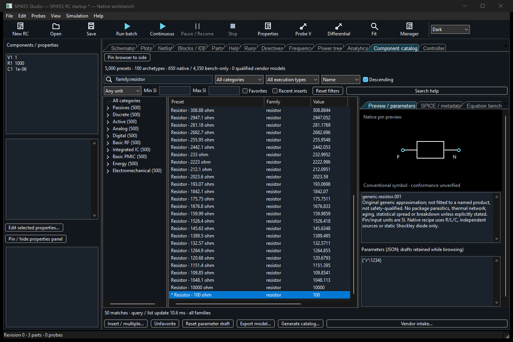
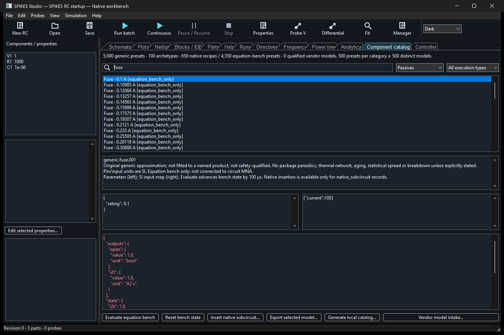
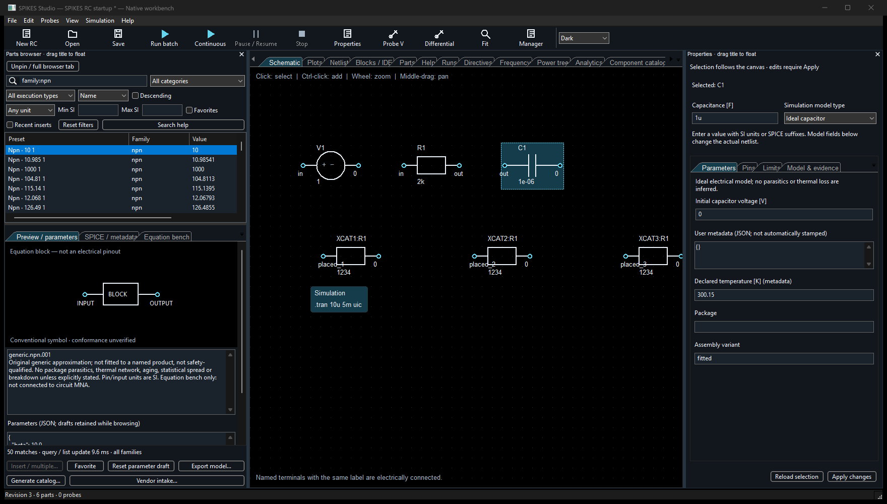
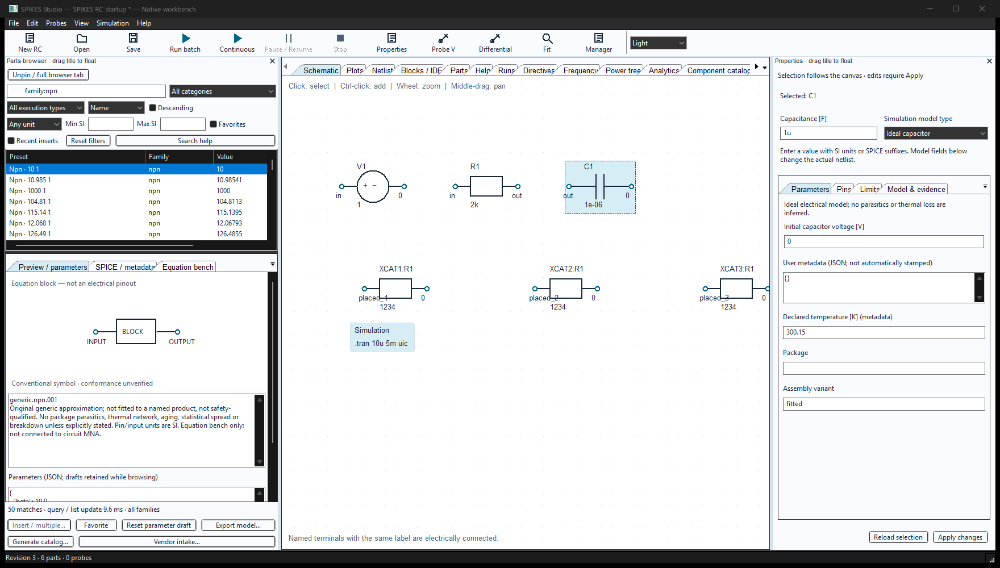
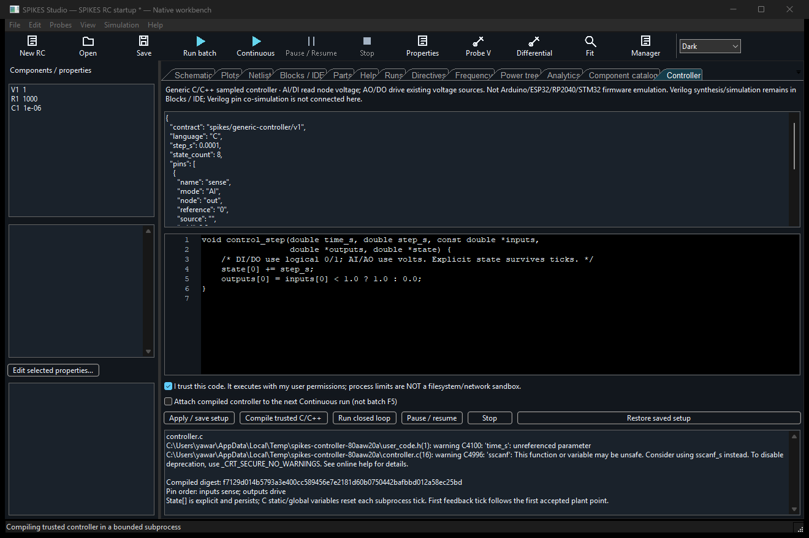
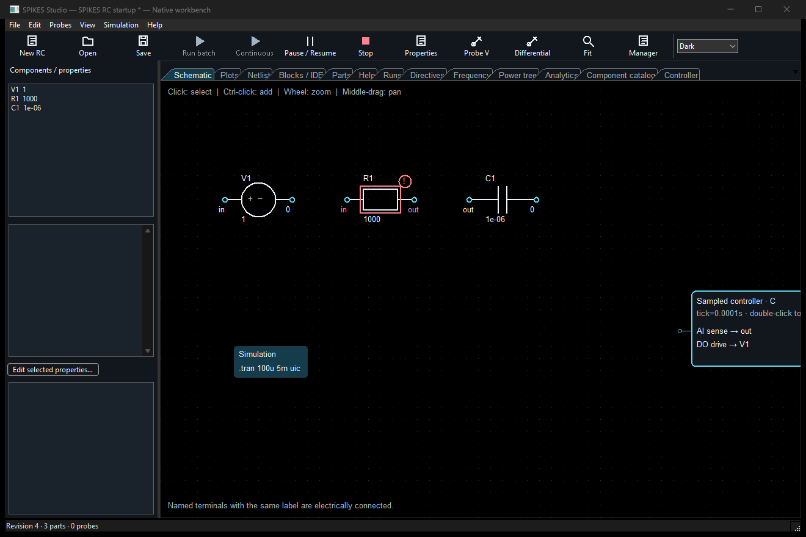

# Generic component catalog and sampled controllers

This is an initial library expansion, **not completion of 500 independently
validated device models in every category**. The generated library contains
5,000 distinct parameter presets built from 100 original generic archetypes.
No preset is represented as a manufacturer-qualified model.

| Category | Presets | Archetypes | Native-insertable presets |
|---|---:|---:|---:|
| Passives | 500 | 10 | 250 |
| Discrete | 500 | 10 | 50 |
| Active | 500 | 10 | 50 |
| Analog | 500 | 10 | 0 |
| Digital | 500 | 10 | 0 |
| Basic RF | 500 | 10 | 250 |
| Integrated IC | 500 | 10 | 50 |
| Basic PMIC | 500 | 10 | 0 |
| Energy | 500 | 10 | 0 |
| Electromechanical | 500 | 10 | 0 |

There are 650 native subcircuit presets and 4,350 **equation-bench-only** presets.
The latter are not circuit elements: evaluate them in the catalog to examine a
sampled equation and its explicit state. Native insertion rejects them. A count
of presets must not be used as a count of independent compact models.

## Using the library

Open **View → Component catalog**. The category/family tree, text search,
execution filter, unit filter and numeric range combine to narrow results.
Rows are virtualized rather than creating 5,000 individual widgets. Search is
debounced by 140 ms, with a bounded cache of 32 queries.

- Words are ANDed. Use quoted phrases and `-excluded` words.
- Search fields: `family:resistor`, `category:"Basic RF"`, `status:native`,
  `unit:V`, `id:generic.resistor.001`.
- Min/max accept SI numbers (for example `0.000001` or `1e-6`, not `1u`).
  They filter the preset's primary parameter, not every model property.
- Sort by name, category, family, primary value or execution; click result
  column headers to sort. Value sorting groups unlike units separately.
- Favorites and recent insertions are saved in the circuit project. Right-click
  a result for insertion, favorite, export, preset-ID copy or shortcut assignment.

Select a preset to see a conventional symbol/pin preview and editable parameter
JSON. Native functional blocks show their external pins; bench blocks explicitly
are not electrical pinouts. These previews are not a claim of symbol-standard
certification. Parameter drafts survive browsing within the session; the SPICE
tab reflects the edited parameters. Unknown parameter names are rejected.
Drafts become durable when exported or inserted, not merely by browsing.



**Equation bench → Evaluate** advances the explicit state by 100 µs; **Reset
state** starts again. Set `time_s` explicitly for oscillators/sampled blocks.

Double-click a native row, or choose **Insert / multiple…**, to review pin-to-node
mapping and request 1–100 instances. `load_{n}` becomes `load_1`, `load_2`, etc.;
unchanged names are deliberately shared, and ground is `0`. Choose click-to-place
then click the schematic. Escape cancels without changing the circuit. Uncheck
click-to-place to insert below existing parts immediately. All copies share one
content-specific `.subckt` definition and form one undoable transaction.
The current editor displays flattened internal primitives, not a collapsible
hierarchical library symbol. No connection is inferred from screen position.
Bench-only models cannot enter this native placement workflow.

**Export model…** saves a `.spkpart` record. **Generate catalog…**
writes the whole catalog as versioned JSON. The bundled file is
`studio/library/generic-components-v1.json`; regenerate it from the repository:

```powershell
python scripts/generate_spikes_component_catalog.py
```



## Pinned panels and part-placement keys

Use **Pin browser to side**, or **View → Pin parts browser**, to keep the same
browser next to the schematic. The list and preview stack vertically in the
narrow layout. Drag its caption to float or redock it, resize its border, and use
**Unpin / full browser tab** to return it to its tab without losing search or
parameter drafts. Closing the pane returns the browser to its tab.

**View → Pin properties** (also beside the component list) opens the editable
properties panel. It contains the same value/model selector, parameters, pins,
limits and model/evidence fields as the dialog. Clean forms follow selection;
unapplied drafts remain attached to their original parts, including when hidden.
Use **Apply changes** or **Reload selection** explicitly. Reload discards the
current draft. If the circuit revision changed, stale drafts cannot be applied;
copy any needed edits and reload first. Panel positions and hidden state are
session-only. Pinning is not an auto-hide-on-hover mode.

Default part-placement keys are **R** (resistor), **C** (capacitor), **L** (inductor)
and **D** (diode). They open the reviewed native insertion dialog, rather than
silently choosing connections. Disable them with **Edit → Enable part-placement
shortcuts**. Part shortcuts are suppressed while typing in text/code editors,
search fields or combo boxes, even if the binding has Ctrl/Alt modifiers.

Right-click a native preset → **Assign placement shortcut…** to link its exact
preset ID. Conflicts are rejected. **Edit → Keyboard shortcuts…** edits, loads and
saves `.spkkeys` profiles. Version 2 preserves the `part_shortcuts` enable switch;
version 1 profiles still load. The JSON binding key for an exact preset is, for
example, `"part:generic.resistor.001": "Alt+R"`. Linked shortcuts use that preset's
current session parameter draft, if any. Load a saved profile to reuse these
settings in a later session; profiles are not auto-loaded at startup.





### Browser validation (source workbench)

The 94-test Python suite passes with the owned C++ DLL configured. Actual wx
acceptance runs verify search/filter/sort, retained drafts and favorites,
three-instance native insertion and one-step undo, Escape cancellation,
pin/unpin/float/redock, compact-window scrolling, electrical property edits,
stale-draft rejection, shortcut disabling and text-editor suppression.
Existing native PULSE/diode editor checks, the sampled C-controller workflow,
and split-canvas/stepped-plot regressions also pass. Screenshots above are from
these running application windows, not mockups. This validates the browser and
editing workflows, not new device fidelity or competitive solver performance.
Launch the source workbench with the repository's `spikes-studio.cmd`; these
changes do not update an already-installed desktop release.

## Coverage and fidelity

The archetypes include R/C/L, supercapacitors, NTC/PTC, fuses, cables, crystal
response, diode/photodiode/LED, NPN/PNP current-gain approximations, enhancement
and depletion channel laws, JFET/MESFET, GaN/SiC channel proxies, IGBT/thyristor/
triac state proxies, optocouplers and switches. These semiconductor proxies are
**not** production transistor compact models: they omit charge storage, reverse
recovery, intrinsic correlated noise, body-diode detail, breakdown and self-heating.

Analog/digital/IC examples include gain, comparator, limiter, integrator,
differentiator, sample/hold, a one-dimensional LUT, gates, D flip-flop, counter,
MUX, ADC/DAC, one-pole op-amp, oscillator and reference. Digital outputs are ideal
zero-delay Boolean/voltage levels: no X/Z, metastability or setup/hold modeling.
ADC/DAC are ideal quantizers, not particular converter ICs. `timer_astable` is a
generic waveform generator, not a transistor-level NE555 model.

PMIC equations include averaged conversion ratios, dropout-limited linear
regulation, current limiting, CC/CV charging, soft start, supervisor and UVLO.
They do not simulate switching losses, compensation, startup dynamics or actual
protection IC behavior. A declared efficiency is an assumption, not a prediction.

Batteries use coulomb counting plus **linear** OCV-versus-SOC and series R.
Chemistry labels indicate illustrative voltage ranges, not characterized cells.
Solar/turbine/generator and motor/actuator equations are reduced-order bench
relations. DC/BLDC torque and back-EMF laws do not contain a winding/mechanical DAE.
The saturating-inductor bench evolves flux, then applies a monotonic cubic
current relation; it does not model core loss or hysteresis. PTC is a linear
temperature approximation, not a polymer resettable-fuse transition model.

The fuse bench trips at an illustrative I²t threshold of `rating² × 1 second`;
the e-fuse bench trips instantaneously at its current rating. Neither is a
manufacturer time-current curve. Thermistors use 100–600 K as a numerical
envelope, not a component rating. Diode bench evaluation rejects forward bias
above 40 thermal voltages instead of silently saturating an exponential.

RF bench responses are explicitly normalized frequency-domain transfer
approximations. The single LC line recipe is a lumped approximation, while its
bench phase equation is an ideal delay; they are not equivalent over broadband.
Crystal/envelope presets are response proxies, not full piezoelectric or nonlinear
detector circuits. Qualification must use the actual circuit and its terminations.

## Manufacturer models

**Vendor model intake** preserves a user-selected plain-text SPICE file, SHA-256,
model/subcircuit declarations and unresolved include/library dependencies in a
`.spkmodel` review package. It does not execute the model, fetch dependencies,
approve redistribution, extract datasheet curves or certify compatibility.
Encrypted/binary model files are rejected. No vendor models are bundled as
qualified executable parts in this pass.

Manufacturer resources reviewed for this workflow:

- [TI LM358 product/model resources](https://www.ti.com/product/LM358).
- [Infineon 2N7002 product resources](https://www.infineon.com/part/2N7002).
- [Infineon MOSFET simulation models](https://www.infineon.com/de/design-resources/simulation-modeling/power-mosfet-simulation-models).
- [Analog Devices third-party model import guidance](https://www.analog.com/en/resources/technical-articles/ltspice-how-to-import-third-party-models.html).

These are source pointers, not grants of model redistribution rights. A reviewed
source/version/license record, pin mapping and electrical qualification remain
required before distributing a branded part as ready-to-run.

## Generic C/C++ controller

Open **View → Controller**. Edit setup JSON and C/C++ source. Setup is saved in
`.spksch`; trust consent, compiled executable and attachment state are session-only.
Inputs and outputs appear as a controller block on the schematic. Double-click
the block to edit. Direction is fixed by setup, not changed dynamically in firmware.

- `AI`: read `V(node)-V(reference)` in volts.
- `DI`: read the same voltage and threshold at VDD/2, producing logical 0/1.
- `AO`: return volts in ±VDD, bound to an existing independent **DC voltage source**.
- `DO`: return exactly 0 or 1; the source is driven to 0 or VDD.

Use unique pin names and unique output source bindings. Pin arrays follow their
order in setup, with inputs and outputs filtered separately. Compilation provides
`IN_<pinname>` and `OUT_<pinname>` index macros,
plus `INPUT_COUNT`, `OUTPUT_COUNT` and `STATE_COUNT`. For example, use
`outputs[OUT_drive] = inputs[IN_sense] < 1.0;`. Controller-owned
sources are excluded from manual live controls. External voltage-source impedance
and connected circuitry determine drive current: this is not a MCU GPIO pad model.

```c
void control_step(double time_s, double step_s, const double *inputs,
                  double *outputs, double *state) {
    state[0] += step_s;
    outputs[0] = inputs[0] < 1.0 ? 1.0 : 0.0;
}
```

`state[]` is explicit persisted state; static/global C variables reset because
each tick invokes a fresh process. Use the provided virtual time and step, not
wall-clock APIs. The tick must be an integer multiple of the circuit `.tran`
output interval. Feedback begins after the first accepted native point, because
the native session has no readable electrical state before then. Before feedback,
each source retains its netlist value. Outputs are held between ticks.

Select trusted-code consent, **Compile trusted C/C++**, then **Run closed loop**.
Actual native circuit state runs continuously; Pause/Resume/Stop operate at native
step boundaries. Controller time and source changes are recorded in capture
provenance. Coupling is explicit sampled feedback, not an algebraic Newton solve.
This subprocess-per-tick implementation prioritizes inspectable state and bounded
execution, not speed or hard-real-time scheduling.

The executable is digest-bound and runs through the existing bounded process
protocol. This is **not an OS filesystem/network sandbox**: code executes with
the user's permissions. Only compile code you trust. No automatic trust is given
to saved projects, vendor text or generated model code.



Verilog synthesis/VCD simulation remains available in **Blocks / IDE**; it is
not connected to this controller pin bridge yet. Arduino/ESP32/RP2040/STM32 binary
upload requires processor/peripheral emulation and is not implemented. A `.bin`
file is not treated as compatible controller code.

## Measured alerts

Component Properties → Limits accepts `voltage_v`, `current_a`, `power_w` in SI.
The marker warns at 80% and indicates exceedance at 100%. Voltage is terminal
difference magnitude; current is absolute branch current; power is positive
absorbed power. Peaks refer to the retained native capture window. Discarded
continuous history is not remembered, and these are not physical damage estimates.

View → Part alerts lists measured values, limits and severity. Unsupported limits
(including temperature with no thermal solver channel) are marked unavailable.
Limits come from the captured project snapshot; edit them and rerun to refresh.
Missing data never becomes a zero measurement or a fabricated failure prediction.



## Verification and remaining work

Automated tests evaluate all 5,000 presets, verify all 650 native recipe decks
parse and complete a native DC smoke solve, test representative physical relations,
compile both C and C++, and run C feedback against the actual native RC plant.
The GUI harness verifies catalog insertion, compiled controller operation,
timestamped output events, pause/resume/stop and the measured-power marker.
Smoke solves establish executability, **not** model accuracy across an operating
envelope or parity with a production simulator.

Still required: 500 genuinely distinct qualified models per category, qualified
redistributable branded libraries, native integration of bench-only families,
full nonlinear/mixed-physics device behavior, hierarchy symbols for catalog parts,
Verilog pin coupling, MCU firmware emulators and hard-real-time/HIL qualification.
