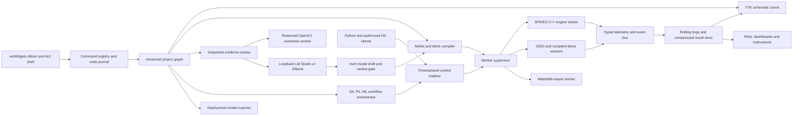

# SPIKES Studio architecture

## Process roles

- `spikes-studio`: trusted native UI, document model, command registry and VTK
  rendering. It never loads model DLLs or Python.
- `spikes-engine-worker`: one owned engine/session boundary with bounded shared
  memory or local IPC and immutable model/project digests.
- `spikes-model-worker`: restricted OSDI/compiled-block host selected according to
  the model trust policy.
- `spikes-plot-worker`: Python/Matplotlib process that consumes a bounded result
  query and writes a staged image; it cannot mutate the project.
- `spikes-coordinator`: schedules local jobs and interactive sessions under CPU,
  memory, worker and priority limits.
- `spikes-datasheet-worker`: extracts bounded page-addressed PDF text, tables and
  image regions. Optional OpenCV analysis runs in a separate restricted process
  and emits observations, never executable source.
- `spikes-model-assistant`: an opt-in client for a user-managed LM Studio or
  Ollama loopback endpoint. It accepts evidence JSON and returns an inert,
  schema-validated draft behind a human review and digest approval gate.
- `spikes-workflow-worker`: executes typed SIL/PIL/HIL routing, clock adaptation,
  calibration, assertions and fail-safe transitions outside the UI thread.
- `spikes-deploy-worker`: lowers a frozen circuit/subcircuit revision to the
  versioned deployment contract and SPIKES C ABI or FMI adapter, then runs the
  declared equivalence fixtures before packaging it.

## Native module boundaries

- `studio_document`: graph objects, serialization, migrations, undo commands and
  semantic diffs;
- `studio_commands`: shared ribbon/context-menu/palette action registry and state;
- `studio_canvas`: VTK 2D actors, spatial index, picking, wire routing and overlays;
- `studio_symbols`: toolkit-neutral symbol geometry, IEEE/IEC presentation
  profiles, pin anchors, grid transforms, level-of-detail and conformance metadata;
- `studio_library`: package index, search, symbol/model editors and licensing;
- `studio_compile`: graph checks and deterministic SPIKES/SPICE/block compilation;
- `studio_sessions`: worker supervision, lifecycle, checkpoints and controls;
- `studio_results`: chunk store, rolling buffers, queries, decimation and triggers;
- `studio_instruments`: scientific plot/dashboard view models, linked cursors,
  axis transforms, view history and deterministic export recipes;
- `studio_automation`: text console, Python connection and compiled-block workflows.
- `studio_ai`: evidence ledger, loopback provider configuration, formation
  requests, draft validation, review diffs and approval digests;
- `studio_workflows`: typed SIL/PIL/HIL graphs, clocks, I/O calibration, monitors,
  safety interlocks and qualification evidence;
- `studio_deployment`: explicit I/O/state extraction, reduction recipes, C ABI/FMI
  packaging, validity-envelope guards and source-to-export equivalence tests.

Dependencies point inward toward versioned contracts. VTK, wxWidgets, Matplotlib,
OSDI and HDL toolchains are adapters and never appear in the canonical document
or result schema.

## Command registry

One command descriptor owns ID, label, icon, shortcut, required selection,
enable/check predicates, undo policy, execution scope and help. Ribbon buttons,
menus, context menus, palette entries and scripts reference the same ID. This
prevents a context-menu operation from behaving differently from its ribbon or
keyboard equivalent.

Long commands return a task handle with progress, cancellation and structured
diagnostics. Engine controls use requested and acknowledged states so the UI does
not display `Paused` before the solver reaches a safe point.

## Document and run isolation

The editor works on a mutable transaction over an immutable saved revision. A run
captures one immutable revision plus a simulation profile and resolved model
index. Editing during a run creates a newer revision and never changes the active
worker implicitly. `Restart with changes` performs an explicit compile and session
replacement.

Results reference the captured revision, exact engine/model hashes and control
event log. Plot queries can compare revisions without merging their signal IDs.

## Extensibility

Extensions declare new part editors, compiler transforms, result decoders,
instrument panels or external adapters through a signed manifest. UI extensions
communicate over declarative contracts; they do not receive a raw pointer to the
document or solver. Compiled device/control code uses the existing digest-bound
OSDI or compiled-block process boundaries.
