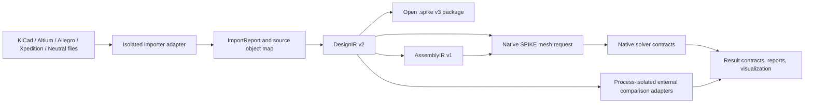
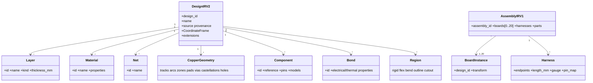
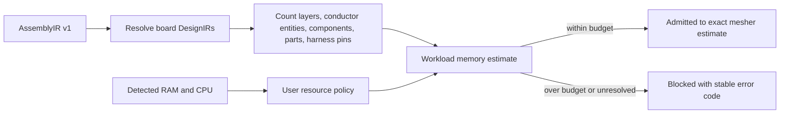
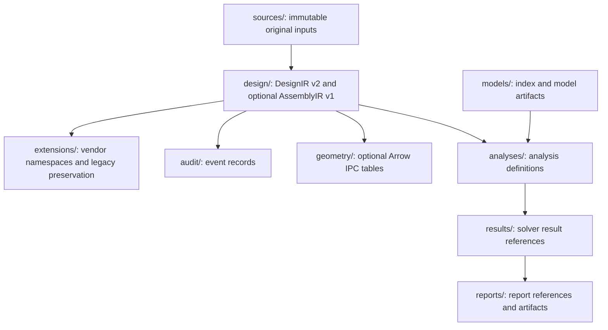
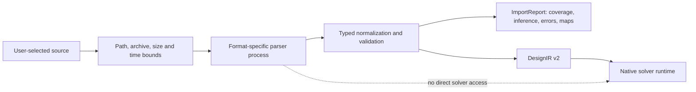
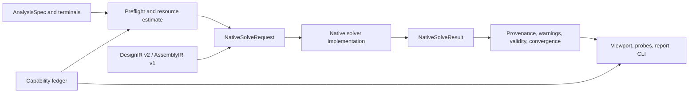
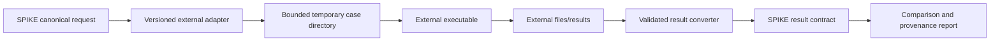
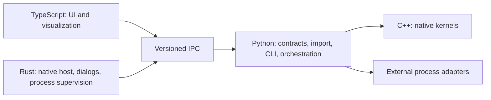

# SPIKE CAD-Neutral Native Multiphysics Foundation

## Purpose and status

This document defines the target architecture for SPIKE as a CAD-neutral,
local-first electronics simulation platform. It records the implemented
foundation, not a claim that every planned solver is complete or validated.

The current implementation includes typed `DesignIR v2`, `AssemblyIR v1`, a
secure `.spike` v3 package reader/writer, a published model-index contract,
bounded STEP/STP/glTF/GLB attachment with artifact-integrity checks,
native-solver request/result contracts, and a machine-readable capability
ledger. Native DC PI remains the only implemented native solver workflow, and it remains `Approximate`. The
PEEC AC/RLCG and geometry transient paths are `Experimental`. Native SPICE,
full thermal/CHT, SI, EMI, magnetics, and multi-board solve paths are not
released capabilities. See [SOLVER_STATUS.md](SOLVER_STATUS.md) and
[../codex_migration/USER_REQUEST_TRACKER.md](../codex_migration/USER_REQUEST_TRACKER.md).

## System boundary

No importer, bridge, renderer, or external program is permitted to leak
vendor-specific objects into solver contracts. Solvers consume canonical
entities and emit versioned results. This permits source adapters and solver
implementations to evolve independently.

## Canonical data model

`DesignIR v2` is the new typed canonical model for a board. It establishes
canonical entity identifiers alongside source-native identities, immutable
source provenance, and explicit coordinate frames. Its unit system is
millimetres in a right-handed board-local frame. All transformation to an
assembly frame is explicit. Coordinate-frame transforms are row-major 4x4
homogeneous matrices mapping a local frame into its declared parent frame.

The model includes layers, materials, regions, nets, tracks, arcs, zones,
holes, pads, vias and spans, castellations, components, pins, bonds,
connectors, flex metadata, models, constraints, variants, and source
extensions. The model schema is intentionally broader than what the current
KiCad importer and current solvers use. An entity represented in the schema is
not automatically supported by an importer, mesh, renderer, or solver.

`AssemblyIR v1` provides the data boundary for up to 20 board instances with
transforms, harnesses, connector mappings, rigid-flex links, enclosure and
thermal parts, assembly material records, thermal contacts, and electrical
bonds. The typed reader validates board, part, contact, and bond limits; unique entity
and coordinate-frame identities, board design references, and harness endpoint,
length, and pin-map data. Contact and bond endpoints must be explicit, and
supplied areas, thicknesses, and resistances must be finite and physically
bounded. Unknown top-level and entity fields are preserved in
a namespaced extension. Canonical package and desktop-worker round trips retain
transforms and source-native board/harness identities deterministically. This is
still a persistence and contract foundation: no native coupled multi-board PI,
thermal, SI, or EMI solve is currently released.

Assembly-scale work is admitted through
`spike/assembly-resource-admission/v1` before a renderer, mesher, or solver is
allowed to allocate its main workspace. The estimator resolves every board's
`design_id`, rejects boards above 32 copper layers, accounts for retained
conductor primitives, components, assembly parts, and harness pin mappings,
and applies both the user memory limit and a bounded fraction of detected
physical RAM. It enforces the product limits of 20 boards and 100 attached MCAD
parts, a minimum 2 GB solver allowance, and a user CPU limit capped by detected
logical processors. Workload-specific estimates currently exist for scene
visualization, PI DC, PI AC, thermal, and full-wave pre-mesh admission.

This is deliberately an admission contract, not physics evidence. A workload
that fits in memory can still be unsupported, fail preflight, fail convergence,
or remain approximate or experimental. The exact mesher and solver must replace
the conservative estimate with their own allocation plan and retain the same
cancellation and budget limits.

Bounded MCAD attachment now creates deterministic assembly-part, model, and
frame identities; retains the selected artifact under
`models/artifacts/`; records its SHA-256 digest and import report; and appends
an auditable attachment event through a transactional worker save. The
`spike/model-index/v1` contract admits safe, flat package URIs and permits
multiple model instances to share one artifact only when their digest and type
claims agree. glTF/GLB are retained as self-contained visual artifacts, while
STEP/STP are retained source geometry. A manifest-bound optional FreeCAD 1.1
adapter can now tessellate a selected retained STEP part into a bounded,
self-contained GLB for viewport display while preserving the original STEP
model and artifact. The derived GLB is independently validated, recorded as
visual-only, and is not topology or solver geometry. This slice does not infer material properties, contact
geometry, boundary, electrical-bond, thermal-bond, or solver semantics.
Reviewed users can assign material IDs and explicit contact/bond setup records,
but those records alone do not make any solver path available or qualified.

The package layer now publishes and fail-closed validates the sibling
`spike/assembly-package-shapes/v1` ownership contract. It binds a canonical
shape and bounded solid/shell/face/edge/axis/vertex inventory to an AssemblyIR
part, the retained STEP model URI/digest and transform digest, an immutable
kernel identity/version, and a digest-matching `.spkshape` member. Typed
constraint and thermal-contact/electrical-bond references must resolve the
owning part, shape, topology identity, and compatible kind. Foreign, stale,
missing, corrupt, duplicate, non-finite, and visual-only selectors fail closed.
The exact STEP package-shape extractor now implements this persistence and
trust boundary as a bounded manifest-bound FreeCAD/OCC transaction. It resolves
the retained STEP even after visual GLB derivation, exports one raw exact BREP,
creates deterministic owned selector identities, independently checks the
source/artifact/report/kernel envelope, and atomically writes the shape index,
artifact, and audit event. A real locked FreeCAD 1.1.3/OCC 7.8.1 box smoke
produces identical artifact and selector identities across repeated runs. The
v2 extraction report also carries strictly validated local-mm point, line,
circle, plane, and axis descriptors derived from OCC; unsupported analytic
classes remain explicit. `topology_ready` is true and `solver_ready` remains
false: contact/bond physics, meshing, and solver-region qualification are
separate gates.

The frontend now retains the exact-shape projection through open, undo/redo,
browser preview, and native save paths. A bounded searchable selector editor
can define typed face/edge/axis/concentric/coincident/distance/angle records and
bind existing AssemblyIR thermal-contact/electrical-bond identities to compatible
owned topology. Its dedicated manifest-bound worker operation cannot mutate
shapes or artifacts and reuses the canonical package validator. This closes
typed definition/persistence. A separate verified-manifest transaction can
apply one persisted two-part constraint with an explicit moving part. It uses
only the exact descriptors plus rigid AssemblyIR/model transforms, enforces the
part's placement policy, checks position/angular residuals, preserves all shape
artifacts, and audits the bound source/BREP/inventory/kernel digests. Face,
linear-edge, axis, concentric, vertex coincidence/distance, and directed-angle
snaps are bounded; this is not a constraint-graph, collision, contact, mesh, or
physics solve.

Multi-design assembly retention is now explicit rather than implied by bare
board IDs. The optional `spike/assembly-designs/v1` member keeps 1-20 complete
DesignIR v2 records and binds every AssemblyIR board instance to one retained
identity. A manifest-bound structure transaction and desktop editor update
board transforms/design references, harness endpoints/lengths/pin maps,
connector mappings, and rigid/flex link definitions while preserving retained
designs, parts, materials, contacts, bonds, and package artifacts. Harness
endpoints must resolve two distinct retained board instances. Active-board-only
execution and ignored-entity provenance remain enforced; this does not enable
coupled multi-board physics.

The exact-selector preview transport is now implemented without promoting that
boundary. Each package shape can own an optional `.spkselect.glb` visual aid
bound to the retained STEP, exact BREP, and canonical selector-inventory
digests. The bounded FreeCAD helper reconstructs BREP-owned face, edge, and axis
identities, emits glTF-standard metre coordinates, and a locked-runtime box
smoke produces byte-identical previews across repeated runs. A dedicated
verified-manifest reader checks package indexes, artifact digests, GLB structure,
selector-node bijection, counts, and resource ceilings. The desktop can generate
or regenerate this visual aid, loads it into a separate Three.js selector group,
resolves nodes against canonical package-shape references, and supports
face/edge/axis raycast selection and highlighting. Selected references can now
drive the bounded single-constraint operation above; packaged human/pixel
acceptance remains pending.

The desktop now exposes this boundary through a restricted MCAD picker, a
Tauri gateway that requires both the project and source paths to have been
approved, a transactional assembly panel, and bounded root/board/part
hierarchies sourced from canonical AssemblyIR frames in both the navigator and
MCAD editor. Part rows focus the existing editor by stable part identity;
malformed or cyclic links terminate as non-actionable diagnostics. Display
status continues to distinguish retained, tessellation-required STEP from
visualizable verified-package glTF/GLB artifacts. Native KiCad board import
also carries the approved board path to the bounded visual-bundle worker, so
`${KIPRJMOD}` and project-local footprint models resolve against the original
board directory instead of a pathless text payload. Browser-only import remains
path-neutral. For an approved desktop
project, the viewport requests only referenced glTF/GLB model IDs through a
64 MiB aggregate reader. The reader binds the request exactly to the manifest
identity verified at project open, validates the archive directory and manifest,
caps decoded renderer-manifest input at 16 MiB, then
streams and rechecks only the model index and selected members instead of
rehashing unrelated multi-gigabyte content. Packaged glTF/GLB bytes are parsed
again to reject malformed or externally referenced resources, and no STEP
bytes are returned. Direct assembly-child scenes are loaded with their
row-major AssemblyIR/model transforms and included in adaptive visible bounds;
partial loader failures are surfaced rather than replaced with
authoritative-looking placeholders. Static frontend contracts, TypeScript,
the production build, Rust gateway tests, and worker round trips pass. The same
panel edits direct assembly-child translation and XYZ rotation numerically,
converts them deterministically to the canonical row-major matrix, rejects stale
manifest identities, and transactionally persists explicit assembly materials,
thermal contacts, and electrical bonds. A selected visual glTF/GLB part can also
be translated or rotated with one viewport gizmo using millimetre grid and
angular-increment snapping. Gizmo motion is preview-only until mouse-up; the
assembly-world result is converted back to the current parent-local frame and
committed once through the same verified-manifest transaction. The worker
independently accepts only rigid placement matrices and rejects projective,
scale, shear, and reflection transforms. Each part may carry the strict
`spike/assembly-placement-policy/v1` contract. Its optional millimetre and
degree increments are persisted in AssemblyIR, registered in the package
manifest, displayed by the gizmo UI, and enforced by the worker against the
parent-local transform delta. Policy changes use a separate verified-manifest
transaction and cannot be combined with movement; world-preserving reparenting
retains the policy. The MCAD panel exposes exact extraction for a retained STEP
part before or after visual tessellation and states the same solver boundary.
Exact descriptor-backed selector interaction, single-constraint application,
and board-instance/harness/multi-design structure editing are implemented and
contract-tested. Packaged human interaction and pixel/transform/reparent/
extraction/snap/structure-editor comparison remain acceptance work, as do
future graph, collision, contact, and multi-constraint solving. Valid
parent-frame chains are checked for missing parents
and cycles and composed for viewport display. Per-part visibility and opacity
are stored under a namespaced AssemblyIR presentation extension through the
same verified-manifest transaction. Temporary isolation and axis/offset section
planes operate only on cloned glTF/GLB viewport materials; they do not alter
geometry, define solver regions, or imply STEP visualization. The bounded
six-plane MCAD section box is likewise temporary and visual-only: one shared
clipping builder applies it to glTF/GLB visuals and exact-selector previews,
while invalid, non-finite, or inverted bounds disable clipping. Its state is
not persisted to AssemblyIR/package and it has no topology, mesh, solver, or
physics semantics.

The Assembly hierarchy now reports a viewport-only state for each part:
pending, ready, failed, hidden, unavailable, or STEP awaiting tessellation.
Ready/failed comes from the actual retry-bounded glTF/GLB renderer result after
the manifest-bound package read; hidden, STEP, and unavailable states are
derived without claiming a visual load. Clicking the stable hierarchy row still
focuses the existing part editor. These transient states are never serialized
as CAD, topology, material, contact, bond, mesh, or solver facts. Packaged human
interaction and reviewed pixel evidence remain required.

Reparenting is a separate manifest-bound package transaction rather than an
ordinary placement edit. The worker resolves the old part world transform,
validates an affine and invertible destination chain, computes the compensating
local matrix, and verifies the world transform after mutation. Self, descendant,
unknown, cyclic, non-affine, singular, and stale-manifest requests fail before
write. Stable part/frame/model identities and retained model bytes are unchanged.

Analysis launched from a retained assembly uses
`spike/assembly-analysis-scope/v1`. The only admitted semantic mode is an
explicit, unambiguous `active_board_only` selection bound to the canonical
DesignIR identity and, when available, the verified project-manifest digest.
Worker and CLI boundaries reject coupled scope before dispatch, record IDs and
counts for every excluded assembly entity, and attach the normalized scope to
result provenance. Prepared OpenFOAM and openEMS cases persist the scope digest
and require the identical scope at execution. This prevents an active-board
result from implying harness, enclosure, contact, or multi-board coupling; it
does not implement those physics.

For importer requirements and identity rules, see
[IMPORTER_ARCHITECTURE.md](IMPORTER_ARCHITECTURE.md). For rigid-flex scope, see
[RIGID_FLEX_SUPPORT.md](RIGID_FLEX_SUPPORT.md).

## Package and cache separation

The `.spike` package separates editable engineering semantics from source
artifacts and regenerable data. This avoids treating render or mesh cache data
as authoritative design data.

The public format and reader/writer behaviour are specified in
[SPIKE_PROJECT_PACKAGE_V3.md](SPIKE_PROJECT_PACKAGE_V3.md). The older JSON
description remains at [PROJECT_FORMAT.md](PROJECT_FORMAT.md) for legacy
`v1`/`v2` context only.

## Import isolation and trust boundary

All CAD sources are untrusted. Importers run behind a bounded adapter boundary
and produce an `ImportReport` rather than silently inventing missing geometry,
materials, net identities, or stackup information.

Current package protection verifies paths, member count, member size, total
expanded size, compression ratio, manifest size, declared members, and a
SHA-256 digest for each member before use. Importer isolation, resource
limits, and source-object maps are architectural requirements; KiCad is the
only geometry-complete source adapter today. IPC-2581 now normalizes bounded
explicit line/circular-arc conductors, one-or-more-step straight positive-width
`ROUND` `LineDescRef` polylines, and a strict padstack subset: inline or
`DictionaryStandard` circle/`RectCenter` lands, typed SMD and plated
through-hole component pads, grouped full-stack through vias, and typed
manufacturing-drill provenance records. Manufacturing drills round-trip in the
package but do not create copper, barrels, or mesh voids. Units,
layer/net/component/pin references, zero offsets, regular-land consistency,
drill-to-land clearance, and per-layer occurrence completeness fail closed;
geometry diagnostics are resource-bounded. Straight multi-step polylines now
retain ordered parent-path, step-count, round end-cap, and round-join semantics
in typed DesignIR and Arrow v4. Arrow v4 also preserves exact boundary rings
and exact heterogeneous per-layer land profiles; pathless Arrow v1, typed-path
Arrow v2, and exact-ring Arrow v3 remain compatible. Curved or non-round paths
still fail closed. The official unchanged Rev C Testcase 10 Full probe
(SHA-256 `6c10fea08943ca7261505bd531a8724bc1dffe8f9fec9e53a2f22d52bc83d347`)
has 46,483 source records and normalizes
27,147 track segments, zero arcs, one exact zone, 1,611 pads, 1,690 vias, and
1,859 drill records. Its 39,094 true-copper records exclude 7,012 non-copper
pads, 346 non-copper polylines, 11 out-of-scope polylines, and 20 out-of-scope
polygons; seven contours are in scope and 1,152 exact heterogeneous land-profile
records are retained. The exact `PWR1/GND` `SOLID_FILL`/`FILL`
zone has 202 ordered rings (one outer ring and 201 cutouts), six line segments,
and 402 circular-arc segments. v13 retains all 39,094/39,094 declared
true-copper source records with residual zero. Retained contour contract v2
accepts and preserves optional profile `Xform` plus bounded `xOffset`,
`yOffset`, `rotation`, `mirror`, `faceUp`, and `scale` raw and normalized facts,
but never applies or composes them. Its 98 source-only occurrences partition
into 32 declared-layer matches and 66 mismatches. Normative composition and
TOP-to-BOTTOM semantics remain unproven. DesignIR v2 now gives those exact
facts a bounded typed envelope whose literal state is
`unapplied_normative_semantics_missing` and whose projection is `forbidden`;
it still creates no Pad, Via, connectivity, Arrow, mesh, solver, or physics
geometry. The one zone and typed pads/vias/drills remain
1/1,611/1,690/1,859, with 1,152 profiles, and every readiness flag remains false:
`LAND_PROFILE_MESHING_PENDING` and `ZONE_CURVE_MESHING_PENDING` block
land-profile and curve-aware zone mesh/ownership. This is exact persistence
only, not sampling, tessellation, frontend exposure, meshing, or solver
readiness; the official digest-bound
`build/ipc2581-testcase10-revc-v13-qualification.json` report is
`passed_with_declared_gaps`; the focused IPC/package slice passes 74 tests, while
the current full suite passes 796 with 0 failures/errors and one expected
external KiCad skip; focused combined passes 67, Rust 24/24, architecture, and
the TypeScript/Vite production build pass.
This
is not full IPC-2581 qualification: curved/non-round polylines, general contours and
cutouts, custom/user primitives, ancillary-layer semantics, standalone holes,
blind/buried/microvias, richer materials, and multiple exporter fixtures remain.
ODB++, Gerber bundles, and vendor bridges remain planned. The bounded MCAD importer accepts
STEP/STP and self-contained glTF 2.x/GLB artifacts for identity and package
persistence, but it is not a STEP topology/tessellation kernel and it does not
make an imported part solver-ready. See [SECURITY_MODEL.md](SECURITY_MODEL.md)
and [IMPORTER_ARCHITECTURE.md](IMPORTER_ARCHITECTURE.md).

KiCad thermal-connection retention is a separate typed DesignIR v2 import
boundary. Copper zones retain their declared/default connection mode,
declaration state, clearance, thermal gap, spoke width, fill mode, and the
`thermal_settings_valid` gate. Footprints/components and pads retain a declared
override (`inherit`, `none`, `thermal`, `solid`, `tht_thermal`, or `unknown`),
declaration state, optional thermal gap/spoke-width overrides, validity, and,
for pads, optional spoke angle and an initially empty per-layer override map.
The parser defaults an omitted zone `connect_pads` setting to `thermal`; omitted
pad and footprint `zone_connect` settings become `inherit`. KiCad numeric
`zone_connect` values map exactly as `0 -> none`, `1 -> thermal`, `2 -> solid`,
and `3 -> tht_thermal`; zone aliases `no`, `yes`/`full`, and
`thru_hole_only` map to the corresponding typed modes. Unsupported modes,
negative/non-finite dimensions, angles outside `[0, 360)`, and unretained
padstack layer-specific settings fail closed as `unknown` or invalid with a
diagnostic; they do not silently become copper semantics.

The retained zone record distinguishes source-filled copper evidence
(`filled_copper_state: source_filled` and its source-filled identity) from an
outline fallback. The focused four-test fixture suite proves typed parser to
DesignIR v2 to schema round-trip, omission/default behavior, invalid-setting
rejection, and a bundled-fixture census: `ebrake1` has 26 source-filled zones
(all `solid`), six thermal footprint overrides, 14 solid pad overrides, and 12
45-degree pad angles; `MODULAR-BUS-NIB` has 83 source-filled zones (80 `solid`,
three `thermal`), 14 zero-degree pad angles, and inherited pad overrides. This
is retention evidence only. Effective pad-zone topology resolution,
spoke-topology regeneration, thermal/solver readiness, and field convergence
remain pending.

`spike/zone-pad-connection-evidence/v1` (error
`SPIKE-BE-MESH-E-0018`) is the subsequent bounded, digest-bound source-filled
pad-zone observation contract. It binds the exact DesignIR v2 identity and
source-filled copper geometry digest; records the candidate pad/component/zone,
net and layer, literal precedence (`pad_layer_override`, `pad_override`,
`footprint_override`, then `zone_default`), resolved mode, and the required
through-hole expansion on a canonical copper layer. It records only exact
source-filled-polygon contact, disjointness, or explicit unsupported state; it
does not manufacture a thermal relief. Unknown/stale identities, source or mode
tampering, net/layer mismatch, unsupported geometry, cancellation, resource or
serialized-size excess, malformed schema, and forged readiness all fail closed.
An explicit `none` policy blocks overlap-only attachment. The mesh may emit a
`pad_zone_attachment` only with admitted evidence and carries its `evidence_id`.
Focused production, schema, and containment tests cover these boundaries.
`topology_state` remains `not_regenerated`; thermal-spoke regeneration,
parametric refill, native geometric-overlay verification, field convergence,
physics readiness, and solver readiness are all false.

Before thermal-spoke topology can be extracted, DesignIR v2 now retains the
complete admitted membership of each source zone/layer `filled_polygon` group.
Each component carries its source ordinal and exact source-path digest; the
group carries its identity, member count, and an order-independent snapshot
digest. The bounded retention gate admits at most 65,536 components per group,
65,536 vertices per component, and 1,048,576 vertices per group. A malformed,
non-finite, incomplete, or over-bound group is retained only as unqualified
legacy geometry with diagnostics; it cannot expose a partial qualified
snapshot. The public flat polygon path does not state hole/negative-space or
electrical-joining roles, so SPIKE does not invent them. Consequently
`thermal_topology_eligible` remains false and this metadata does not change the
generic mesh attachment. The bundled census retains all 26 ebrake components
in 24 groups and all 83 MODULAR components in 54 groups; this is provenance,
not spoke, refill, mesh, solver, field, or physics evidence.

`spike/thermal-relief-boundary-contact-evidence/v1` (error
`SPIKE-BE-MESH-E-0019`) then revalidates both DesignIR v2 and the IN-0229
connection report and observes where retained source-filled copper covers an
admitted polygonal pad boundary. Records distinguish partial, full, absent, and
unsupported boundary contact and retain exact bounded intervals. The contract
accounts every resolved-thermal candidate, binds both input digests, polls
cancellation during inner geometry work, and fixes topology/refill/mesh/field/
physics/solver qualification false. This follows the public KiCad distinction
between retained `filled_polygon` geometry and nominal thermal gap/spoke-width
settings; it is an independently implemented observation, not copied refill
logic. The bundled boards currently expose no source-contact candidate whose
effective mode is thermal, so the present qualification is controlled-fixture
evidence, not real-board spoke validation. Boundary intervals are not spokes;
component joining, spoke extraction, regeneration, mesh consumption, and
physics remain pending.

The next controlled observation contract is
`spike/thermal-relief-observed-topology/v1` (error
`SPIKE-BE-MESH-E-0020`). Its fixed
`four_cardinal_rectilinear_reservoir_v1` profile admits a rectangular pad only
when four complete, disjoint, simple source components each contact exactly one
open pad edge; match the inherited effective width; preserve centered width and
a contained centerline through the complete relief gap; widen into an outer
source-filled reservoir; and match the explicit cardinal angle set. Exact
source/dependency digests, component-order independence, cancellation, and
bounded records/attachments/vertices/cross-sections/work/input are enforced.
This independently proves that controlled source geometry is spoke-shaped; it
does not prove which filler generated it. The public KiCad manual also permits
custom thermal templates and variable resolved spoke counts, so this profile is
not generalized into a KiCad refill claim. ebrake has no thermal candidate and
MODULAR has two thermal-but-disjoint candidates; both return `no_candidates`.
General KiCad topology extraction, refill/regeneration, mesh consumption,
native overlay, field convergence, solver readiness, and physics remain false.

The first Wave 2 PI/SI-shared discontinuity boundary is now registered as
`spike/pcb-via-transition-geometry/v1`. KiCad parsing retains source-proven
through, blind, buried, and outer-adjacent microvia spans and excludes malformed
or unproven combinations. The contract admits only explicit positive plating,
centered circular lands, and explicit larger circular reference-net antipads
whose bounded local reference patch is proven inside one canonical convex
straight-edged source zone on the declared layer/net;
it preserves canonical via/net/layer/source identities, analytic barrel/land/
void facts, and bounded deterministic refinement requests.

The separately registered `spike/pcb-via-transition-mesh/v1` creates a
deterministic triangle surface mesh without modifying preview-oriented
`spike/mesh/v3`. It unions the plated barrel and circular lands into one closed
signal-conductor boundary and emits each source-zone-contained reference patch
as a separate closed annular copper domain. Outer conductor boundaries are
inscribed while drill and antipad void boundaries are circumscribed, preventing
the discrete mesh from entering the exact circular voids. Runtime validation
binds the canonical analytic-geometry digest and audits finite/owned vertices,
zero-area and duplicate faces, edge incidence, consistent orientation, positive
closed-domain volume, unused vertices, exact void exclusion, and hard vertex,
triangle, and serialized-byte budgets. Error `SPIKE-BE-MESH-E-0004` rejects a
bad handoff.

The separately registered `spike/native-via-transition-handoff/v1` report now
proves that this source-bound mesh crossed a strict typed C++ admission
boundary. The `spike_transition_handoff` target is isolated from Eigen,
OpenMP, PEEC solver headers, and legacy fast-math/ISA flags. Python first
revalidates the mesh against the supplied analytic geometry, computes the
expected canonical digest independently, and then native code rechecks finite
geometry, compact indexing, closed oriented domains, domain ownership,
triangle-level source ownership, resource counts, and provenance. Error
`SPIKE-BE-MESH-E-0005` fails closed. The original mesh's embedded
`native_handoff_ready: false` remains correct because a mesh alone is not its
native-admission evidence; the separate digest-bound handoff report is.

The bounded circular transition additionally has registered
`spike/pcb-via-transition-mesh-quality/v1` geometry/domain-convergence
evidence. Four deterministic doubling radial levels are topology-validated and
strictly native-admitted; analytic domain area/volume discrepancy, conservative
volume monotonicity, circular-boundary deviation, reference clearance, and
triangle conditioning are recorded under a declared policy. Runtime admission
regenerates the complete report from the supplied geometry and requires exact
equality, so schema-shaped stale or promoted claims are rejected. Error
`SPIKE-BE-MESH-E-0006` fails closed.

This remains geometry evidence only, not field-solver or physical convergence.
The local reference patch is not the complete plane; capacitance, SI, and
solver readiness remain false. Custom pads, slots, thermal spokes,
castellations, stacked/staggered microvias, inferred negative-plane transforms,
full-plane behavior, and measured or independent physics validation are outside
this slice. Research and clean-room boundaries are recorded in
[RESEARCH_AND_CLEAN_ROOM_ENGINEERING.md](RESEARCH_AND_CLEAN_ROOM_ENGINEERING.md).

The additive `spike/pcb-reference-plane-antipad-geometry/v1` contract begins
removing that local-patch limitation without changing v1 transition bytes. It
captures the entire source-owned polygon for the currently admitted convex,
hole-free, straight-edged zone subset; binds DesignIR and transition digests;
and represents exact polygon area minus the explicit circular antipad. Its
regenerating validator rejects source changes or readiness promotion.

Generalized plane topology is being developed as an additive v2 family rather
than silently widening these published v1 bytes. The new solver-independent
`spike_geometry` C++ target supplies the first shared-kernel foundation:
bounded finite planar points, certified-or-fail-closed orientation, explicit
represented collinearity, simple-ring intersection rejection, and stable
CCW/lexicographic canonicalization that retains concavity. It does not yet
admit source cutouts or arcs, triangulate a PSLG, or create solver geometry.
The registered `spike/pcb-reference-plane-antipad-geometry/v2` contract now
consumes the fixed 1 nm exact-integer kernel for one connected concave
straight-edged outer ring and multiple proper source cutouts. It canonicalizes
outer/cutout winding and order, binds source and resolved topology digests, and
analytically subtracts the explicit circular antipad only after strict
integer-domain containment and separation checks. Crossing, touching, nested,
off-grid, non-finite, over-budget, and curved source rings fail closed with
`SPIKE-BE-MESH-E-0011`. This completes analytic straight-segment topology only;
constrained triangulation, native loop admission, mesh quality, and every
physics-readiness flag remain false.

The additive `spike/pcb-reference-plane-antipad-geometry/v3` contract admits
the exact DesignIR line/circular-arc source representation without changing
v1 or v2. It flattens each directed arc by direct indexed equal-angle samples
on the fixed 1 nm grid. A 0.001 mm maximum sagitta and 0.25 mm maximum segment
length are hard limits; the grid-snap displacement is included in the
certified deviation, near-half-grid numeric rounding decisions fail closed,
and required work above fixed point/segment caps fails closed. Native
exact-integer predicates revalidate the flattened PSLG, while
antipad separation includes the certified curve-deviation envelope. Exact
source-boundary and canonical flattened-boundary digests plus per-arc sweep,
segment-count, and deviation records bind deterministic regeneration.

V3 deliberately describes the result as a bounded flattened approximation,
not exact curved copper and not a conservative copper envelope. It has no mesh
consumer yet and keeps native handoff, capacitance, SI, solver, convergence,
and physics readiness false. The policy is independently derived from the
elementary circular sagitta bound. The following generalized-mesh gate follows
the robust-predicate foundation in Shewchuk's published work and the current
CGAL 6.2 constrained-Delaunay distinction between disallowed intersections,
exact predicates, and exact constructions; SPIKE does not copy third-party
mesher source code.

The shared kernel now also exposes an exact fixed-grid incircle predicate. Its
translated determinant is summed with an independently implemented signed
256-bit accumulator so the existing ±1,000,000,000 grid-coordinate domain does
not depend on floating-point epsilon decisions. Native boundary cases and 250
deterministic Python arbitrary-integer oracle cases pass.

That predicate now drives an independently implemented, no-Steiner constrained
triangulator for canonical straight-segment regions. It constructs a bounded
triangulation of every canonical source vertex, recovers each outer/cutout
segment by deterministic convex flips, legalizes unconstrained interior edges,
and classifies retained faces with exact denominator-three centroid winding.
The returned evidence is accepted only after exact CCW, constraint/interior
incidence, Euler face/edge count, complete source-vertex use, doubled-area,
stable ordering, and constrained local-Delaunay audits. Tests cover concave
outers, one and two holes, a 0.002 mm passage, collinear boundary vertices,
cocircular ties, input permutations, and deterministic resource rejection.

This closes a native constrained-domain topology prerequisite only. It does
not refine skinny triangles, generate antipad constraints from the analytic or
bounded-arc contracts, extrude a closed mesh artifact, admit that artifact at
the native solver boundary, or establish field/physics convergence.

The additive registered `spike/pcb-reference-plane-antipad-mesh/v2` now
consumes that prerequisite for geometry v2/v3. It adds an independently
audited exact-grid circumscribed antipad loop to every source-cutout region,
retains every CDT constraint, and extrudes upper/lower faces plus all
outer/source-cutout/antipad walls into closed outward-oriented volumes. Both
elevations of every loop carry source provenance. Exact discrete area/volume,
geometry/source/flattened digests, cancellation polling, work and allocation
caps, serialized size, and byte-stable regeneration are mandatory.

For straight geometry v2 the discrete source boundary is exact and the source
copper envelope is conservative. For bounded-flattened geometry v3 the mesh
remains bound to the certified deviation but explicitly does not claim a
conservative envelope of the original curved copper. Native generalized mesh
admission, refinement/quality, board-wide ownership, fields, and every solver
or physics readiness flag remain pending or false.

The registered native handoff v2 now closes the next geometry boundary. Its
solver-isolated C++ validator exposes no solver entry point and independently
checks v2/v3 claim consistency, source and region digests, bounded work/counts,
compact single-domain vertex ownership, closed opposite edge orientation,
positive volume, exact area-times-thickness consistency, complete lower/upper
loop pairing, every loop edge's declared wall role, and required surface
roles. The v3 path must carry both source and flattened boundary digests and
must deny a conservative original-curve envelope.

Mesh-quality v2 regenerates four 8/16/32/64 antipad levels and requires native
admission at each. Conservative area deficit must decrease monotonically and
finish below 0.0015 relative error; exact discrete area/volume, minimum
upper-face triangle quality, loop counts, digests, cancellation, and work are
retained. This is discrete antipad geometry convergence relative to the
admitted straight or flattened region. It deliberately excludes original
curve convergence, field convergence, capacitance, SI, and solver readiness.

The additive registered `spike/pcb-reference-plane-mesh-ownership/v1`
artifact now overlays every supplied generalized domain onto its digest-bound
source region. After deterministic mesh regeneration, exact-grid predicates
check all triangle vertex references and planar-face centroids against the
admitted outer ring, source cutouts, analytic antipad exclusion, and Z bounds;
domain, triangle, and loop provenance must remain within the canonical
zone/antipad source set. Duplicate zone/layer owners and orphan triangles are
rejected. This is ownership of the supplied straight or bounded-flattened
regions only. It explicitly records `complete_board_copper_coverage: false`
and `native_geometric_overlay_verified: false`; thermal reliefs, generalized
slots/vias, castellations, and a unified board mesh remain open before field
convergence.

The registered `spike/pcb-board-mesh-ownership/v1` sidecar now closes bounded
whole-board accounting for the conductor volumes that are actually supplied by
`spike/mesh/v3`. It first reuses the fail-closed geometric ownership proof for
every track, filled-zone, pad, plated-pad-barrel, and via volume, including
circle/capsule void exclusion and net/layer/span identity. It then binds the
complete legacy solver projection and mesh digests and records every canonical
copper source exactly once as owned, intentionally outside the requested net
scope/non-electrical, or unsupported. Explicit mesh scope, deterministic
regeneration, cancellation polling, a 131,072-source limit, a 1,048,576-cell
limit, a 16,777,216-step work limit, and a 64 MiB canonical-input limit are
mandatory; truncated or ambiguous partial meshes are ineligible. Resource-
admitted selected-net regressions run on both bundled boards. This proves all
supplied legacy volumes are owned and all source omissions are visible. It is
not the future native exact-grid complete-board overlay and therefore retains
`complete_board_copper_coverage: false`,
`native_geometric_overlay_verified: false`, `field_convergence_performed:
false`, `solver_ready: false`, and `physics_ready: false`.

The admitted custom-pad subset is retained through KiCad import and DesignIR
v2 as one local, finite, simple positive polygon with explicit back-side
reflection. It includes zero-width filled `gr_poly`, filled `gr_circle`,
supported multi-primitive unions with a rectangular base anchor, and one
filled `gr_poly` with a centered nonzero outline. A clean-room rational segment
arrangement forms compound unions. Circle and round-stroke curves become
conservative inscribed equal-angle polygons with persisted maximum error at or
below 0.001 mm, fixed quantization, and hard primitive/vertex/work limits. The
stroke gate additionally binds its source width/vertex digest and closed-path,
round-join, no-cap semantics. The hybrid mesh
triangulates concave outlines, clips every grid fragment to source copper,
connects only in-polygon fragments, and applies the same rotated/reflected
polygon in 3D ownership validation. All 52 `ebrake1` custom pads are admitted;
40 carry round-stroke evidence. `SPIKE-BE-MESH-E-0016` still blocks malformed,
disjoint, ambiguous, mixed-stroked, line/arc/curve-stroked, or topology-changing
customs without fallback copper. A centered plated circle or true capsule/oval
drill is also admitted when it is offset-free, strictly inside the rectangular
anchor, has a plating-plus-tolerance envelope inside the resolved polygon, and
forms a bounded star-visible annular mesh. Pad-level DesignIR drill fields stay
authoritative; every surface cell and plated barrel must pass outer-polygon and
analytic-void ownership. No bundled board contains this drilled-custom case, so
the evidence is synthetic/derivative only. Offset, unplated, and nonstandard
custom drills remain blocked. Curved results are bounded representations, not
analytic or exact source-curve retention. Remaining primitive/stroke classes,
native complete-board ownership, source-curve and field convergence, and all physics
qualification remain pending.

The clean-room semantics for that boundary follow KiCad's public file-format
documentation and user manual, which define `rect`/`circle` anchors, graphical
custom primitives, and the compound shape as the union of the touching base
pad and graphics:

- KiCad, *S-Expression Format — Custom Pad Options and Primitives*:
  https://dev-docs.kicad.org/en/file-formats/sexpr-intro/index.html#_custom_pad_options
- KiCad 8.0, *PCB Editor — Custom pad shapes*:
  https://docs.kicad.org/8.0/en/pcbnew/pcbnew.pdf

- Shewchuk, *Adaptive Precision Floating-Point Arithmetic and Fast Robust
  Geometric Predicates* (1997):
  https://people.eecs.berkeley.edu/~jrs/papers/robustr.pdf
- CGAL 6.2, `Constrained_Delaunay_triangulation_2`:
  https://doc.cgal.org/latest/Triangulation_2/classCGAL_1_1Constrained__Delaunay__triangulation__2.html
- Shewchuk and Brown, *Fast Segment Insertion and Incremental Construction of
  Constrained Delaunay Triangulations* (2015):
  https://people.eecs.berkeley.edu/~jrs/papers/segments.pdf

`spike/pcb-reference-plane-antipad-mesh/v1` now discretizes that admitted
complete-zone subset. Every original polygon edge is retained in the outer
constraint loop, source vertices participate in a deterministic radial
partition, and the antipad is circumscribed before extrusion into a closed
oriented copper volume. Domain and loop provenance, exact source/resolved
digests, hard resources, void exclusion, and byte-stable regeneration are
audited.

The registered `spike/native-reference-plane-antipad-handoff/v1` report adds a
separate solver-isolated admission boundary for that complete-zone subset.
Python first regenerates the mesh from the independently supplied geometry and
binds both canonical digests. The typed C++ `spike_transition_handoff` target
then rechecks exact contracts and counts, finite compact geometry, unique and
closed opposite-oriented faces, positive domain volume, disjoint ownership,
complete upper/lower/outer/antipad surface-role coverage, and exact domain
provenance. It exposes no solver entry point and fails closed with
`SPIKE-BE-MESH-E-0009`.

This remains geometry-only. Generalized concave/cutout/arc topology, full-zone
field convergence, capacitance, SI, solver readiness, and all other physics
qualification remain pending or false. The separate registered
`spike/pcb-reference-plane-antipad-mesh-quality/v1` artifact now supplies the
missing full-zone geometry-quality gate: four native-admitted doubling levels
are checked against exact circular-domain measures and independent analytic
circumscribed-polygon measures, require conservative monotonic volume,
nonincreasing surface error, decreasing radial excess, retained outer-boundary
clearance, and deterministic regeneration. This is not field convergence.

Canonical desktop saves generate the registered DesignIR-bound Arrow copper
projection. Its targeted reader bounds the manifest and actual ZIP member
before retention and requires the exact deterministic uncompressed byte stream
before decoding. The canonical-byte-before-decode ordering fix and removal of
the loose duplicate typed sidecar are in the historical r12 frozen Windows
worker. Source changed for the v11 slice, so r12 is historical. The historical r13
engineering-preview manifest generated `2026-08-26T18:57:31.5575476+00:00`
passes 20/20 automated checks and fresh 8/8 runtime parity with digest
`0537e5dc7cd36cd59ac1be3d510a1df56f1edce77dffe7a7e30e0d682bf37906`, but
remains unsigned `pending_human` with all ten human checks pending. The
section-box source slice changed after r13, and r14-r15 are historical. r15
was generated `2026-08-26T23:05:46.0259327+00:00`; its `NotSigned` MSI is
123,617,980 bytes (`9f396046fa0e392a9daea6f45acbc3b0242a4e0de348ef00ec9a57a0480a1c23`)
and its `NotSigned` NSIS is 87,288,223 bytes
(`54d834f9813613fde4bc9071b8b754500673e3b04743df9d9063a482ad4365d3`). Its
1,559-file / 296,548,059-byte extraction at
`artifacts/windows/installer-smoke-20260827-r15/PFiles/SPIKE` has a ready
1,081-file / 262,619,732-byte worker, passes 15/15 benchmarks,
embedded/fresh 8/8 parity (`8db5618…` / `0537e5dc…`), and Arrow v4 four-row
probe `30c24729efa63187daf3a8d3c26167ebd89b65836cf7f758e86d0e96604bb988` with
one retained unresolved occurrence excluded as copper. Its 23-member fixture
and `build/wave1-packaged-assembly-acceptance-r15.json` pass 21/21 automation,
including `worker.fixture_mutation_reopen`: a temp-copy extracted-worker update
persists visibility, 0.625 opacity, and placement-policy-valid translation and
rotation; chained manifest identities, world-preserving reparent to the board
frame, unchanged model/package-shape artifacts, deterministic canonical reopen,
and `solver_ready: false` are guaranteed.
Its source is IPC-2581 v12; r15 remains unsigned `pending_human` with all
10/10 human checks absent. Exact hash-bound clean-machine harnesses are staged
at `artifacts/wave1-clean-machine-r15-msi` and
`artifacts/wave1-clean-machine-r15-nsis`; staging neither provisions nor
executes an isolated machine and satisfies no human check;
the historical r16 portable preview used the fixed paths now replaced by r17
and had SHA-256
`8b497a72c3cd7e844464fdd794df6b705dece609a235c5489b222d1050514588`; its
portable manifest v1 records 1,548 files / 296,380,909 bytes / zero failures,
and bundled-worker health is `ready`. This closes repository-built portable
preview evidence only—not signing, legal, clean-machine, user-pixel, upgrade,
uninstall, production, or Wave 1 requirements;

The r12-r17 package records are historical. Current r18 has IPC-2581 v13 and
the 64 MiB JSON cap present. Its `NotSigned` MSI/NSIS are 123,638,540/
87,310,439 bytes with SHA-256
`639758f8170fb81c0e7cd942038ee7d48ca55a197ed46ff6eff279fc9e2085e1`/
`ca8f6090cb3dbb0d49463385ad44ab3d732c3e0913e76c418545aff7d99c03dd`.
Extraction at `artifacts/windows/installer-smoke-20260827-r18/PFiles/SPIKE`
has 1,564 files/296,613,533 bytes and a ready 1,081-file/262,625,391-byte
worker. The r18 report passes 21/21; status is `pending_human` 0/10. r18
harness staging binds `f149a969bf14d0b3f6f3ed0d0fb759e6c2890a19e8f31ac71d23e5c87d544790`
and `67d2c80a727b110939083c10860f2836d7b2ab42123585920186799ccb75d8c6` but has
no human evidence. Portable ZIP SHA-256
`47e59bf365e7d8752af24181911f1f0c238df21d2e3d5d90ae5f0f41ef6d7184` verifies
1,551 files/296,411,495 bytes/zero failures with worker health `ready`. The
The current pinned CPython 3.12 full suite passes 824 with 0 failures/errors and one expected external
KiCad skip; focused combined passes 67, Rust 24/24, architecture, and the
TypeScript/Vite production build pass. No legal/signing/Wave 2 or physics
promotion occurs;
one typed authoritative package representation remains and the v1 projection
reconstructs metadata. It passes a real write/read/decode
probe; this qualifies transport fidelity only, not mesh or physics readiness.

## Native solver platform

`NativeSolverDescriptor`, `NativeSolveRequest`, and `NativeSolveResult` are
the versioned contract boundary for native solvers. Each descriptor declares
the workload, required canonical entities, formulations, validity limits,
resource estimates, acceleration backends, and validation evidence.

The capability ledger is the authoritative disclosure mechanism. It maps a
UI workload to its native owner, geometry requirements, validation state,
external comparison engines, and blocking error codes. It must prevent a UI
from representing a planned, external-only, experimental, or approximate path
as validated. The ledger does not implement a solver.

The intended native platform covers PI DC, AC/PDN, transient and circuit,
SI, thermal, magnetics, EMI, and multiphysics. Most of those workloads remain
planned. Current executable boundaries are maintained in
[SOLVER_STATUS.md](SOLVER_STATUS.md), [VALIDATION_PROGRAM.md](VALIDATION_PROGRAM.md),
and [SOLVER_PLUGIN_ARCHITECTURE.md](SOLVER_PLUGIN_ARCHITECTURE.md).

## External solver adapters

openEMS, OpenFOAM, sparseLizard, Elmer, FastHenry, FastCap, and ngspice are
optional process-isolated adapters. They are useful for comparison, validation,
or explicitly configured execution, but they are not the native implementation
of a released SPIKE feature.

Adapters must use explicit paths, time and memory budgets, cancellation,
allowlisted invocation, result-size limits, and provenance recording. A
detected executable, library, or catalog entry is not evidence that a PCB
workflow is runnable or validated. Licensing remains an explicit commercial
gate. See [EXTERNAL_ENGINE_INTEROPERABILITY.md](EXTERNAL_ENGINE_INTEROPERABILITY.md),
[EXTERNAL_SOLVER_DEPLOYMENT.md](EXTERNAL_SOLVER_DEPLOYMENT.md), and
[LICENSING_AND_USERS.md](LICENSING_AND_USERS.md).

## Language and deployment policy

SPIKE limits production implementation ownership to TypeScript for the desktop
UI, Python for contracts/import/services/CLI, C++ for performance-critical
native numerical kernels, and a thin Rust Tauri host. This is a controlled
four-language boundary, not permission to implement one feature in all four
languages. Python is being removed from future production-native solver paths,
not removed abruptly from working importer and worker services.

The detailed maintenance rules are in [LANGUAGE_POLICY.md](LANGUAGE_POLICY.md)
and [adr/0007-language-budget-and-runtime-boundaries.md](adr/0007-language-budget-and-runtime-boundaries.md).

## Release and validation gates

No workflow may be stable merely because a screen exists. Release gates are
ordered so data and numerical provenance are established before broader
physics claims.

| Gate | Required evidence | Current state |
|---|---|---|
| Data foundation | DesignIR v2, typed AssemblyIR v1 round-trip, v3 package, migration, importer reports, KiCad hardening | Partial; typed assembly and multi-design retention, deterministic DesignIR-bound Arrow copper tables with targeted verified reads, bounded MCAD attachment/model integrity, numeric and gizmo placement, world-preserving reparenting, manifest-bound STEP tessellation, exact STEP package-shape extraction/selector previews, descriptor-backed single snapping, topology-addressed contact/bond definitions, board/harness/connector/flex editing, verified-package glTF/GLB controls, resource admission, and worker/CLI active-board exclusion provenance pass. Packaged visual/reparent/extraction/snap/editor acceptance, complete topology endpoints/solver regions, coupled execution, graph/collision/contact solving, and qualified solvers remain. |
| Validated PI | Native DC and AC/RLCG, transient, PDN workflow, CLI/UI agreement, benchmark and measured correlation | Not complete |
| Circuit and thermal | Native SPICE-compatible path, solid thermal, CHT, electrothermal evidence | Not complete |
| Multi-board | Mixed-source assembly import, harness/connector modelling, resource tests | Not complete |
| SI | Quasi-TEM, S-parameters, TDR, crosstalk, eye/PAM4 evidence | Not complete |
| EMI and magnetics | Full-wave, chamber, PCB winding, EM-thermal evidence | Not complete |

Validation requires analytical fixtures, mesh convergence, independent
comparison where lawful, measured fixtures where available, deterministic
package checks, import round trips, cancellation and worker-crash recovery,
large-design resource testing, and CLI/desktop result equivalence. Results
must retain assumptions, error bounds, convergence history, and known failure
modes. See [VALIDATION_PROGRAM.md](VALIDATION_PROGRAM.md),
[TEST_FIXTURES.md](TEST_FIXTURES.md), and [ERROR_HANDLING.md](ERROR_HANDLING.md).

### Bounded multi-board planning boundary

The retained-project scale contract currently admits up to 20 board instances,
32 copper layers per board, a 1,000 mm by 1,000 mm declared or derived board
envelope, 20,000 components per board, and 100,000 nets per board. These are
data and resource-admission ceilings, not throughput or numerical-accuracy
claims. Repeated instances of the same retained DesignIR are charged separately
for component, net, area, and workload memory estimates.

`spike/multiboard-analysis-request/v1` produces a deterministic
`spike/multiboard-analysis-plan/v1` for PI or SI. The plan assigns a stable
namespace to every selected board, resolves every virtual-harness endpoint to a
retained board, normalizes pin maps and connector mappings, and binds the graph
with SHA-256. The desktop may draw and highlight this graph without treating a
line as an electrical model. Independent jobs are admitted for caller-controlled
reuse of the existing single-board execution paths and state explicitly that
harness coupling is excluded. A bounded sequential SI batch runner consumes
exact retained DesignIR v2 records with aggregate lane/frequency/output budgets.
An additional compiler accepts only explicit per-conductor harness R/L and
optional reference-bound C/G values and emits an inspectable circuit fragment;
it does not infer values from AWG/material names and does not bind board ports.
Coupled harness mode remains blocked until versioned board-network and solver
adapters consume this graph and pass analytical, independent, and measured
PI/SI fixtures.

Solver management now has an explicit `spike/solver-selection/v1` boundary.
The user selects one candidate for one workload; the resolver returns that exact
eligible plugin or blocks and never substitutes a fallback. Native MNA is
exposed only for reviewed linear circuit workspaces. openEMS remains selectable
only when its live runtime, adapter, and capability evidence passes the gate.

The compact thermal path now also solves a bounded explicit lumped solid/contact
network for up to 256 elements, including named heat-source-table bindings,
ambient paths, and optional backward-Euler RC transients. It is an approximate
engineering precheck: geometry spreading, radiation, airflow, conjugate heat
transfer, electrothermal feedback, and release qualification remain absent.

## Commercialization boundary

The schemas, package specification, importer SDK direction, and conformance
fixtures may be openly documented. Native solver implementations and advanced
workflows may remain proprietary. External adapter licences must be reviewed
before distribution or embedding; process isolation is an engineering boundary,
not legal advice or an automatic licence solution.

No release may claim a capability solely because an external GPL or other
third-party engine can run it. The capability ledger and release gates require
an owned native path for released SPIKE workflows.
