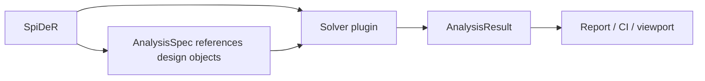

# Versioned Data Contracts

SPIKE transports plain JSON-compatible records between importers, projects,
the desktop, CLI, workers, solvers, reports, and future remote services. Python
dataclasses in `python/spike_core/contracts.py` are the active implementation;
JSON schemas in `schemas/` document the compatible wire envelope.

## Contract family

Coupled assembly studies add `spike/multiboard-circuit-request/v1`,
`spike/multiboard-thermal-request/v1`, and `spike/multiboard-em-request/v1`
with corresponding result contracts. These use explicit reduced properties and
retained occurrence identities. `spike/multiboard-study-file/v1` stores a domain,
physical assembly digest, setup and nullable results for direct loading.
See [coupled assembly contracts](MULTIBOARD_COUPLED_ANALYSIS.md) and ADR 0027.

All three currently use `contract: spike/v1`.

`DesignIR` naming remains a compatibility surface at the KiCad-Prism boundary;
SPIKE internals consume `SpiDeR` (SPIKE Design Reference).

Workflow-specific envelopes use separate contracts where their lifecycle is not
a normal solver request/result. The EMI family uses `spike/emi-setup/v1`,
`spike/emi-preflight/v1`, and `spike/emi-workflow/v1`; see
`docs/EMI_WORKFLOW.md` and `schemas/emi-setup-v1.schema.json`.

## SpiDeR

`SpiDeR` describes normalized source geometry and metadata. Coordinates and
linear dimensions use millimetres unless an entity contract explicitly states
otherwise. Electrical values use SI units. It includes:

- ordered layer table and physical stackup;
- nets and stable object identities;
- tracks, vias, pads, copper zones, components, and connectors;
- reviewed component-to-pad/copper contact records; see
  `docs/COMPONENT_BONDS.md`;
- rigid, flex, or rigid-flex regions and bend metadata;
- import issues and source/importer provenance.

Entity dictionaries are currently extensible and not yet fully discriminated.
New code should document required fields and avoid consuming source-only fields.
Future entity schemas will tighten this without changing units or identity
semantics inside `spike/v1`.

## AnalysisSpec

`AnalysisSpec` is the complete reproducible request. It identifies solver mode
and capability, nets, sources, loads, return paths, probes, frequency/transient
settings, mesh settings, limits, and explicit options. Coordinates in terminals
must be anchored to normalized geometry where possible; a bare coordinate is a
request to snap, not proof of electrical connection.

## AnalysisResult

`AnalysisResult` preserves result and validity separately:

- `status`: execution outcome;
- `model_status`: validated/approximate/unsupported/convergence status;
- `summary`: scalar engineering outcomes and resource/timing data;
- `fields`: scalar fields, vector fields, mesh, animation frames, and units;
- `networks`: RLCG, impedance, S-parameter, or circuit outputs;
- `probes`: sampled values with object/coordinate provenance;
- `issues`: numerical, geometry, limit, and validity diagnostics;
- `provenance`: solver, version, assumptions, mesh, and dependency record.

Clients may hide a dataset, but they may not create a dataset the solver did
not return. Reports and visualizations preserve the exact model status.

## Compatibility

The internal meshing worker uses `spike/internal-mesh-request/v1` and returns
`spike/internal-mesh-result/v1`. Generation/adaptation/optimization candidates
contain solver-neutral tetra meshes, complete labeled boundary triangles,
quality and provenance digests; `production_qualified` remains false. Unknown
controls are rejected. See [the request schema](../schemas/internal-mesh-request-v1.schema.json)
and [the engine integration guide](INTERNAL_MESH_ENGINE.md) for limits and field
transfer semantics. This is additive and does not change `spike/mesh/v3` preview
or `spike/solver-mesh/v1` interchange semantics.

Compatible `spike/v1` changes may add optional fields or new issue codes.
Breaking changes include unit changes, renamed required fields, changed identity
semantics, or altered interpretation of existing values. They require:

1. a new contract version;
2. project/result migration code;
3. compatibility tests and fixtures;
4. an ADR and release note;
5. updated solver/importer SDKs.

Unknown optional fields must survive load/save where practical. Unknown enum
values must produce an explicit unsupported diagnostic rather than silently
mapping to a different mode.

## Validation ownership

- Importer registry validates that adapters return the expected contract.
- Design validation checks completeness and source quality.
- Preflight validates analysis terminals, geometry, mesh, and solver capability.
- Solver plugins validate formulation-specific requirements.
- Reports present recorded validation; they do not approve it.
- EMI preflight owns setup, geometry-coverage, and execution-readiness gates;
  EMI screening ranks only supplied pre-pass metrics and never creates fields.

### Python IDE files and recovery

`python_workspace_files` returns `spike/python-workspace-files/v1`. List, read,
and write remain confined to the selected root, reject symlink traversal, and
limit files to 512 KB. Writes require the opened file's SHA-256 before replacing
an existing path. The additive `worktrees` action inventories existing Git
checkouts with argument-array invocation, a five-second timeout, and bounded
porcelain parsing. It returns `root`, `available`, `worktrees`, and an optional
diagnostic `message`; navigation never changes Git state.

The IDE's v2 session record is validated before restoration. Durable local
recovery retains at most five snapshots in a 2 MB record. Recovery opens a new
unsaved identity without path, root, or overwrite hash. Failed storage writes
retain the last valid backup and remain visible. Recovery does not establish a
file save or a solver-result validation.

## Study resources and captured history

The optional additions to the version-one frontend study projection are `tags`, `archived`, `datasets`, case `datasetIds`, and case `runs`. A run is a workspace capture with `capturedAt`, frozen settings/scenario, reported result facts, and the original payload or reference. Capture time is not execution time. Legacy current-result fields retain their invalidation behavior. Limits are 128 datasets per study, 2 MiB per dataset, 100 captures per case, 96 MiB of retained dataset/capture data per study, and 256 MiB per full study document including frozen setups. Exceeding a bound is an explicit error. Result-free copies remove result-derived payloads and references while preserving definitions. See [study model](SIMULATION_STUDIES.md) and ADR 0033.
