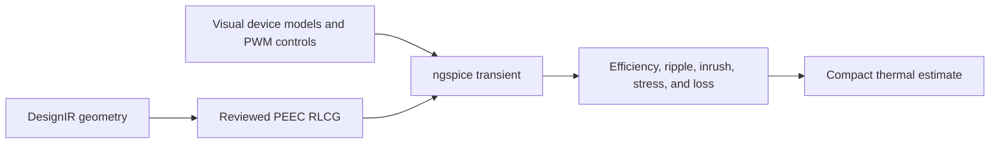

# PWM Converter Study

SPIKE's converter-study contract composes a reviewed circuit model, optional
geometry-derived PEEC RLCG sections, process-isolated ngspice execution,
windowed engineering analytics, and an explicit loss handoff to the compact
thermal model. The workflow is intended for buck, boost, isolated, bridge, and
custom PWM power stages.

## Contracts and entry points

- Input: `spike/converter-study/v1`
- Result: `spike/converter-study-result/v1`
- Schema: `schemas/converter-study-v1.schema.json`
- Worker: `validate_converter_study`, `run_converter_study`, and
  `converter_capabilities`
- CLI: `spike converter-study DESIGN STUDY [--extraction-result RESULT]`
- Extension: `extensions/converter-analysis`

The CLI and worker use the same orchestration code. Unsupported or incomplete
setups fail preflight instead of producing placeholder measurements.

## Executed stages

1. Validate the visual SPICE workspace, transient settings, waveform bindings,
   measurement window, optional PEEC endpoint mappings, and loss bindings.
2. Compile structured PWM source controls into SPICE `PULSE` expressions.
3. Optionally insert a reviewed PEEC RLCG network into the circuit netlist.
4. Run ngspice in the bounded process adapter.
5. Calculate input/output power, conversion loss, efficiency, voltage ripple,
   current ripple, input inrush, elapsed execution time, and bound/unallocated
   loss from named result vectors over the explicit measurement window. Metrics
   use time-weighted trapezoidal integration for adaptive ngspice timesteps.
6. Calculate per-device loss from an explicit power vector or voltage/current
   vector pair. No switching loss is inferred from component names.
7. Send average bound losses to the compact thermal model when thermal
   resistance and scenario data are supplied.

## Structured PWM sources

`switching.sources` connects visual timing fields to primitive voltage or
current source models in the SPICE workspace:

```json
{
  "model_id": "high_side_gate",
  "role": "gate",
  "low": 0,
  "high": 10,
  "delay_s": 1e-6,
  "rise_s": 10e-9,
  "fall_s": 10e-9,
  "on_time_s": 900e-9,
  "frequency_hz": 500000,
  "phase_deg": 0
}
```

Frequency and duty inherit the study-level values when omitted. Phase is
converted to an additional delay. Explicit `on_time_s` overrides the duration
derived from duty cycle. The original workspace is never mutated.

## Required result bindings

The study must name ngspice vectors for input voltage, input current, output
voltage, and output current. Each current or voltage polarity can be set to
`-1` when the SPICE reference direction is opposite to the engineering power
flow. Missing or incomplete vectors fail result processing.

Device loss and thermal analytics require `loss_bindings`. A binding supplies
either a power vector or a voltage/current vector pair, plus optional ratings
and compact thermal parameters. This keeps loss provenance inspectable and
prevents SPIKE from inventing device dissipation.

## Validity boundary

The implemented coupling is one-way and staged:



Temperatures do not yet update conductor resistance or nonlinear device model
parameters and trigger another circuit/field iteration. Bode/loop-gain
analysis is gated until injection, probe, unwrap, crossover, margin, and
validation contracts are implemented. OpenFOAM and full field solvers remain
separate capability-gated workflows. A completed converter study therefore
inherits the weakest status of its ngspice models, PEEC extraction, and thermal
model; it is not automatically a validated converter signoff result.

## Diagnostic codes

Converter preflight and result processing use stable domain codes beginning
with `CONVERTER_`, including contract, topology, switching timing, PWM source,
waveform binding, measurement window, PEEC mapping, device loss, and analytics
failures. The result also preserves canonical worker and solver diagnostics.

## Remaining qualification gates

- Validated nonlinear MOSFET, diode, magnetic, controller, and package models.
- Iterative electrical/thermal parameter feedback with convergence criteria.
- Geometry-resolved loss-map handoff to a validated board/CFD thermal model.
- Startup, load-step, short-circuit, saturation, and control-loop benchmark
  fixtures correlated to measurements and independent tools.
- Reviewed Bode injection and loop-gain extraction.
- UI model assistant for pin groups, symbol models, ratings, and loss bindings.
