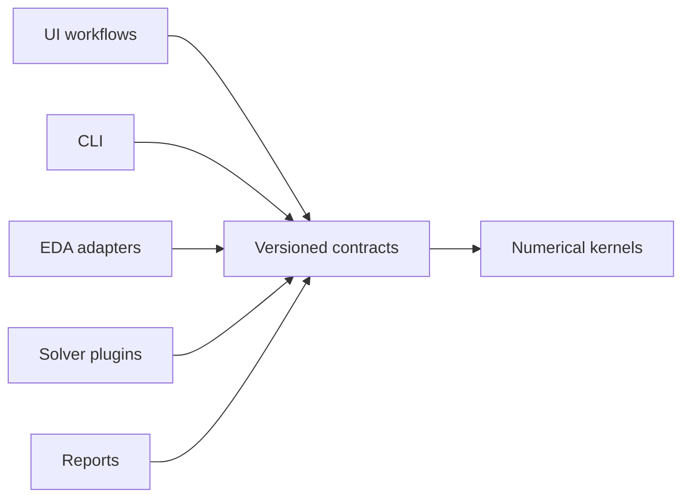

# SPIKE Design Principles

These principles turn maintainability goals into reviewable engineering rules.
They apply to UI, native host, importers, workers, solvers, reports, and tools.

## SOLID in SPIKE

### Single responsibility

A module should have one reason to change. Source parsing, normalization,
solver orchestration, numerical formulation, rendering, and persistence are
separate responsibilities. Composition roots may connect them but should not
implement them.

Current debt: `App.tsx`, `BoardViewport.tsx`, and `LayoutViewport.tsx` are too
large. They are migration targets, not accepted templates for new code.

### Open/closed

New EDA sources, solvers, exporters, and extensions are registered through
descriptors and narrow interfaces. Adding an Allegro importer or external MoM
solver should add an adapter, fixtures, and a descriptor without modifying
every consumer.

### Liskov substitution

Any registered importer must return a valid `DesignIR` with the same units,
coordinate semantics, issue behavior, and provenance guarantees. Any solver
advertising a capability must accept the corresponding valid `AnalysisSpec`
and return a conforming `AnalysisResult` or a structured failure.

### Interface segregation

Plugins receive only what they need. Importers do not receive UI state.
Solvers do not receive parser objects or DOM objects. Renderers do not receive
private solver instances. General extensions use the extension SDK rather than
the complete application object.

### Dependency inversion

High-level workflows depend on versioned contracts and registries. Concrete
KiCad parsing, Python process launch, Three.js scene details, and numerical
kernels sit behind adapters.

## Additional rules

### Truth before convenience

`validated`, `approximate`, `unsupported`, and `failed_to_converge` are distinct
states. UI wording, reports, and automation must preserve them.

### Determinism and provenance

Inputs, units, solver version, mesh settings, assumptions, warnings, and
convergence data are part of the result. Re-running the same version and inputs
must be reproducible within documented tolerances.

### Explicit failure

Malformed source data, missing dependencies, timeouts, unsupported geometry,
and resource limits produce structured errors. Partial data is allowed only
when every omission is recorded in the import or validation report.

### Bounded resources

Every potentially large operation needs a memory model, message limit,
decimation strategy, timeout, progress path, and eventual cancellation path.
Avoid full-array argument spreading and unbounded dense matrices.

### Offline by default

Core import, setup, analysis, visualization, project storage, and reporting do
not require a network service. Optional cloud execution must implement the same
contracts and remain replaceable.

### Human maintainability

Names, types, tests, diagrams, and module ownership must carry enough context
for a conventional engineering team. Do not commit code that is only
understandable by replaying an AI conversation.

### Language economy

Use the language that owns the subsystem. TypeScript/TSX is for presentation,
Python for application services and orchestration, C++ for justified numerical
kernels, and Rust only for the thin desktop host. Do not add a language or
duplicate a domain model for local convenience. Platform shell files remain
thin shims. The enforceable budget and retirement plan are in
`docs/LANGUAGE_POLICY.md`.

## Dependency policy

Forbidden directions include solver-to-UI, contract-to-EDA-parser,
renderer-to-parser, and KiCad-plugin-to-solver-state.

## Refactoring policy

SPIKE does not need a full rewrite. Replace risky boundaries incrementally:

1. Characterize behavior with tests.
2. Introduce a contract or adapter.
3. Move one responsibility.
4. Keep compatibility at the old call site.
5. Remove the compatibility path after all consumers migrate.

Large aesthetic or organizational rewrites without behavior tests are not a
substitute for this process.
