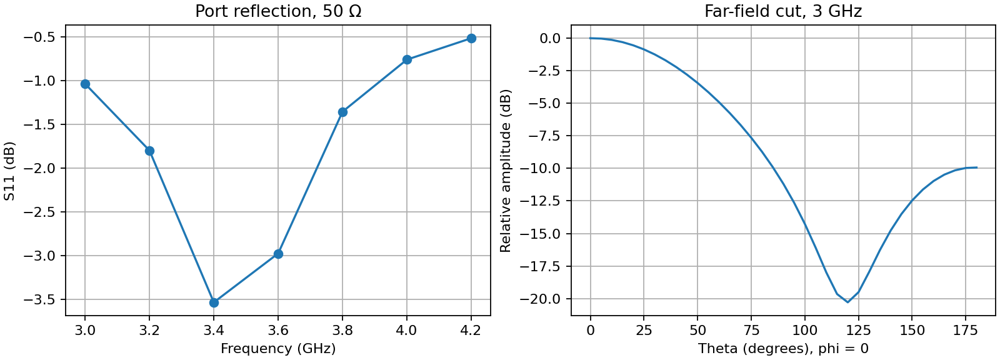
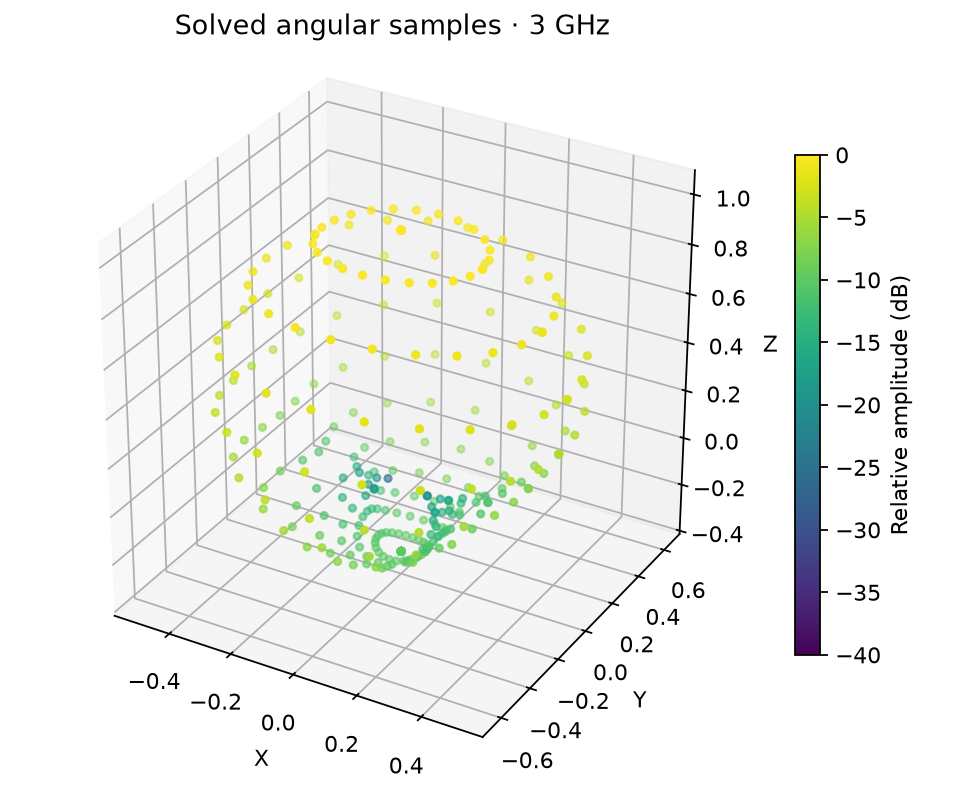

# EMerge antenna walkthrough in SPIKE

This walkthrough is for a **planar, two-layer antenna model that satisfies the
current EMerge board adapter**. It describes how to get a 3D relative far-field
pattern, angular cuts, and S-parameter plots into SPIKE. It is not a recipe for
an arbitrary PCB antenna, a calibrated gain measurement, or an EMI compliance
assessment. The [extension implementation and exact limits](../extensions/emerge_suite/README.md)
and [solver status](SOLVER_STATUS.md) govern capability claims.

## 1. Prepare and import the board

Prepare a rigid board with an F.Cu signal geometry, one dielectric, and B.Cu
return copper. The current adapter exports only the selected signal and return
nets. The feed must be represented by an F.Cu signal pad and a B.Cu return pad
whose centers align within 0.05 mm; SPIKE creates a vertical 50 ohm lumped port
between them. A second aligned pair is optional for two-port S-parameters.
Import the KiCad board with **Home → Import**, then inspect its stackup,
filled-zone import, net names, pad IDs, and geometry warnings. The source board
must contain a physical dielectric thickness and relative permittivity.

Selected-net vias, curved tracks, zone holes/cutouts, extra copper layers,
flex/bends, and unsupported pads are rejected by the adapter. The rectangular
board bounds and surface PEC copper are approximations. Other nets,
components, copper thickness, solder mask, and dielectric loss are not in the
EMerge model. Check the actual exported geometry before interpreting an
antenna pattern.

## 2. Set up EMerge in SPIKE

Open **Settings → Extension manager → EMerge Suite**. Click **Run** beside
**Check EMerge runtime** and inspect its availability and version. The adapter
supports EMerge 2.8.x and the tested EMerge 3.0.0a19 prerelease in a compatible
Python 3.10–3.13 environment. If needed,
set **EMerge Python executable** to that environment's interpreter. A runtime
probe confirms API availability; it does not validate the antenna model.

In **EMERGE PORT SWEEP SETUP**, enter the signal and return nets and their
aligned signal/return pad IDs. Set the start and stop frequency, 2–64 sweep
points, and 0.05–10 mm requested mesh resolution. The supported frequency
range is 100 MHz–100 GHz. Pick **EMerge radiation pattern** in the
contribution list and click its **Run** button. SPIKE builds the bounded case,
launches EMerge in its separate interpreter, then admits the returned arrays
only if they match the board, ports, sweep, units, shapes, and finite-value
checks. The separate **EMerge SI port sweep** contribution returns S-parameters
without radiation samples.

Alternatively, open **Help → Interactive analysis guide**, choose **EMerge
radiation**, and use **Next** or **Find control** to locate the EM tab's EMerge
setup, runtime check, Run, and result controls. The guide highlights controls; it does not select
engineering values or run the solver.

The **EM → EMerge** panel exposes only the analyses reported by the runtime
probe. Its radiation output is relative field data and is not a calibrated
emissions or regulatory compliance result.

## 3. Read and probe the result

After a completed EMerge radiation run, SPIKE opens the **EM** workspace in
3D board view: the native viewport places the relative far-field pattern
beside the imported board, where it can be rotated and probed. **EM → Chamber**
opens the separate bench view and **EM → Board + pattern** returns to the board.
The results pane shows the interactive 3D surface, angular cut, S-parameters,
warnings, and provenance. The Extension Manager can also show the result. The 3D
surface uses EMerge samples on a 13 × 25 theta/phi grid at each solved
frequency; the surface between samples is display interpolation. Its radius
is proportional to **relative electric-field amplitude** and its color is
relative dB, each frequency sphere normalized to its own peak. The cut is
likewise relative to its own peak. Do not read these as absolute gain, realized
gain, radiated power, or an EMI limit margin.

The board-view surface is an angular display around the modeled antenna/feed;
its radius is a visual encoding of relative amplitude, not a physical distance
or near-field sample. Board location probing for voltage, current, and thermal
fields uses their respective spatial solver samples. Radiation probing reports
theta, phi, and relative dB from the saved angular grid.

The same radiation run includes complex S-parameters at the solved frequencies.
Use the receive and excited port selectors to inspect S11, S21, or other
available terms; SPIKE plots magnitude in dB and wrapped phase in degrees.
One port provides S11 only. Compare the resonance or return-loss shape with a
credible reference only after checking that port position, reference
impedance, geometry, materials, and frequency definitions agree. SPIKE records
the result in normal analysis history, with `model_status: unvalidated` and a
case digest for provenance. Hover a 3D sample to read theta, phi, and relative
dB. Hover a 2D curve for the nearest solved sample; click or press Enter to pin
its value. These probes read saved solver samples and do not trigger another solve.

## 4. Checks before a physical claim

Repeat the run with a finer trace mesh and a suitable frequency sweep, and
check whether the S-parameter features and directional pattern stabilize.
Independently assess the finite absorbing-region spacing and boundary effect.
Review the mapped geometry and excitation against the intended physical feed.
For measured comparison, identify whether the reference reports directivity,
gain, realized gain, polarization, frequency, and calibration plane; these are
not interchangeable. A knowledgeable human must review numerical behavior
before release. A passing runtime or UI test and the earlier two-frequency
fixture smoke test establish integration, not antenna accuracy.

## Recorded evidence for this walkthrough

The repository includes a generated KiCad 10 planar patch fixture and the
[exact run configuration](../examples/emerge/antenna_run.json). From the repo
root, run `python scripts/run_emerge_antenna_example.py --python-executable
.venv-emerge3/Scripts/python.exe` with a separately installed EMerge 3.0.0a19
environment. `python scripts/plot_emerge_antenna_pattern.py` renders the 3D
sample figure from the saved result. The solver output is admitted through the
same SPIKE analysis-result checks used by the extension host.

| Evidence | Recorded value or artifact |
|---|---|
| Board source, license, revision, SHA-256 | [Generated KiCad 10 board](../examples/emerge/antenna_example.kicad_pcb), MIT project fixture, SHA-256 `f8fd038633c5b49a3867c8f09dc4fb3341b9be5a4a3cd961a088dbde6a77a2f0`. KiCad 10.0.6 DRC with zone refill: 0 violations, 0 unconnected items. |
| EMerge version/interpreter | 3.0.0a19 prerelease in project-local `.venv-emerge3`; existing 2.8.9 environment preserved. |
| Signal/return nets, pad IDs, port count | RF / GND; F.Cu signal `51d0c420-4c7b-4da5-b9ec-001000000011`, B.Cu return `51d0c420-4c7b-4da5-b9ec-001000000012`; one 50 Ω port. |
| Stackup, modeled geometry, omitted features | 40 × 30 mm rectangular two-layer board, 1.6 mm FR-4 dielectric with εr 4.3, F.Cu patch/feed, filled B.Cu ground. Surface PEC and dielectric loss tangent omission are reported warnings. |
| Sweep, mesh settings, absorbing-region margin | 3.0–4.2 GHz, seven solved frequencies, requested 2.0 mm trace mesh, 20 mm air margin. This is a coarse demonstration setup. |
| Solver completion, diagnostics, result/case digests | [Host-admitted result](../examples/emerge/antenna_result.json): `completed`, `model_status: unvalidated`; warnings `EMERGE_BOARD_MODEL_UNVALIDATED`, `EMERGE_DIELECTRIC_LOSS_OMITTED`, `EMERGE_EMI_NOT_COMPLIANCE`. Result SHA-256 `5d77b93e74f20401dc8108c0236c7482732d44dbe242b37e25405dea1f8bc380`; case SHA-256 `a6bf9ab8d3c67977fc9483bc16c46d01c8d5d0294b37c9169f796becbebd58aa`. |
| S-parameter values and plot | [Evidence JSON](../examples/emerge/antenna_evidence.json) and [plot](../examples/emerge/antenna_plots.png): S11 = −1.03 dB at 3.0 GHz, −3.53 dB at 3.4 GHz, −0.51 dB at 4.2 GHz. The seven-point minimum is not a validated resonance estimate. |
| 3D samples and angular cut | Seven saved 13 × 25 angular grids plus seven phi = 0° cuts in the result; [3D sample view](../examples/emerge/antenna_pattern_3d.png), [cut plot](../examples/emerge/antenna_plots.png). A saved peak grid probe at 3.0 GHz reads theta 0°, phi 15°, relative 0 dB; azimuth labels at the pole describe the same direction. |
| Mesh/boundary sensitivity and independent comparison | Not performed; required before physical antenna or EMI claims. |
| Human numerical review and disposition | Pending. The recorded output demonstrates integration and interaction only. |

## Dielectric cover and in-view result

The [paired radome example](../examples/emerge/radome/README.md) reuses one
KiCad patch board for a bare run and a covered run. The cover is an explicit
50 × 40 × 1.5 mm ideal dielectric box with relative permittivity 2.1, beginning
10 mm above F.Cu. Both seven-frequency cases completed through the SPIKE
extension host with EMerge 3.0.0a19. At 3.4 GHz the sampled S11 changed from
−3.53 dB bare to −4.02 dB covered. The saved angular patterns also differ;
each is normalized separately, so their difference is pattern shape and not
radome insertion loss.

In SPIKE, enable **Model dielectric cover in front of antenna** in the EMerge
setup, enter the dimensions and relative permittivity, then run radiation.
The result panel can show the solved angular grid or a 5° display surface
interpolated from relative linear amplitude. **View radiation on bench** opens
the EM chamber with that relative pattern around the placed board. Use the
chamber frequency selector to switch solved frequencies and **Bench display**
to make the test table visible, translucent, or hidden. These view settings
do not change the field solve. A curved radome or arbitrary imported complex
structure is outside this adapter's current geometry support.
