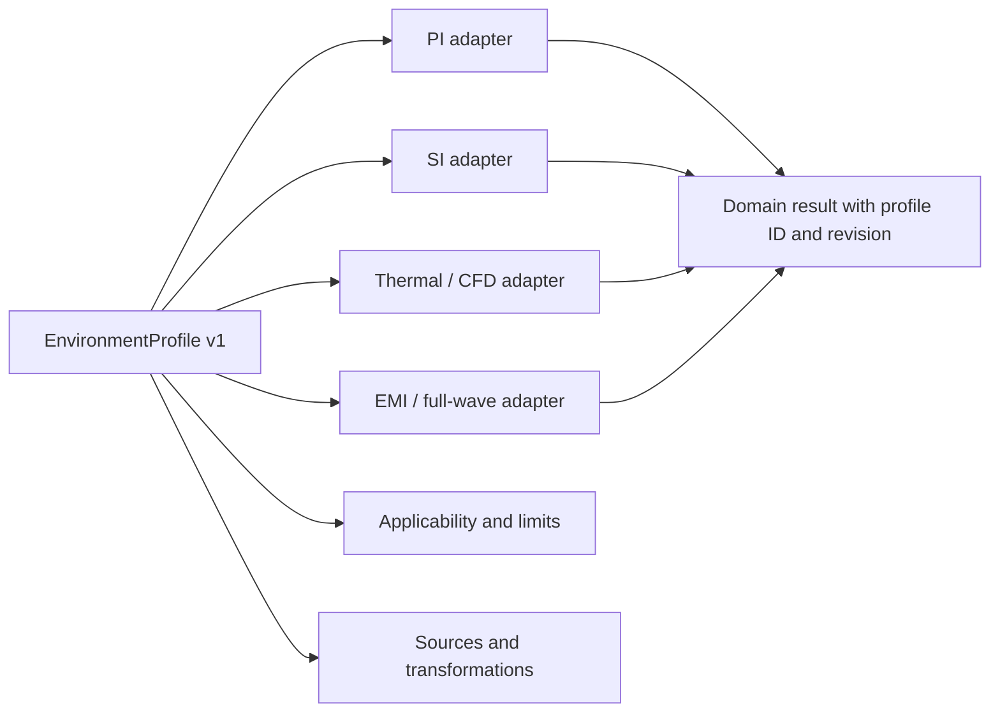

# Cross-Domain Environment Profiles

## Purpose

SPIKE environment profiles provide one versioned, solver-neutral description of
the physical operating environment used by PI, SI, thermal, and EMI analyses.
They prevent each solver adapter from inventing its own temperature, pressure,
fluid, flow, radiation, or electromagnetic background defaults.

The profile contract is:

```text
spike/environment-profile/v1
```

The validation response contract is:

```text
spike/environment-profile-validation/v1
```

The JSON schema is `schemas/environment-profile-v1.schema.json`. The reference
implementation is `python/spike_core/environment_profiles.py`.

An environment profile is an input record. It is not a solver result, a test
report, a qualification record, or certification evidence.

## Built-In Profiles

| Profile ID | Intended starting point | Important boundary |
| --- | --- | --- |
| `standard-lab-air` | Open laboratory air at 25 C and 101325 Pa | Not a chamber, bench-plane, or compliance setup |
| `sealed-potted` | Sealed electronics with generic full epoxy encapsulation | Product potting data and actual enclosure geometry must replace seed data |
| `automotive` | Elevated-temperature air at a representative 85 C point | No mounting class, OEM requirement, vibration, fluid, or load-dump requirement is implied |
| `marine` | Warm, high-humidity air | Salt fog, condensation, corrosion, and coating effects are not inferred |
| `aerospace-altitude` | Low-pressure air near a representative 10 km point | No pressurization schedule, vehicle flow, corona, or airworthiness claim is implied |
| `vacuum-space` | Convection-disabled rarefied environment with radiation enabled | Orbit, attitude, eclipse, optical properties, charging, and radiation exposure need explicit inputs |
| `user-defined` | Blank user-owned profile | Required physical values and provenance must be supplied before use |

Built-in values are engineering seeds. They make assumptions visible and give
the UI and solver adapters a complete data shape. They are not represented as
measurements or standards data. A project should clone a preset, replace values
that control the result, attach sources, and record the review state.

## Data Model



Every numerical value uses SI units. PCB geometry remains governed by the
DesignIR geometry contract and is not duplicated in the environment profile.

### Thermal operating point

`physical.thermal` records:

- ambient temperature in kelvin;
- initial assembly temperature in kelvin;
- whether radiation is enabled;
- radiative sink temperature in kelvin;
- incident external radiative flux in W/m2;
- a default surface emissivity from 0 to 1 when a more specific material value
  is unavailable.

Surface emissivity is material and finish dependent. A solver-specific material
assignment should override the profile default wherever possible.

### Atmosphere and gravity

`physical.atmosphere` records:

- medium class;
- absolute pressure in pascals;
- relative humidity as a fraction from 0 to 1;
- geometric altitude in metres when applicable;
- a three-component gravity vector in m/s2.

Altitude does not silently generate pressure, temperature, density, or gravity.
Those values remain explicit so that imported chamber data, flight profiles, and
non-Earth environments can be represented without hidden conversions.

### Flow and fluid properties

`physical.flow` contains the selected flow regime, velocity vector, optional
mass-flow rate, turbulence intensity, and characteristic length.

`physical.fluid` contains density, dynamic viscosity, specific heat capacity,
thermal conductivity, and volumetric thermal expansion. CFD adapters may use a
temperature-dependent material model instead, but the adapter must record that
transformation in result provenance.

A vacuum profile must use `flow.regime = vacuum` and
`convection.model = disabled`. Fans or continuum airflow in vacuum are rejected
as inconsistent inputs.

### Convection and enclosure

`physical.convection.model` supports:

- `natural`;
- `forced`;
- `specified_coefficient`;
- `solver_resolved`;
- `disabled`;
- `user_defined` while a draft profile is incomplete.

An explicitly specified heat-transfer coefficient uses W/(m2 K). Natural,
forced, and solver-resolved convection require fluid properties. The enclosure
record identifies open, sealed, vented, free-space, or user-defined boundaries.
Detailed enclosure geometry, openings, fans, and channels remain analysis setup
geometry rather than profile metadata.

### Encapsulation

`physical.encapsulation` records coverage, thickness, thermal conductivity,
density, heat capacity, relative permittivity, and dielectric loss tangent.
These values are shared by conjugate thermal, SI, and EMI adapters.

The built-in potted profile uses generic epoxy seed values. Void fraction, cure
state, filler orientation, anisotropy, interface resistance, aging, and
frequency dispersion require product-specific data or a material model.

### Electromagnetic background

`physical.electromagnetic` records:

- material name;
- relative permittivity and permeability;
- electrical conductivity in S/m;
- dielectric loss tangent;
- the frequency range over which those values are intended to apply.

This describes the background medium only. Board dielectrics, coatings,
encapsulation, enclosures, shields, cables, and absorbers remain explicit
materials and geometry in their owning contracts.

### Electrical temperature inputs

`physical.electrical` records the conductor reference temperature and copper
temperature coefficient used by PI adapters. A temperature-coupled PI solve
must consume a thermal result or an explicit temperature field. The environment
profile alone does not manufacture a board temperature field.

### Exposure inputs

`physical.exposure` reserves explicit SI values for salinity, surface
contamination conductance, solar flux, ionizing dose rate, atomic oxygen flux,
vibration, and shock. Null means unavailable, not zero. Zero is used only when
the profile explicitly assumes no applied exposure.

Exposure values do not automatically alter conductor, dielectric, coating, or
mechanical properties. A domain model must declare and validate that coupling.

## Validity

`validity` keeps model applicability separate from profile identity:

- `input_status`: `draft`, `template`, `user_confirmed`, `measured`, or
  `imported`;
- `applicable_domains`: any of `pi`, `si`, `thermal`, and `emi`;
- temperature, pressure, and frequency ranges;
- assumptions and known limitations;
- unresolved JSON-pointer paths in `required_overrides`;
- the fixed certification fields.

The schema requires:

```json
{
  "certification_claimed": false,
  "certification_basis": []
}
```

Any attempt to set a certification claim is rejected. Certification and
qualification evidence belongs in a separately reviewed verification artifact
that references exact solver results, fixtures, procedures, acceptance limits,
and responsible sign-off.

## Provenance

`provenance` contains:

- origin: built-in, user, measured, or imported;
- profile revision and creation metadata;
- one or more source records;
- JSON-pointer-to-source mappings;
- transformations such as explicit overrides.

A parent path such as `/physical` may identify a source that applies to all
descendants. More specific mappings override the parent mapping. Solver result
provenance should retain at least the profile ID, revision, content digest, and
any adapter transformations.

Uncertainty is not invented by the profile subsystem. A source may describe its
measurement uncertainty in `scope`, and a future compatible contract may add a
structured uncertainty field. Solvers must not assume zero uncertainty when it
is absent.

## Domain Readiness

`validate_environment_profile()` reports `inputs_complete` independently for
each requested domain.

| Domain | Required environment inputs |
| --- | --- |
| PI | Ambient and initial temperature, pressure, gravity, conductor reference temperature, copper temperature coefficient |
| SI | Common operating point plus background permittivity, permeability, conductivity, loss tangent, and frequency validity |
| Thermal | Common operating point, gravity, flow vector, radiation inputs when enabled, plus fluid or specified-convection properties; encapsulation properties when enabled |
| EMI | Common operating point plus background electromagnetic material and frequency validity |

`can_supply_solver_inputs = true` means only that required profile fields are
present and internally consistent for the requested domains. It does not mean:

- a solver is installed;
- geometry and boundary conditions are complete;
- the mesh converged;
- the solver has been benchmarked for this case;
- the result meets an acceptance limit;
- the product is qualified or certified.

Template profiles return `review_required` even when all physical fields needed
by a solver are present.

## Python API

List and retrieve immutable built-in profiles:

```python
from python.spike_core.environment_profiles import (
    get_environment_profile,
    list_environment_profiles,
)

catalog = list_environment_profiles()
profile = get_environment_profile("automotive")
```

Apply explicit overrides without changing the catalog:

```python
from python.spike_core.environment_profiles import materialize_environment_profile

profile = materialize_environment_profile(
    "automotive",
    {
        "physical": {
            "thermal": {
                "ambient_temperature_k": 373.15,
                "initial_temperature_k": 373.15
            },
            "flow": {
                "regime": "forced",
                "velocity_m_s": [8.0, 0.0, 0.0]
            },
            "convection": {
                "model": "forced"
            }
        },
        "validity": {
            "input_status": "user_confirmed"
        }
    }
)
```

Create a user-defined profile with explicit provenance:

```python
from python.spike_core.environment_profiles import create_user_defined_profile

profile = create_user_defined_profile(
    "thermal-chamber-run-42",
    "Thermal chamber run 42",
    physical_overrides={
        "thermal": {
            "ambient_temperature_k": 333.15,
            "initial_temperature_k": 333.15
        }
    },
    source_title="Chamber controller export",
    source_locator="lab://chamber-a/run-42"
)
```

Validate only the domains requested by an analysis:

```python
from python.spike_core.environment_profiles import validate_environment_profile

validation = validate_environment_profile(profile, ("pi", "thermal"))
if not validation["can_supply_solver_inputs"]:
    for issue in validation["issues"]:
        print(issue["severity"], issue["path"], issue["message"])
```

## Solver Adapter Rules

A solver adapter should:

1. Validate the profile for its domain.
2. Refuse execution when its domain reports incomplete inputs.
3. Map SI values to solver-native dictionaries without changing physical
   meaning.
4. Record every conversion, interpolation, clamping operation, and material
   substitution in result provenance.
5. Keep analysis geometry and detailed boundary conditions outside the profile.
6. Include the exact profile identity and content digest in the result bundle.
7. Report unsupported coupling instead of silently omitting it.
8. Never promote profile completeness to solver validation or certification.

Examples of adapter-owned transformations include OpenFOAM thermophysical
dictionaries, openEMS background materials and boundaries, or a PI conductor
resistivity correction at an explicit temperature. Those generated files remain
inspectable execution artifacts.

## Project Storage

The intended project reference is:

```json
{
  "environment_profile": {
    "contract": "spike/environment-profile/v1",
    "profile_id": "project-automotive-hot",
    "revision": "1.0.0"
  }
}
```

For reproducibility, a project package should store the complete materialized
profile rather than only a built-in ID. A built-in profile can evolve only under
a new revision, and old result bundles must continue to reference the exact
materialized content used for execution.

## Compatibility

Compatible v1 changes may add optional source kinds or optional physical fields.
Changes to units, field interpretation, required fields, enum meaning, or
certification semantics require a new contract version and migration tests.
Unknown environment classes or domain names must be reported as unsupported and
must not be silently mapped to a nearby preset.
