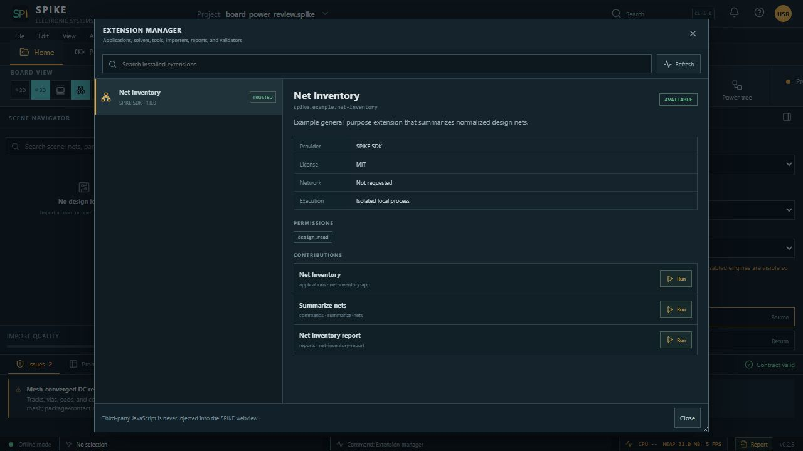
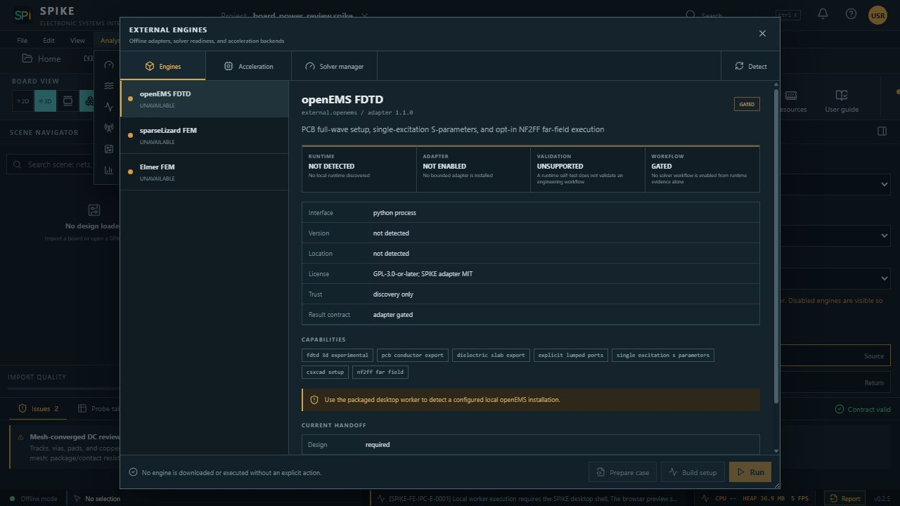
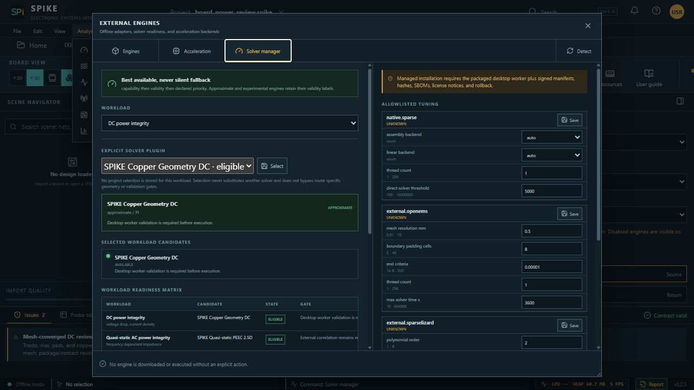

# External Solver Plugin Guide

This guide describes the clean-room process boundary for adding an external
solver to SPIKE. It applies equally to a user-owned solver, an internal SPIKES
binary, openEMS, Elmer FEM, or sparseLizard. A plugin is selected explicitly
per workload and cannot silently fall back to another engine.

The checked-in vendor examples contain no third-party implementation code and
do not install, activate, or claim qualification for those engines:

- [openEMS descriptor](../solver_sdk/openems-solver-plugin.example.json)
- [Elmer FEM descriptor](../solver_sdk/elmerfem-solver-plugin.example.json)
- [sparseLizard descriptor](../solver_sdk/sparselizard-solver-plugin.example.json)
- [generic descriptor](../solver_sdk/solver-plugin.example.json)
- [SDK contract overview](../solver_sdk/README.md)

## What The User Sees

The Extension Manager shows trusted process extensions and their permissions.
No third-party JavaScript is injected into the SPIKE webview.



The External Engines panel separates runtime discovery, adapter readiness,
validation, and workflow eligibility. This screenshot was captured from the
real local SPIKE UI with no desktop runtime connected; all three engines
correctly remain gated.



The Solver Manager stores an exact plugin selection per workload. Its
no-fallback policy and each candidate's qualification state remain visible.



## End-To-End Authoring Walkthrough

### 1. Declare Identity And Scope

Copy `solver_sdk/solver-plugin.example.json` into a private plugin directory as
`solver-plugin.json`. Give it a stable lowercase ID and declare only analyses,
formulations, and capabilities the adapter actually implements. Keep `state`
as `unavailable` and `model_status` as `unsupported` while developing.

```text
solvers/
  company.engine/
    solver-plugin.json
    bin/
      spike-engine-adapter.exe
    LICENSES/
    validation/
```

The entry point must stay inside the plugin directory. SPIKE invokes it through
a fixed argument array with `shell=false` in a private job directory.

### 2. Implement The Runtime Probe

Implement the descriptor's fixed probe verb, normally `--spike-probe`. It must
write one bounded JSON object to standard output using
`spike/solver-plugin-probe-result/v1` and identify both runtime and adapter
versions. SPIKE rejects timeouts, oversized output, malformed JSON, failed
status, missing identity, and protocol mismatch.

A passing probe proves only that this adapter can communicate with that local
runtime. It does not grant geometry, workflow, product, or compliance
qualification.

### 3. Consume Digest-Bound Inputs

SPIKE supplies `spike/solver-plugin-job/v1`. Every input is job-relative and
digest-bound. The neutral mesh uses `spike/solver-mesh/v1` and carries:

- explicit units and right-handed coordinates;
- bounded vertices and typed cells;
- source-object ownership for board, net, layer, package, connector, enclosure,
  harness, and thermal objects;
- material, port, boundary, and resource metadata owned by the calling
  workflow.

The adapter must reject unsupported cells, missing ownership, unit ambiguity,
unknown boundary conditions, digest mismatch, and paths escaping the job root.
It must never silently discard a conductor, return path, contact, port, solid,
or requested physics term.

### 4. Translate Through A Public Solver Interface

Keep all engine-specific translation inside the isolated adapter:

- **openEMS:** build CSXCAD geometry and mesh, create explicit ports, set FDTD
  boundaries/excitation, run the simulation, then normalize port or NF2FF
  outputs. The official Python API exposes `Run`, lumped/MSL/waveguide ports,
  boundary controls, and NF2FF. PCB launches, ports, and convergence remain
  adapter-owned validation responsibilities.
- **Elmer FEM:** translate the neutral mesh and named regions into an ElmerGrid
  mesh and explicit solver input file, invoke ElmerSolver with fixed arguments,
  then import only declared result fields. Select heat, flow, electromagnetic,
  or coupled equations explicitly; do not infer equations from file names.
- **sparseLizard:** map the neutral mesh to explicit Gmsh physical regions,
  generate a reviewed formulation using the public C++/Python API, solve, and
  export bounded VTU/field/network artifacts. Region, polynomial order,
  adaptivity, circuit coupling, and solver backend must remain explicit.

These are API integration patterns, not copied implementations. Review each
engine's license before redistributing a runtime or linked adapter.

### 5. Return Bounded Artifacts

Return `spike/solver-plugin-result/v1`. Large fields, matrices, Touchstone
networks, and waveforms remain job-relative artifacts with SHA-256, byte count,
contract, units, coordinate frame, runtime version, and adapter version. SPIKE
checks containment and digests before an owning workflow normalizes results for
plots, 2D/3D fields, reports, or electro-thermal feedback.

Returning a converged field does not automatically create a production-valid
`AnalysisResult`. The workflow must still check conservation/passivity,
convergence, applicable fixtures, and qualification evidence.

### 6. Close Qualification Gates

Promote in this order:

1. Runtime probe passes for an exact adapter/runtime pair.
2. Contract and malicious-input fixtures pass.
3. Analytical/reference fixtures pass with declared tolerances.
4. Mesh, time-step, and frequency convergence pass.
5. Independent-solver and measured correlation pass for the intended geometry
   class.
6. Product/protocol compliance is assessed separately against authorized
   limits and documented uncertainty.

Until the applicable steps pass, retain `experimental`, `unvalidated`, or
`unsupported`. Never edit a result or report to promote it manually.

Field-thermal adapters encode this record as
`spike/thermal-solver-qualification-evidence/v1`. The manifest binds the exact
adapter ID/version, supported capabilities and Windows/Linux packages to
immutable fixture/result SHA-256 digests. SPIKE derives the required gates from
the requested physics and rejects missing conservation, mesh-convergence,
independent-solver, or measured references even when a plugin labels itself
`validated`.

### 7. Discover And Select

Install the complete plugin directory into an installer-managed, trusted solver
root. In SPIKE open **Settings → External engines**, run detection, inspect the
four readiness gates, then open **Solver manager** and select the exact plugin
for the desired workload. A blocked selection reports why; SPIKE does not run a
different solver.

## Application-Specific Expectations

| Workload | Minimum adapter outputs | Important validation |
| --- | --- | --- |
| SI/full-wave | Port map, complex N-port network, field/convergence evidence | Passivity/causality, port convergence, VNA/TDR correlation |
| PI | Reduced R/L/C/G or field network, terminal/return ownership | Conservation, DC/AC/transient fixtures, measured rail correlation |
| Thermal | Temperature/flux and optional velocity/pressure fields | Energy balance, mesh/time convergence, thermocouple/IR correlation |
| Coupled electro-thermal | Digest-bound electrical loss and updated material state per iteration | Residual/history convergence and independent coupled fixtures |
| Multi-board/harness | Board-port networks, connector/harness/return/shield ownership | N-port assembly, return/mutual sensitivity, cross-board fixtures |

## Security And Performance Rules

- Never accept a shell command from a project or extension UI.
- Use fixed verbs and argument arrays; projects provide inert data only.
- Enforce CPU, RAM, wall-time, mesh, output, and artifact-count budgets.
- Poll cancellation between translation, meshing, solver iterations, and import.
- Stream or memory-map large artifacts; do not place million-point fields in
  control JSON.
- Preserve exact object IDs so field decimation never changes solver ownership.
- Treat external result files as untrusted until shape, unit, digest, and finite
  value validation passes.

## Official API References

- openEMS Python API: <https://docs.openems.de/python/openEMS/openEMS.html>
- openEMS ports: <https://docs.openems.de/python/openEMS/ports.html>
- Elmer FEM official repository and manuals: <https://github.com/ElmerCSC/elmerfem>
- sparseLizard official documentation: <https://www.sparselizard.org/DOCUMENTATION.pdf>
