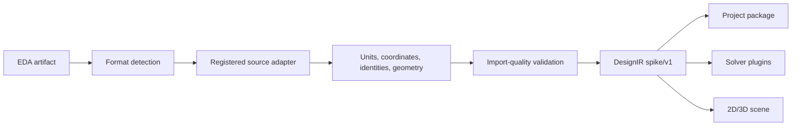

# Importer Architecture

SPIKE analysis is source agnostic. An importer translates an EDA artifact into
the normalized `DesignIR` contract and reports every material omission or
ambiguity. Solvers, reports, project storage, and renderers do not parse EDA
formats.

## Boundary

Backend protocol and registration live in `python/spike_core/importers.py`.
The KiCad implementation lives in `python/spike_core/kicad_importer.py` and
uses `python/core/board_parser.py` internally. Browser-side source dispatch is
in `app/src/designSourceRegistry.ts`.

## Adapter contract

An adapter descriptor declares a stable ID, display name, source format IDs,
and file extensions. Its import function returns `DesignIR` or raises a clear
unsupported/invalid-source error.

Every successful import records:

- importer ID and source format;
- source path or embedded-source provenance;
- units and coordinate orientation;
- layers and physical stackup;
- conductive and component object counts;
- unsupported or ambiguous objects;
- parser diagnostics;
- source-specific assumptions.

Parser objects, source enums, and source coordinate types stop at the adapter.

## Geometry requirements

Importers preserve topology and identity, not just a picture:

- all declared copper layers in physical order, up to at least 32 layers;
- tracks with exact width, endpoints, arcs, and layer;
- vias with drill, plating, diameter, start/end layers, and net;
- pads with shape, drill, rotation, layers, net, component, and identity;
- zones/fills with polygon contours, holes, net, layer, and source kind;
- board outline, cutouts, regions, rigid-flex sections, and bends;
- components, footprints, pins/pads, side, rotation, and model references;
- stackup copper thickness, dielectric thickness, material, Dk, and loss data.

If a format cannot supply a field, the importer leaves it unknown and emits an
issue. It must not invent a common default without recording the assumption.

## Identity and cross-selection

Normalized objects require stable IDs for project persistence, probes,
terminals, revision comparison, and cross-selection. An adapter should retain
source UUIDs when available. Synthesized IDs must be deterministic from source
identity and geometry, not random per import, once the format implementation is
declared stable.

The source bridge translates normalized IDs back to EDA selections. Solver
state remains in SPIKE.

## Multi-file formats

ODB++, Gerber/drill/BOM/netlist, and some vendor exports are source packages,
not single files. Their adapters receive a package root or manifest and resolve
all members before normalization. Missing members appear in the import-quality
report. No consumer should know whether the source was one file or fifty.

## EDA strategy

| EDA system | First integration | Native follow-up reason |
|---|---|---|
| KiCad | Native PCB and thin bridge | Implemented source of detailed geometry |
| Altium Designer | IPC-2581 or ODB++ | Only metadata or models lost in interchange |
| Cadence Allegro | IPC-2581 or ODB++ | Constraints/cross-selection gaps |
| Siemens Xpedition | ODB++ or IPC-2581 | Constraints/cross-selection gaps |
| Other tools | Standards-first | Adapter only where business and fidelity justify it |

Standards-first ingestion reduces vendor lock-in and makes fixtures legally and
technically easier to maintain. Native integration is justified by measurable
fidelity gaps, not by adding vendor names to the UI.

## Current standards-adapter qualification

The IPC-2581 adapter is a bounded, namespace-agnostic
`ipc2581-conductor-primitives-v13` slice. It
imports strict explicit `Line` and circular `Arc` conductor primitives,
one-or-more-step straight positive-width `ROUND` `LineDescRef` polylines, plus inline and
`DictionaryStandard` `Circle` and `RectCenter` padstacks. It creates
typed one-layer SMD pads, grouped plated-through-hole component pads, and
grouped full-stack through vias. It also retains typed manufacturing-drill
records for package round-trip provenance: records linked to typed vias retain
their owner identity, while unresolved owners remain explicitly diagnostic.
Manufacturing drills do not create copper, barrels, or mesh voids. Multi-step
polylines retain deterministic
segment identities plus a typed ordered parent-path, step count, round end-cap,
and round join; DesignIR JSON and versioned Arrow v4 preserve those semantics.
Arrow v4 additionally retains exact per-layer land profiles; pathless Arrow v1,
typed-path Arrow v2, and exact-ring Arrow v3 remain compatible.
It also retains the exact `PWR1/GND` `SOLID_FILL`/`FILL` zone boundary from the
official fixture: 202 ordered rings (one outer ring and 201 cutouts), containing
six line segments and 402 circular-arc segments. This is exact persistence only:
there is no sampling, tessellation, curve-aware mesh/ownership, frontend
exposure, or solver readiness; `LAND_PROFILE_MESHING_PENDING` and
`ZONE_CURVE_MESHING_PENDING` remain explicit.
`LayerRef` does not shadow `Layer`; the parser
recognizes `layerFunction="PLANE"` and `layerOrGroupRef` for stackup mapping.

Coordinates and stackup thicknesses are converted from declared millimetres,
inches, or mils into canonical millimetres. Referenced line dictionaries must
match the Ecad units as required by Rev C. Import validation checks units and
layer, net, component, and pin references; rejects zero offsets, non-identical
regular lands, incomplete occurrences, and drills that are not smaller than
their lands. Unsupported, malformed, or unresolved records are omitted with
structured diagnostics rather than repaired with defaults. Diagnostics are
capped at 10,000 entries.

This is not complete IPC-2581 support and is not solver-ready for a general
IPC-2581 file. Curved polylines and non-round line policies still reject
atomically rather than being tessellated or silently reinterpreted. Remaining
work includes curved/non-round polylines; other contours, zones, and cutouts;
user/custom primitives; mask/paste semantics;
standalone and non-plated holes; blind, buried, and microvias; richer material
data; and exporters. ODB++ and Gerber/drill + BOM/netlist package adapters
remain unimplemented. XML input is rejected for DOCTYPE/ENTITY declarations
anywhere in the payload and is bounded by source size, element, nesting,
attribute, and primitive limits.

The official unchanged Rev C Full fixture (SHA-256
`6c10fea08943ca7261505bd531a8724bc1dffe8f9fec9e53a2f22d52bc83d347`) has
46,483 source records. It declares 39,094 true-copper records after excluding
7,012 non-copper pads, 346 non-copper polylines, 11 out-of-scope polylines,
and 20 out-of-scope polygons; seven contours are in scope. The typed
pad/via/drill totals remain 1,611/1,690/1,859 and 1,152 heterogeneous profiles
are retained. v13 retains all 39,094/39,094 declared true-copper source
records, with a true residual of zero. Its typed retained standard contour-land
envelope is explicitly `semantic_state=unapplied_normative_semantics_missing`
and `projection=forbidden`: it accepts
and preserves optional profile `Xform` plus bounded `xOffset`, `yOffset`,
`rotation`, `mirror`, `faceUp`, and `scale` raw and normalized facts, but never
applies or composes them. The digest-bound fixture observations (not IPC-2581
conformance claims) are 32 `TOP/TOP` rotation `90`/mirror `false` and 66
`TOP/BOTTOM` rotation `360`/mirror `true`, with identity profile Xforms.
Normative composition and
TOP-to-BOTTOM semantics remain unproven, so there is no typed, Arrow, mesh,
solver, or physics promotion. The one zone and typed pad/via/drill totals remain
1/1,611/1,690/1,859, with 1,152 profiles; every readiness flag remains false.
The official digest-bound `build/ipc2581-testcase10-revc-v13-qualification.json`
report is `passed_with_declared_gaps`; the focused IPC/package slice passes 74
tests, the pinned-venv suite passes 787 with one skip, and architecture passes.
This is bounded exact import persistence, not a production-physics claim.

## Import validation

Tests for every adapter cover:

- format detection and ambiguity;
- malformed/truncated input;
- units and coordinate transforms;
- top/bottom orientation and rotation;
- layer ordering and 32-layer designs;
- connected hybrid trace/pad/via/zone geometry;
- arcs, polygons, holes, and rotated pads;
- stackup completeness;
- rigid-flex metadata where applicable;
- stable object IDs and counts;
- unsupported objects and partial-import diagnostics.

Fixture expected values belong in tests or validation records. A screenshot is
useful visual QA but is not sufficient geometry validation.

## Adding an adapter

1. Add a focused module under `python/spike_core` or an external extension.
2. Implement the importer protocol and descriptor.
3. Normalize into `DesignIR` without leaking source types.
4. Register it at the application composition root.
5. Add redistributable fixtures and assertion-based tests.
6. Update the support table and project-format migration behavior.
7. Run `scripts/check_architecture.py` to verify source coupling did not escape.
