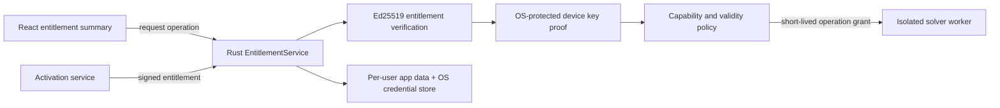

# License Engine Architecture

## Security Boundary

React displays license state but never authorizes work. The Rust desktop host is
the sole entitlement authority. It verifies a signed entitlement before invoking
a protected worker or exporting a protected artifact. Python and C++ workers
receive a short-lived operation grant containing only the operation ID,
capability, project digest, and expiry; they never receive a purchase key.

## Signed Contract

The wire format is `schemas/license-entitlement-v1.schema.json`. The envelope
contains a key ID, exact payload bytes encoded as unpadded base64url, and an
Ed25519 signature over those exact bytes. The claims include one activation,
one subject, one device public-key digest, tier, capability set, product-major
compatibility, issue/not-before/expiry times, refresh policy, and revocation
epoch.

The private signing key is held only by the licensing service or an audited
offline issuer. It is never stored in source control, CI logs, installers, or
applications. Public verification keys are pinned in signed production builds
and rotate by key ID.

## Activation

1. The user signs in or enters a one-time activation code.
2. The host creates a device Ed25519 key pair in Windows Credential Manager or
   user-scope DPAPI, macOS Keychain, or Linux Secret Service.
3. The host sends the license invitation, authenticated subject, product
   version, and device public-key digest to the service.
4. A transaction locks the license record and rejects a second active device
   when the seat limit is one.
5. The service returns the signed entitlement. The reusable activation code is
   discarded.
6. The host proves possession of the device key when refreshing, deactivating,
   or performing a server-checked action.

Offline activation exports a request containing a nonce and device public key.
An authorized issuer returns a signed, machine-bound, time-limited response.

## Capability Enforcement

Every native command maps to one capability in a deny-by-default table. Example
capabilities include `project.read`, `project.write`, `design.import`, `pi.dc`,
`pi.ac`, `pi.transient`, `spice.execute`, `thermal.solve`, `si.solve`,
`emi.solve`, `report.export`, `solver.extensions`, and
`administration.settings`.

Checks occur again at operation execution; hiding a button is not enforcement.
Generic worker entry points must parse the request method, map it to a capability,
and reject unknown methods. The worker verifies the host-signed operation grant
before starting long-running work.

## Developer Entitlement

Development access is not a permanent universal bypass. Debug builds may use a
clearly displayed local entitlement. Production packaging fails if that bypass
is enabled. Distributed developer licenses are signed, named, device-bound,
short-lived, auditable, and revocable.

## Failure States

| State | Required behavior |
| --- | --- |
| Missing or malformed entitlement | Viewer/recovery mode; do not delete projects |
| Bad signature or wrong device | Deny protected work and record a redacted security event |
| Not yet valid or expired | Deny new protected work; allow entitlement renewal and permitted project export |
| Clock rollback suspected | Require service refresh or controlled offline recovery |
| Revoked activation | Deny protected work and offer deactivation/recovery guidance |
| Licensing service unavailable | Honor a signed offline/grace policy; never silently grant capabilities |

License keys, tokens, private device identifiers, and device keys must be
redacted from logs, reports, crash dumps, and project packages.

## Implementation Gate

The Rust host now implements the first enforceable boundary: Ed25519 signature
verification, product and validity checks, machine/user binding, native
activation/deactivation, an offline device request, a read-only React summary,
and capability mapping at the generic worker command. No unsigned frontend
developer entitlement remains.

This is an engineering preview, not the complete production boundary. Before a
commercial licensed release:

- replace the current machine/user digest with an OS-protected device key and
  proof-of-possession flow;
- gate every native worker, file-export, extension, and administrative command;
- implement online refresh, deactivation, recovery, clock-rollback handling,
  key rotation, and offline grace policy;
- implement server-side atomic one-seat assignment and revocation so one
  commercial license cannot be active for two users or devices;
- test signature, device, expiry, rollback, corruption, copying, recovery, and
  concurrent activation races;
- fail release packaging when an unsigned bypass, placeholder issuer key, or
  unapproved legal notice is present; and
- security-review and penetration-test the complete flow.

An offline signed entitlement can enforce that it runs only for the machine and
user named in its claims. It cannot independently prove that the issuer did not
issue another valid entitlement for the same order; that invariant belongs to
the licensing service.
