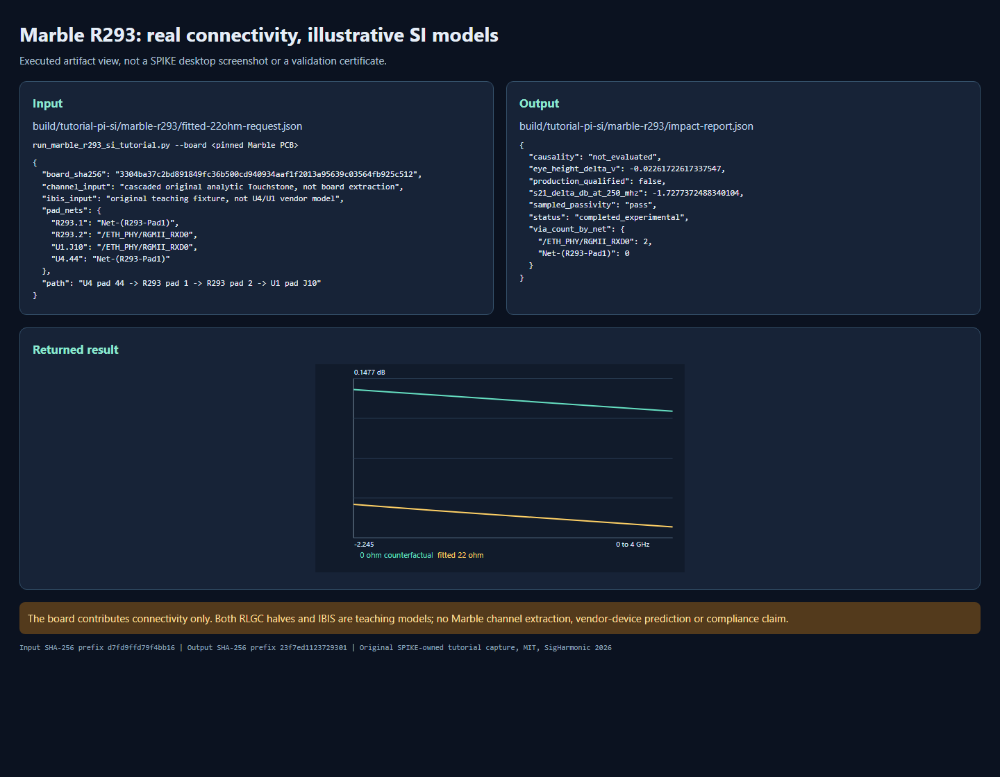

<!-- SPDX-License-Identifier: MIT -->
<!-- Copyright (c) 2026 SigHarmonic -->

# Real-board SI path: Marble R293, Touchstone and IBIS

This is a guided **experimental topology and model-binding tutorial**, not a
validated prediction of the Marble board. It uses a real, pinned KiCad board
to establish component/pad/net identity, then independently authored
Touchstone and IBIS teaching models to exercise the loaded SI workflow. No
measured or extracted Marble channel, Marvell/AMD device model, or 10GbE
compliance result is supplied. The selected RGMII signal is not a 10GbE link.


The existing copper image is a KiCad export of Berkeley Lab's Marble v1.4.4;
its upstream copyright, CERN OHL v1.2 and government notice are recorded in
[`THIRD_PARTY_NOTICES.md`](../THIRD_PARTY_NOTICES.md). This tutorial does not
repackage the board. Obtain the [pinned upstream revision](https://github.com/BerkeleyLab/Marble/tree/a426777d92c0f22a546d4740b419a3937e0c1f90)
separately and preserve its notices.

## 1. Bind the real input

Use Python 3.11 with the [development dependencies](../DEVELOPMENT.md) and
a compatible local native module. This session used KiCad CLI 10.0.6 and
`build/qualification-py311/Scripts/python.exe` on Windows. From the SPIKE
repository root:

```powershell
$py = 'build/qualification-py311/Scripts/python.exe'
$board = 'build/marble-qualification/sources/Marble-v1.4.4/design/Marble.kicad_pcb'
Get-FileHash -LiteralPath $board -Algorithm SHA256
```

The required SHA-256 is
`3304ba37c2bd891849fc36b500cd940934aaf1f2013a95639c03564fb925c512`.
The runner rejects another board or a stale normalized import. On that pinned
source, `U4` (88E1512 PHY) pad 44 `RXD[0]` and `R293` pad 1 share
`Net-(R293-Pad1)`; `R293` pad 2 and `U1` FPGA pad J10 share
`/ETH_PHY/RGMII_RXD0`. The board property names `R293` as a 22 ohm, 1%,
0402 resistor. The imported post-resistor net contains 451 track segments
and two vias. This verifies the declared topology, not a unique electrical
route or return-current path.

To inspect the normalized board independently (large ignored JSON output):

```powershell
& $py -m python.spike_core.cli --output build/tutorial-pi-si/marble-r293-design.json --quiet import $board
```

The installed KiCad version also rendered the board without changing source
bytes. A KiCad render confirms it opens; it is not DRC, connectivity,
fabrication or electrical validation.

## 2. Run the complete bounded study

```powershell
& $py scripts/run_marble_r293_si_tutorial.py --board $board --output-dir build/tutorial-pi-si/marble-r293
```

The runner imports the board, asserts the four pad-to-net mappings, builds a
counterfactual 0 ohm and a fitted 22 ohm channel, exports both as RI `.s2p`,
re-imports them to check numeric round trips, binds an original illustrative
IBIS source/receiver, and executes frequency, PRBS eye, TDR and noise stages.
It writes `*-request.json`, `*-result.json`, `.s2p`, and `impact-report.json`
under the ignored output directory. The `--design-json` option may reuse an
earlier normalized v1 import only when its recorded source digest matches the
board; it is optional.

The two 10 mm/30 mm RLGC halves, their `5 ohm/m`, `250 nH/m`, `100 pF/m`
parameters and loss tangent `0.015` are **illustrative placeholders**. The
physical mid-path `R293` is inserted between those halves as an analytic
series-resistor two-port; it is not incorrectly placed at an endpoint. The
checked-in [`illustrative-rgmii.ibs`](../examples/tutorial_pi_si/illustrative-rgmii.ibs)
is also SPIKE-authored teaching data, **not** the actual U4 or U1 model.
IBIS processing retains its explicit fixed I/V-slope and ramp reduction; it
does not execute switching waveforms, clamps or IBIS-AMI.



The executed run returned `completed_experimental`, with sampled passivity
and reciprocity `pass` and causality `not_evaluated`. At 250 MHz, the fitted
resistor changed the illustrative `S21` by **-1.727737 dB**. The finite-record
reference eye height changed from **1.796815 V** to **1.774198 V**
(`-22.617 mV`). The independent ideal-resistor oracle is
`S21 = 2 Z0/(2 Z0 + 22 ohm)` at `Z0 = 50 ohm`, or about `-1.73 dB`; line loss
accounts for the small difference in the cascaded calculation. None of these
numbers is a Marble measurement or a device-specific margin.

## 3. Inspect, convert and re-run the Touchstone channel

```powershell
& $py -m python.spike_core.cli --output build/tutorial-pi-si/marble-r293/inspect.json --quiet sparam-inspect build/tutorial-pi-si/marble-r293/fitted-22ohm.s2p
& $py -m python.spike_core.cli --output build/tutorial-pi-si/marble-r293/75ohm-conversion.json --quiet sparam-renormalize build/tutorial-pi-si/marble-r293/fitted-22ohm.s2p --to-ohms 75 --touchstone-output build/tutorial-pi-si/marble-r293/fitted-75ohm.s2p
& $py -m python.spike_core.cli --output build/tutorial-pi-si/marble-r293/50ohm-roundtrip.json --quiet sparam-renormalize build/tutorial-pi-si/marble-r293/fitted-75ohm.s2p --to-ohms 50 --touchstone-output build/tutorial-pi-si/marble-r293/fitted-50ohm-roundtrip.s2p
& $py -m python.spike_core.cli --output build/tutorial-pi-si/marble-r293/cli-result.json --quiet si-workflow build/tutorial-pi-si/marble-r293/fitted-22ohm-request.json --touchstone-output build/tutorial-pi-si/marble-r293/cli-channel.s2p
```

The `.s2p` file is the **channel-only** Touchstone network; its loaded IBIS
reductions and endpoints are in the request/result, not embedded in exported
S-parameters. Port 1 is the PHY side and port 2 the FPGA side in this
explicit study. For a real measured file, verify its port direction, reference
impedances, calibration planes, DC and high-frequency coverage, and passivity
before assigning a PHY/FPGA meaning. Reorder and positive port-extension
edits, and forward 2-port cascade, are available in the loaded SI request;
renormalization is also exposed above. The 50 -> 75 -> 50 ohm round trip on
this 513-point file differed by at most `5.6e-16` in complex S. A passing
sampled passivity test does
not establish causality, de-embedding or measurement correlation.

The [Touchstone 2.1 specification](https://www.ibis.org/touchstone_ver2.1/touchstone_ver2_1.pdf)
guides the parser tests. SPIKE admits bounded S/Z/Y full-matrix input, RI/MA/DB,
explicit two-port order, per-port reference values and declared frequency
count, but export remains common-reference Touchstone 1.0. Lower/upper
triangular and mixed-mode input, complete 2.1 grammar, fixture inversion,
causality enforcement and uncertainty-aware de-embedding remain unsupported.

## 4. Replace the teaching inputs for engineering use

1. Obtain a separately measured or independently extracted two-port for
   **each side** of R293, with documented ports, calibration/reference planes,
   DC handling, frequency grid, uncertainty and source/license. The current
   general-board extractor cannot generate this pair from Marble's via-bearing
   route. A full-path `.s2p` that already contains R293 must **not** receive a
   second 22 ohm insertion.
2. Obtain the actual U4 transmitter and U1 receiver IBIS models, confirm
   exact part/package/pin/IO standard and usage rights, then bind a selected
   model and corner. [AMD publishes 7-series IBIS model downloads](https://www.amd.com/en/support/downloads/adaptive-socs-and-fpgas/device-models/simulation-models.html),
   but this tutorial has not admitted a matching model for U1, and no U4
   model is bundled. Consult the [IBIS 7.2 specification](https://ibis.org/~ibisorg/ver7.2/ver7_2.pdf)
   for model and pin semantics; this is not evidence that SPIKE executes all
   of that specification.
3. Run a mesh/port convergence study or measured VNA/TDR comparison, including
   launch/via/return-path effects and component parasitics. Keep the exact
   source hashes, independent or measured oracle, units and tolerances with
   the result. Only then evaluate whether any board-specific promotion is
   justified; knowledgeable human numerical review remains required.

Endpoint series R/L/C sensitivity is separately available through
`run_series_component_impact` in `si_workflow.py`. It rejects an unassigned
port and must **not** be used to represent this mid-channel R293. This
tutorial instead uses an explicit cascaded two-port at R293's topology
position. See the [SI workflow](SI_WORKFLOW.md) for the corresponding desktop
controls and [solver status](SOLVER_STATUS.md) for current qualification.
