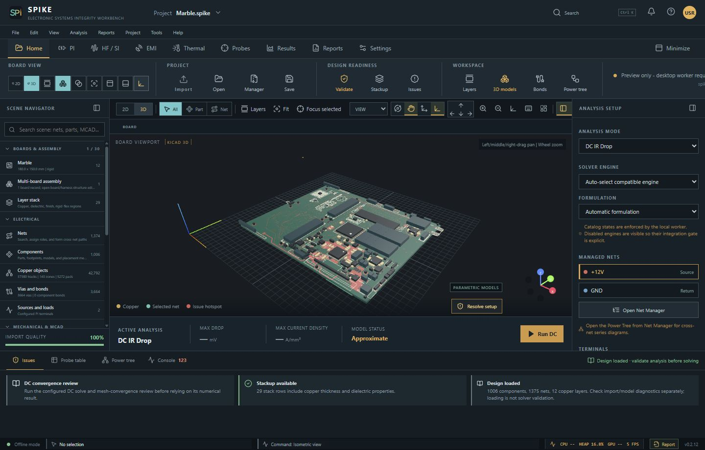
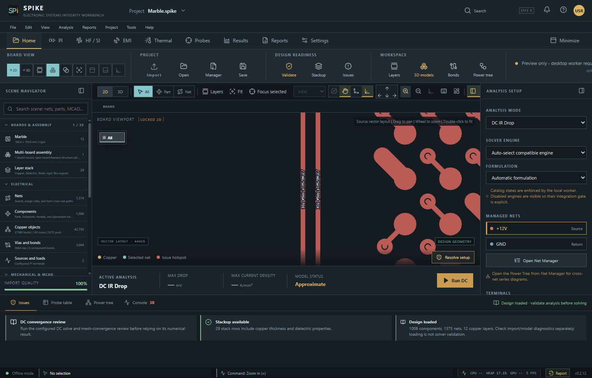
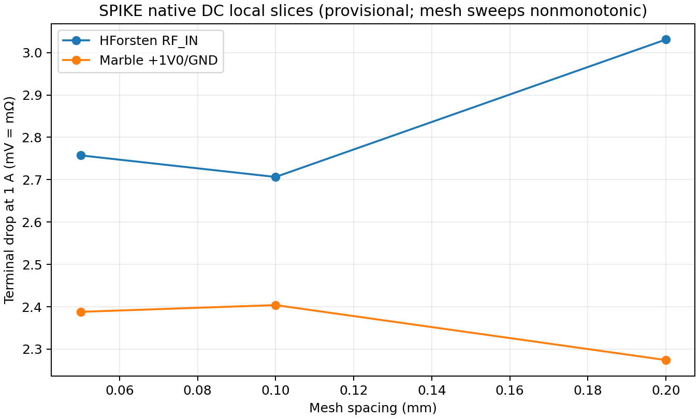
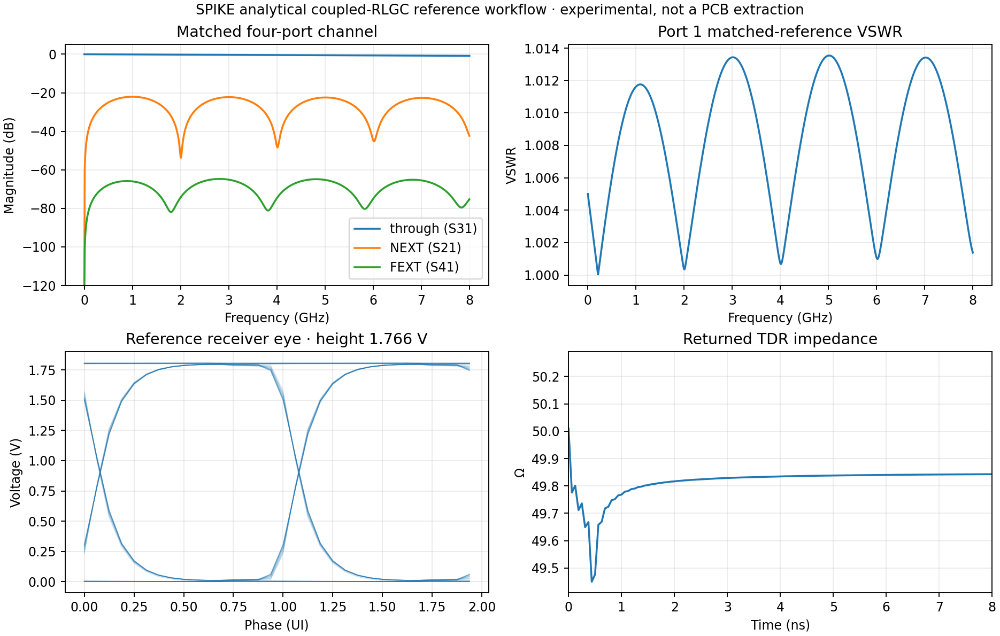
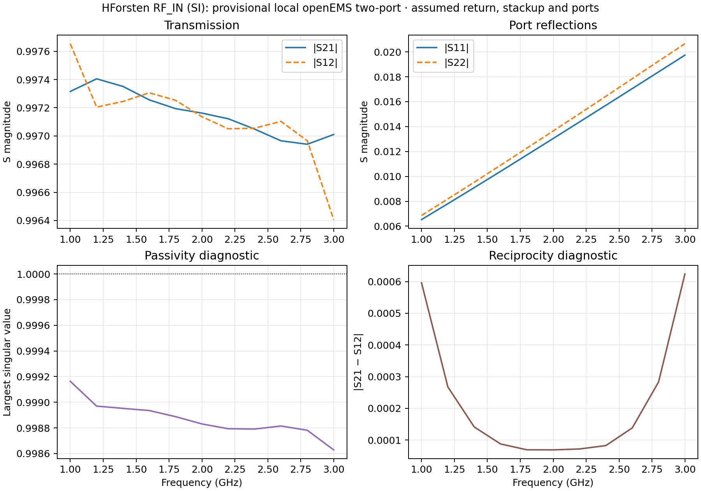

<!-- SPDX-License-Identifier: Apache-2.0 -->

# PI and SI in SPIKE: desktop and openEMS Suite tutorial

This illustrated guide covers board import, internal DC power integrity (PI),
internal signal integrity (SI), extension use, and the optional openEMS Suite.
It is written for the native Tauri desktop. The browser preview can show setup
and saved results, but cannot run the local worker or native file dialogs.

**Result status matters.** The workflows below are engineering previews. An
imported board, a completed preflight, and a plotted result do not establish
mesh convergence or agreement with a fabricated board. Check the result's
`status`, `model_status`, warnings, ports, units, and provenance before using
numbers. See the current [solver status](SOLVER_STATUS.md) and
[validation record](validation/SI_CAPABILITY_VOLUME_PEEC_20260928.md).

## 1. Start the desktop and load a board

For a source checkout, follow [Development setup](../DEVELOPMENT.md), then run
the native desktop on Windows:

```powershell
Set-Location app
npm.cmd run tauri dev
```

If you have a SPIKE desktop package, launch that application instead. Use
**File → New project** or **Open project**, then choose **Home → Import** to
select a supported KiCad `.kicad_pcb` board. Save the resulting `.spike`
project before a long solve. Open **Home → Issues** / **Import Quality** and
resolve blocking diagnostics. Inspect the nets,
layers, tracks, pads, vias, and filled zones against the KiCad source. An
imported layout can still lack the physical stackup or topology needed by a
particular solver.



*Figure 1. Existing SPIKE 0.2.12 browser capture of source-imported Marble
v1.4.4. Procedural component bodies and visible copper provide navigation
context; this picture is not a solved result or proof of material properties.*

Use the **2D** layer view to locate conductors. Select the target layer and
net, zoom to the terminal location, and confirm the selected object's net and
coordinates in the inspector. **View → Show net names** exposes labels on
visible copper at sufficient zoom.



*Figure 2. A historical SPIKE capture showing how net names appear on a
zoomed front-copper layer. Current tab positions may differ.*

For PI and SI, record the actual source and return conductors, the physical
stackup (copper thickness, dielectric thickness and material), and the intended
source/receiver or port planes. Do not replace unknown fabrication values with
unlabelled defaults. Provisional values are useful for exploratory runs when
identified as assumptions.

## 2. Internal DC PI: voltage drop and current flow

1. Open **PI → DC drop**. Choose the exact power net and its connected return.
2. Place a voltage source and current load on mapped copper. Review source,
   load, package, and contact resistance. A terminal placed near copper but
   outside the connected region is not a valid electrical connection.
3. Select a compatible installed internal solver in **Solver Manager**. Run
   **Preview mesh** and fix connectivity, terminal, or resource diagnostics.
4. Run the DC solve. Inspect the voltage at the load, source-to-load drop,
   branch current, current density, loss, warnings, and result provenance.
5. Repeat at several mesh sizes with the same terminals and material
   assumptions. Save the project and open **Reports → Engineering** for a
   reviewable result record.

The internal copper-geometry DC solver supports routed tracks, through vias,
pads, and polygonal zones where admitted by the importer and solver. The mesh
and terminal definitions govern the answer. A low residual is not a mesh
convergence study. [DC solver details](DC_SOLVER.md) and
[PI task sequence](USER_TASK_SEQUENCES.md#start-a-dc-pi-review) give the
underlying model and recovery steps.



*Figure 3. SPIKE native DC runs on provisional HForsten and Marble local copper
slices at 1 A. The plotted source/load terminal drops change nonmonotonically
with mesh size; these are not full-board or converged values. The reproduction
record is [here](validation/PROVISIONAL_PI_SI_OPENEMS_INTERNAL_20260928.md).*

If the report displays **ANALYSIS NOT RUN**, it is a setup record and contains
no numerical model result. The following image illustrates that distinction.


*Figure 4. Existing unsolved Marble report preview. Run and select a result
before interpreting report metrics.*

## 3. Internal SI: channel, crosstalk, reflection, and eye

Open **HF / SI → S-parameter workbench → Source-to-receiver workflow**. The
native desktop worker executes the study. In the first tab, choose one input:

- A **uniform RLGC** line for an analytical channel reference.
- A **Touchstone** network with a known port map and reference impedances.
- An admitted **canonical board path** with an explicit reference conductor.

For a first successful run, use a supplied analytical RLGC or Touchstone case.
Board extraction has tighter geometry, material, and port gates. Define the
source and receiver ports, source impedance and voltage, load impedance,
10–90% rise/fall times, receiver capacitance, and thresholds. Source voltage
is an **open-circuit Thevenin level**; a matched source and load divide the
steady-state voltage. Add package R/L/C, passives, IBIS reduction, or network
edits only when their parameters and limits are understood.

For a coupled four-port channel, the default ordering is **1 aggressor near,
2 victim near, 3 aggressor far, 4 victim far**. With port 1 excited, inspect
**S31** as through transmission, **S21** as NEXT, and **S41** as FEXT. Imported
networks require you to verify their own port ordering. The **NEXT / FEXT**
geometry tab requires a separate victim net; SPIKE does not infer a qualified
crosstalk pair from a single selected net.

Run the study, then inspect S-parameter magnitude/phase, loaded transfer,
driving-point impedance, per-port matched reflection and VSWR, time-domain
reflectometry (TDR), waveform, and eye diagram. Infinite or non-passive VSWR
samples are explicitly marked and omitted from a finite plot. If the requested
frequency grid cannot support the time stage, the result is **partial**:
frequency results may still exist while the eye/TDR stage is blocked. The
[SI workflow reference](SI_WORKFLOW.md) explains the grid, limits, and port
conventions. Save the setup and result JSON or the `.spike` project; a changed
setup makes the prior result stale until rerun.



*Figure 5. Executed analytical coupled-RLGC reference: through, NEXT, FEXT,
matched-reference VSWR, receiver eye, and TDR. This demonstrates the workflow,
not extraction or validation of a PCB. Source and output details are in the
[SI capability record](validation/SI_CAPABILITY_VOLUME_PEEC_20260928.md).*

**E/H field views:** The viewer plots spatial E and H vectors only when the
selected `AnalysisResult` contains actual finite vector samples. The internal
port-network SI workflow reports `field_maps: unsupported`; it cannot derive
spatial fields from S-parameters or a plotted eye. The native PEEC AC path
currently returns approximate driving-point impedance, not a calibrated SI
S-matrix. It requires a compatible native module and remains subject to
geometry, energy, mesh, and human-review gates.

For a headless SI study with a reviewed JSON setup, run from the repository
root:

```powershell
python -m python.spike_core.cli --output result.json si-workflow study.json --touchstone-output channel.s4p
```

`channel.s4p` exports the edited channel network. Its source, receiver, and
passive loading remain a separate loaded-system calculation in the result.

## 4. Find and use extensions

Open **Tools → Extension manager** (also available from **Settings →
Extensions**). Search the installed catalog, select an extension, and review
its provider, permissions, execution method, state, and contributions. Select
a contribution's **Run** button. For contributions requiring parameters,
expand **Extension options**, enter a JSON object, then run that contribution.
Read **Extension output** for the returned status and diagnostics.


*Figure 6. Existing Extension manager capture. It shows catalog, permissions,
and contribution Run buttons; OpenEMS Suite is selected the same way, but is
not the extension pictured here.*

The **Menu bar** and **Title bar** checkboxes appear when an extension
declares those surfaces. They toggle that extension's host-rendered chrome;
the preference persists locally. A hidden bar does not disable the extension.
For an unbundled local extension, review its permissions and use **Trust for
session** before running it. Bundled OpenEMS Suite is trusted by its
distribution-owned location. See the [extension API](EXTENSION_ANALYSIS_API.md)
for package and trust details.

If the catalog is empty, click **Refresh**. This source checkout includes
`extensions/openems_suite/spike-extension.json`; a package built without it
will not show OpenEMS Suite. For a separately obtained extension, place its
package folder under the workspace `extensions` directory or set
`SPIKE_EXTENSION_PATH` to the **parent directory** containing that folder,
then restart/refresh the desktop. There is no in-app download button for the
suite. The extension package and the openEMS solver runtime are separate.

## 5. Install and discover the optional openEMS runtime

OpenEMS Suite offers **PI full-wave setup** and **SI full-wave setup**. Its PI
mode is high-frequency PDN port analysis, not DC voltage drop. The suite does
not offer thermal analysis. It does not download or bundle the openEMS solver.

On Windows, follow the [official openEMS Python installation instructions](https://docs.openems.de/en/latest/python/manual_install.html#windows):

1. Download a Windows package from the project's [release page](https://github.com/thliebig/openEMS-Project/releases) and extract it, for example to `C:\openEMS`.
2. Use a Python version matching the wheels in the extracted `python` folder
   (for example, a `cp313` wheel needs CPython 3.13). In the **same Python
   environment that SPIKE will use**, install the compatible openEMS and
   CSXCAD wheels and required Python dependencies. The official Windows
   commands, adapted to a package extracted at `C:\openEMS`, are:

   ```powershell
   python -m pip install numpy h5py matplotlib
   python -m pip install --no-index --find-links C:\openEMS\python openEMS
   ```
3. Set `CSXCAD_INSTALL_PATH` to the extracted package root so the binding can
   find the native DLLs. Set `OPENEMS_INSTALL_PATH` to the directory containing
   `openEMS.exe` when automatic discovery does not find it.
4. If the bindings are in a separate environment, set `SPIKE_OPENEMS_PYTHON`
   to that environment's absolute `python.exe` path. Restart SPIKE after
   changing persistent environment variables.

For a temporary PowerShell session with a package extracted to `C:\openEMS`,
the path setup is:

```powershell
$env:CSXCAD_INSTALL_PATH = 'C:\openEMS'
$env:OPENEMS_INSTALL_PATH = 'C:\openEMS'
$env:SPIKE_OPENEMS_PYTHON = 'C:\absolute\path\to\compatible\python.exe'
& $env:SPIKE_OPENEMS_PYTHON -c "import CSXCAD, openEMS; print(CSXCAD.ContinuousStructure()); print(openEMS.openEMS())"
```

Check the actual executable location in the extracted package and adjust
`OPENEMS_INSTALL_PATH` accordingly. If a compatible wheel is unavailable for
your Python version, use the [official source-build instructions](https://docs.openems.de/en/latest/install/clone-build-install.html)
or a supported interpreter rather than mixing DLLs and bindings from different
builds. On Linux or macOS, follow the same official installation index for
your platform and verify the two Python native-object constructions above.

SPIKE's **External solver center** or CLI reports discovery separately from
extension discovery. From the repository root:

```powershell
.\spike.cmd external-engines
```

If the executable is found but Python construction fails, the state is
`installed_interface_missing`. A successful probe can be `experimental` or
`reference_validated` for the exact packaged simple-patch fixture; neither
state validates an arbitrary board. The optional solver path may also be
registered explicitly with `spike solver-register external.openems
<absolute-local-path>`; registration records a location, not an installation.

## 6. Run an OpenEMS Suite preflight, then a bounded case

1. Import and review the board as in section 1. Open **Extension manager →
   OpenEMS Suite** and select **SI full-wave setup** or **PI full-wave setup**.
2. Expand **Extension options**. For an initial readiness check, adapt the
   following JSON to real net names and a bounded frequency range:

   ```json
   {
     "operation": "preflight",
     "analysis": {
       "net_names": ["SIGNAL", "GND"],
       "frequency_start_hz": 1000000,
       "frequency_stop_hz": 1000000000,
       "frequency_points": 101,
       "options": {"ports": []}
     },
     "engine_options": {"mesh_resolution_mm": 0.5}
   }
   ```

3. Click the contribution's **Run** button and inspect the preflight's
   geometry, material, resource, and port diagnostics. Empty ports in this
   example are intentional: **it is a diagnostic request, not a runnable
   full-wave case**.
4. Supply an explicit physical stackup and reviewed signal/return lumped
   ports at mapped copper locations. Each port needs a name, 3D `start` and
   `stop` coordinates in millimetres, `direction`, `impedance_ohm`, and
   `excite`; exactly one port is excited per run. Re-run preflight until its
   admission gates pass. Change `operation` to `prepare` to write an
   authenticated case, or `run` to execute openEMS. Use a separate run for
   each excited port needed to assemble a multiport S matrix.
5. Record the case directory, input assumptions, solver/adapter versions,
   mesh, timeout, status, and normalized output. An extension application
   result displayed in **Extension output** is not automatically a saved
   project `AnalysisResult`; save a durable case/result through the CLI or
   retain the case directory.

The headless path for a reviewed analysis request is:

```powershell
.\spike.cmd openems-prepare request.json --case-dir .\my-openems-case
.\spike.cmd openems-run .\my-openems-case --timeout-seconds 300
```

The request schema and CLI examples are in
[external-engine interoperability](EXTERNAL_ENGINE_INTEROPERABILITY.md).
The prepared directory contains `job.json`, `geometry.json`, `object-map.json`,
`artifacts.json`, `engine-input/`, and later `engine-output/normalized-result.json`
and `logs/openems.log`. Keep this directory and the original board revision
together for reproduction.

OpenEMS admission currently blocks drilled pads, via padstacks, unverified
filled zones, and copper cutouts when their full topology cannot be preserved.
Curved pad contours may be faceted and marked approximate. Missing physical
stackup, unclear return path, or unreviewed ports also prevent an accuracy
claim. Marble, White Rabbit, HForsten, and Haasoscope have specific unresolved
full-board conditions described in the
[board comparison record](validation/OPENEMS_BOARD_COMPARISON_20260927.md).



*Figure 7. Saved local HForsten RF_IN openEMS two-port result, 1–3 GHz. The
return plane, FR-4 stackup, and 50-ohm ports were assumed and uncalibrated;
each port was excited in a separate run. Passivity and reciprocity checks catch
gross inconsistencies but do not validate board accuracy. See the
[reproduction record](validation/PROVISIONAL_PI_SI_OPENEMS_INTERNAL_20260928.md).*

## 7. Compare results without hiding model differences

Compare only like quantities with the same geometry, terminal and return
definitions, frequency grid, reference impedance, and material assumptions.
DC milliohm voltage-drop results cannot be compared directly to 50-ohm
S-parameters. A current internal PEEC local-slice AC result is a driving-point
impedance, while the provisional openEMS example is a port-calibrated network
with different return and terminal definitions. Their discrepancy is model
feedback, not a calibration coefficient. The saved
[cross-check](validation/SI_CAPABILITY_VOLUME_PEEC_20260928.md) documents the
limits. Do not fit solver constants to an unvalidated provisional result.

For a credible board benchmark, retain source-board revision/hash, complete
fabrication stackup, filled-copper and via topology, reviewed port planes,
at least a mesh-refinement sequence, independent measurements or a trusted
reference, and the exact solver/runtime versions. The current examples do not
meet that bar.

## 8. Quick recovery table

| Symptom | Next check |
| --- | --- |
| Board imports but solve is blocked | Read Import Quality and the solver's exact geometry/stackup/port diagnostic. |
| Extension absent | Confirm `extensions/openems_suite/spike-extension.json` is in the package; refresh catalog or add an external package root via `SPIKE_EXTENSION_PATH`. |
| Extension visible but cannot run | Review state, permissions, and whether an unbundled package needs **Trust for session**. |
| `installed_interface_missing` | Verify `CSXCAD_INSTALL_PATH`, matching Python wheels/DLLs, and `SPIKE_OPENEMS_PYTHON`; rerun native-object smoke checks. |
| openEMS times out | Review generated mesh size and minimum cell spacing; preserve the failed case/log and reduce the case only with an explicit new assumption. |
| Eye or TDR is missing from SI | Check result `partial` diagnostics, DC and uniform frequency spacing, sampled bandwidth, source length, and port assignments. |
| No E/H plot | Confirm that the selected result actually contains spatial vector samples; network-only SI returns `field_maps: unsupported`. |

For error codes and longer recovery procedures, see the
[error catalog](ERROR_CODE_CATALOG.md) and [troubleshooting guide](../TROUBLESHOOTING.md).

## Image provenance

Figures 1, 2, 4, and 6 reuse SPIKE-owned reviewed help captures already in
this repository; their captions state what is and is not shown. Figures 3, 5,
and 7 were generated by SPIKE repository validation scripts from the explicitly
provisional and analytical records linked above. All seven images are copied
into `docs/tutorial-assets/pi-si-openems/` so this page renders when GitHub
Pages serves `docs/` as its source.
They are result plots, not desktop screenshots. No third-party board image was
added to this tutorial.
