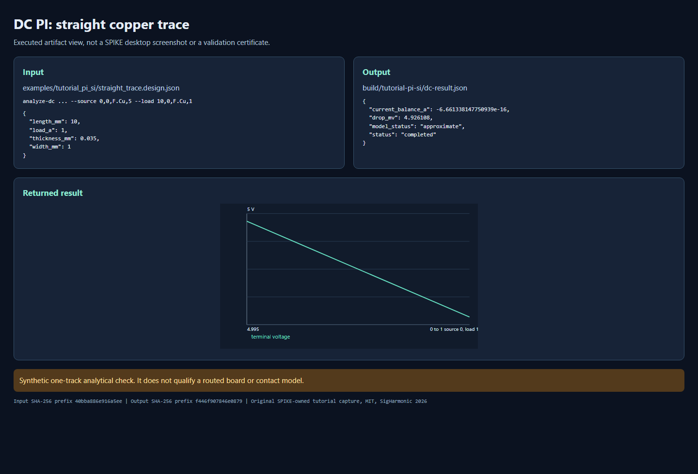
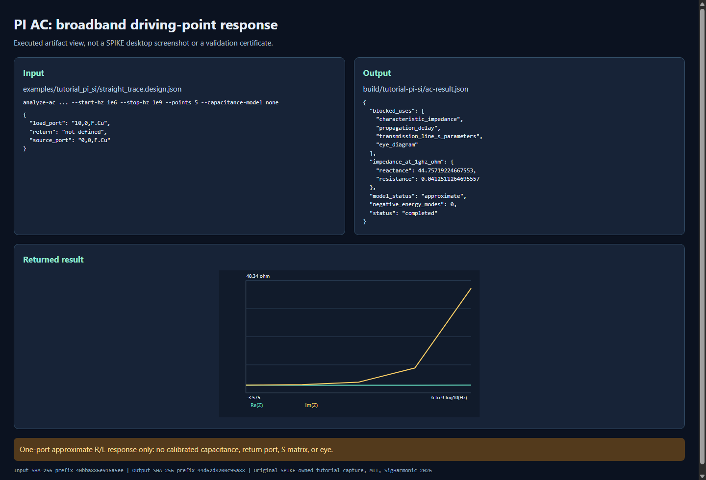
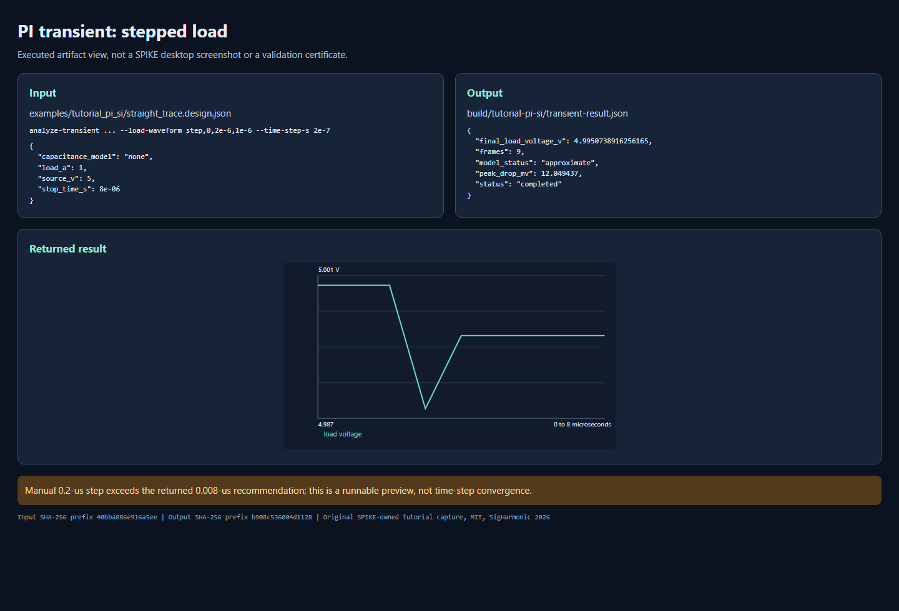
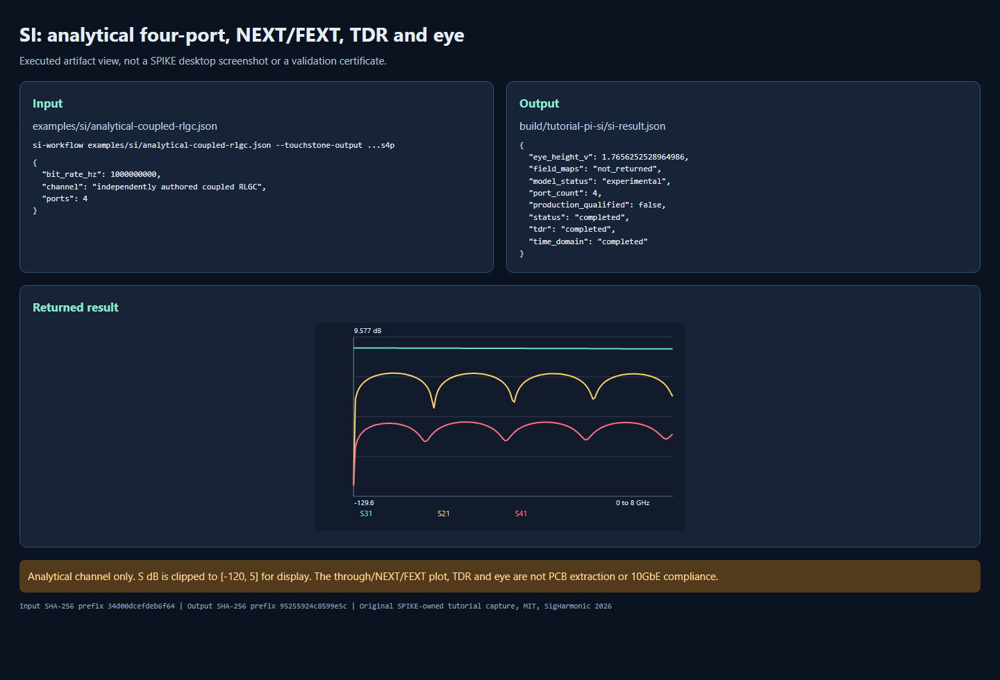
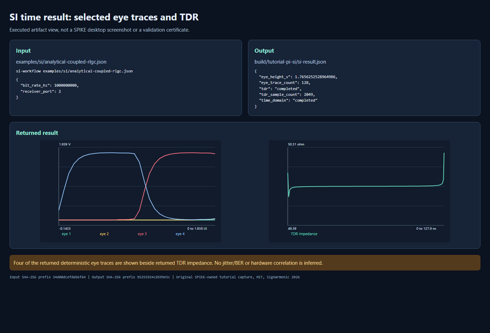
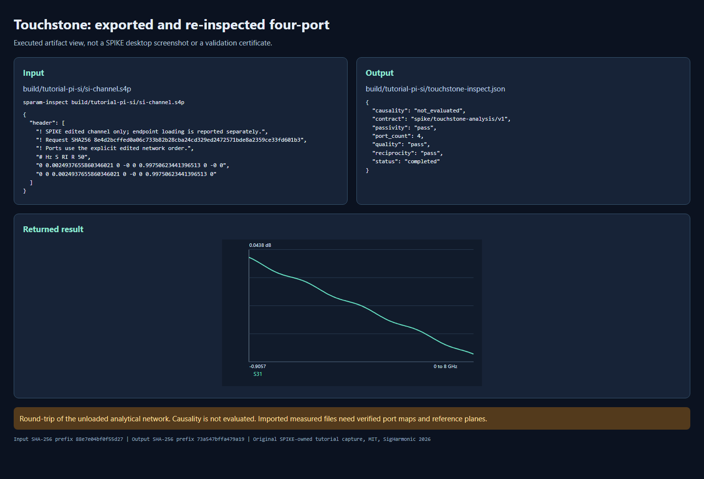
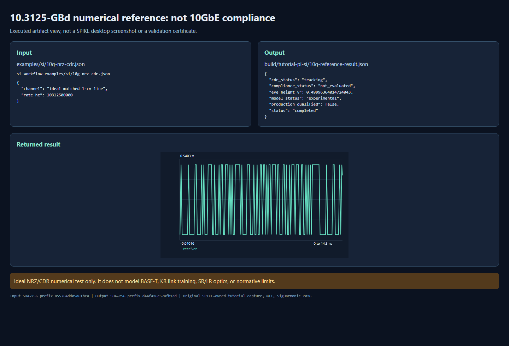
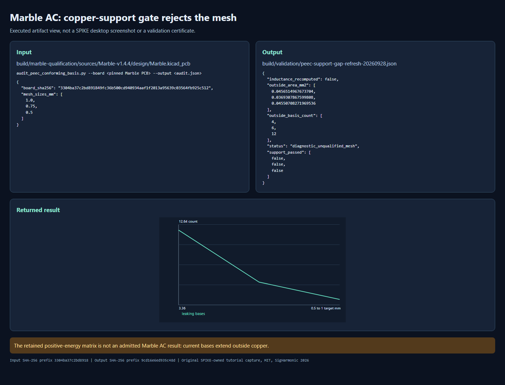

<!-- SPDX-License-Identifier: Apache-2.0 -->
<!-- Copyright (c) 2026 SigHarmonic -->

# PI and SI: seven guided, executable cases

This casebook is for a source checkout. It pairs each input with a command,
returned fields, and a browser screenshot of the *executed artifact view*.
The captures are not screenshots of the SPIKE desktop and do not certify a
fabricated board. For desktop controls, use the [task sequences](USER_TASK_SEQUENCES.md)
and [SI workflow reference](SI_WORKFLOW.md).

Run from the repository root with a Python 3.11 environment containing the
[development dependencies](../DEVELOPMENT.md) and a locally built compatible
native module. The exact session below used
`build/qualification-py311/Scripts/python.exe` on Windows. Substitute your
interpreter for `$py`; all result paths under `build/` are ignored. No
external board is needed for cases 1-6.

```powershell
$py = 'build/qualification-py311/Scripts/python.exe'
New-Item -ItemType Directory -Path build/tutorial-pi-si -Force | Out-Null
```

The original [synthetic 10 mm copper trace](../examples/tutorial_pi_si/straight_trace.design.json)
is 1 mm wide and 0.035 mm thick. Its dielectric row is needed by AC
preflight, but cases 2-3 deliberately disable distributed capacitance. It
has no return conductor, connector, package, or real fabrication data.

## 1. Routed-copper DC PI

Run a 5 V source at the left endpoint and a 1 A load at the right:

```powershell
& $py -m python.spike_core.cli --output build/tutorial-pi-si/dc-result.json --quiet analyze-dc examples/tutorial_pi_si/straight_trace.design.json --net VCC --source 0,0,F.Cu,5 --load 10,0,F.Cu,1 --mesh-size-mm 2 --save-request build/tutorial-pi-si/dc-request.json
```

Open the saved request and result. The result must say `completed` and
`approximate`. At 1 A, the returned load drop was **4.926108 mV** and source
current imbalance was below `7e-16 A`. The independent uniform-conductor
check is `R = length/(conductivity * width * thickness)`, with copper
conductivity `5.8e7 S/m`; it predicts **4.926108 mOhm**. This checks the
synthetic straight trace, not zone topology, contact resistance, or a board.



## 2. AC/broadband PI driving-point impedance

```powershell
& $py -m python.spike_core.cli --output build/tutorial-pi-si/ac-result.json --quiet analyze-ac examples/tutorial_pi_si/straight_trace.design.json --net VCC --source 0,0,F.Cu,source --load 10,0,F.Cu,load --start-hz 1000000 --stop-hz 1000000000 --points 5 --mesh-size-mm 2 --capacitance-model none --save-request build/tutorial-pi-si/ac-request.json
```

Inspect `networks.parasitics[0].impedance` and `blocked_uses`, not just
`status`. This run returned `completed/approximate`, zero rejected
inductance modes, and **0.04125 + j44.75719 Ohm at 1 GHz**. It returned no
qualified C or G. Characteristic impedance, propagation delay, transmission-
line S-parameters, and eye use are explicitly blocked. The frequency sweep
demonstrates the R/L code path, not a calibrated PDN port or broadband signoff.



## 3. Geometry-derived PI transient

```powershell
& $py -m python.spike_core.cli --output build/tutorial-pi-si/transient-result.json --quiet analyze-transient examples/tutorial_pi_si/straight_trace.design.json --net VCC --source 0,0,F.Cu,5 --load 10,0,F.Cu,1 --source-waveform constant --load-waveform step,0,2e-6,1e-6 --stop-time-s 8e-6 --time-step-s 2e-7 --output-decimation 5 --output-decimation-mode manual --capacitance-model none --mesh-size-mm 2 --save-request build/tutorial-pi-si/transient-request.json
```

The returned nine frames show a stepped-load dip and recovery to
**4.995074 V** at the load; the maximum reported transient drop was
**12.049437 mV**. The chosen `0.2 us` step is **25 times** the solver's
`0.008 us` recommendation. This screenshot demonstrates execution and
interpretation, not time-step convergence. Re-run with refined time steps
before relying on a transient peak; the model has no distributed C or
semiconductor device.



## 4. SI channel, crosstalk, TDR and eye

The independently authored [coupled-RLGC request](../examples/si/analytical-coupled-rlgc.json)
has four ports. The input ordering is aggressor near, victim near, aggressor
far, victim far. With port 1 excited, `S31` is through, `S21` NEXT, and
`S41` FEXT. It is **not** an extracted PCB channel.

```powershell
& $py -m python.spike_core.cli --output build/tutorial-pi-si/si-result.json --quiet si-workflow examples/si/analytical-coupled-rlgc.json --touchstone-output build/tutorial-pi-si/si-channel.s4p
```

The returned frequency, time-domain, and TDR stages completed, with four
ports and a **1.765625 V** deterministic reference-eye height. The waveform,
TDR and eye are in `time_domain.receivers` and `tdr`; no spatial E/H samples
are returned (the development UI may explicitly label them `unsupported`),
and `production_qualified` is false. The first capture
shows the exact input/output and a display-clipped S plot; the second shows
four returned eye traces alongside the returned TDR.





For a board path, inspect net connectivity, a separate return and victim,
stackup, reference planes and source/receiver port maps in the desktop before
trying the geometry tab. A selected net and a plotted eye do not qualify the
board-to-channel extractor. See the [geometry channel scope](GEOMETRY_DERIVED_SI_CHANNEL.md)
and [solver status](SOLVER_STATUS.md).

## 5. Touchstone output and re-inspection

The previous command exports an *unloaded* four-port `.s4p`. Re-read it:

```powershell
& $py -m python.spike_core.cli --output build/tutorial-pi-si/touchstone-inspect.json --quiet sparam-inspect build/tutorial-pi-si/si-channel.s4p
```

Expect four ports, `completed`, and sampled passivity/reciprocity checks
`pass` for this analytical network. **Causality is `not_evaluated`**, not
passed. Verify the imported file's physical port order, impedances, reference
planes, frequency coverage, and units before using any other Touchstone
file. The capture binds the exported header to the re-inspected output.



## 6. 10.3125-GBd NRZ/CDR numerical reference

```powershell
& $py -m python.spike_core.cli --output build/tutorial-pi-si/10g-reference-result.json --quiet si-workflow examples/si/10g-nrz-cdr.json
```

The ideal matched 1 cm line returned `completed/experimental`, a
**0.499964 V** deterministic eye height, and a CDR state of `tracking`.
`production_qualified` is false. Neither that bitrate nor an open eye
means 10GbE compliance.



Choose the intended PHY before comparing evidence. Public IEEE 802.3
[family material](https://www.ieee802.org/3/hssg/public/sep06/law_01_0906.pdf)
distinguishes electrical-backplane 10GBASE-KR, four-pair copper 10GBASE-T,
850 nm multimode optical 10GBASE-SR, and 1310 nm single-mode optical
10GBASE-LR. An [IEEE 802.3ap plenary record](https://www.ieee802.org/3/minutes/mar05/0305_ap_open_report.pdf)
records the 10.3125-GBd KR baseline. These public development records are
context, **not** normative compliance procedures. `assess_10gbe_evidence`
uses SPIKE-authored inventory labels, never IEEE clause names:

```powershell
& $py -c "from python.spike_core.si_ethernet_qualification import assess_10gbe_evidence; import json; print(json.dumps(assess_10gbe_evidence('10GBASE-KR', ['linear_nrz_10_3125_gbd_reference'], reference_rate_hz=10_312_500_000.0), indent=2))"
```

It returns `kr_linear_nrz_numerical_foundation` as exploratory scope,
`pcb_channel_extraction_qualified: false` and
`compliance_status: not_evaluated`. T, SR and LR return no exploratory
scope for this NRZ fixture. Supplying strings that name all missing evidence
cannot assert compliance; that requires a reviewed mode-specific procedure
and actual correlation.

## 7. Marble AC is a *rejection* tutorial

The source board is not bundled. The evaluation uses Berkeley Lab's
[Marble v1.4.4](https://github.com/BerkeleyLab/Marble) at pinned source
SHA-256 `3304ba37c2bd891849fc36b500cd940934aaf1f2013a95639c03564fb925c512`.
Its CERN OHL v1.2 license and source remain with the board author; the
capture below contains only SPIKE-derived audit metrics, not the board file.
After obtaining the exact board and checking that hash, run:

```powershell
& $py scripts/audit_peec_conforming_basis.py --board build/marble-qualification/sources/Marble-v1.4.4/design/Marble.kicad_pcb --output build/validation/peec-support-gap-refresh-20260928.json
```

The refreshed 1/0.75/0.5 mm meshes had **4/6/12 current bases outside
copper**; none passed support. This makes the AC result inadmissible even
when a partial-inductance matrix has no negative-energy modes. A separate C
audit gave 4.206835/4.729905/4.729905 pF at 1/0.5/0.25 mm but omitted
11 via branches at *every* level, so it cannot qualify capacitance. The
full [repair record](validation/PEEC_REFINEMENT_REPAIR.md) and
[solver status](SOLVER_STATUS.md) take precedence over older counts.



Closing this gate requires a native current basis whose support stays in
copper and conserves face flux; consistent R/L and via interactions; complete
C/return coverage; calibrated multiport definitions; three-level convergence;
independent correlation; and knowledgeable human numerical review. Do not
replace the failed gate with passivity projection or an assumed capacitance.

## Reproduce the captures and interpret them safely

`scripts/render_pi_si_tutorial_pages.py` verifies the executable outputs,
including the analytical DC check and explicit blocked SI uses, then creates
up to eight offline HTML artifact views under `build/tutorial-pi-si/pages/`.
The Marble page is optional unless the exact board and audit are present.
Screenshots here were taken with local headless Chrome from those HTML pages.
They show input, output, and returned result together; they are **not**
application-UI captures. Each page displays SHA-256 prefixes of its exact
input and output. See the [asset provenance](tutorial-assets/pi-si-casebook/README.md)
for the capture command and redistribution statement.

```powershell
& $py scripts/render_pi_si_tutorial_pages.py
```

All eight images are original SPIKE-owned captures under Apache 2.0. The synthetic
fixture is original. The Marble board itself, packaged native binaries,
generated full result JSON, and downloaded dependencies are not committed by
this tutorial. A passing example or attractive graph does not override the
result's `model_status`, `blocked_uses`, missing evidence, or release gate.
