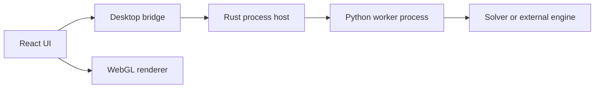

# Stability and Recovery

SPIKE runs untrusted design inputs, large geometry, native graphics, and long
numerical jobs. Stability therefore relies on explicit boundaries rather than
assuming every operation succeeds.

## Failure domains

A worker or solver failure must not terminate the desktop process. A React
render failure must show the recovery boundary. A malformed source must fail
import or carry explicit diagnostics; it cannot become a silently valid board.

## Implemented protections

### UI

- `AppErrorBoundary.tsx` catches uncaught render failures and offers reload,
  interface-state reset, and copyable diagnostics.
- `workerBridge.ts` catches native invocation rejection and always returns a
  structured `WorkerResponse`.
- heavy operations have operation IDs and frontend admission control.
- activity events report start, completion, failure, rejection, and duration.
- local preference writes tolerate unavailable browser storage.
- large scalar ranges use iterative reducers instead of spreading arrays into
  JavaScript function arguments.
- project save records bounded dock layout plus exact 2D and 3D viewport state
  through `spike/workspace-state/v1`; reopen restores the active view without
  an unconditional fit.

### Native host

- worker execution is asynchronous through `spawn_blocking`.
- one heavy operation runs at a time.
- stdin, stdout, and stderr have size limits.
- stdout and stderr are drained concurrently to avoid pipe deadlock.
- a request-aware watchdog terminates a stalled worker.
- worker processes use hidden-window flags on Windows.
- native file writes are restricted to paths selected by a native dialog.

### Worker and importers

- every response includes request metadata and elapsed duration.
- health is separate from solver catalog discovery.
- parser syntax errors raise instead of returning a partial parser.
- recoverable object diagnostics are attached to `DesignIR`.
- importer selection is explicit and unsupported formats fail clearly.

## Recovery behavior

| Failure | User-visible behavior | Data effect |
|---|---|---|
| Worker busy | New heavy request is rejected with active operation ID | Existing project unchanged |
| Worker timeout | Operation fails with watchdog diagnostic | Partial worker output discarded |
| Malformed worker JSON | Protocol error | Result not installed |
| Parser syntax failure | Import fails | Existing project remains open |
| React render failure | Recovery screen | Saved project files untouched |
| Local UI state corruption | Reset interface state | Project files untouched |
| Invalid optional workspace state | Reject invalid view values and fit active design | Design, analyses, and results remain available |
| Missing optional solver | Capability unavailable | No synthetic result generated |

## Remaining high-priority work

- Solver-level checkpoint/resume; current Stop terminates the owned worker by
  operation ID rather than checkpointing numerical state.
- Progress streaming for mesh and solver phases rather than elapsed time only.
- A persistent crash bundle with logs, versions, resource snapshots, and input
  hashes while excluding embedded confidential design data by default.
- WebGL context-loss recovery and per-scene GPU budget reporting.
- Process-boundary integration tests for timeout, cancellation, malformed
  output, oversized output, and forced worker termination.
- Checkpointed or restartable long batch analyses.
- Dedicated bundled Python/runtime verification on every release platform.

## Stability test matrix

Every release should exercise:

- malformed and truncated EDA files;
- 2, 4, 10, 20, and 32 copper-layer boards;
- boards with missing stackup and missing 3D models;
- large zones, via fields, dense components, and rigid-flex regions;
- worker timeout and forced process exit;
- repeated run/open/close cycles;
- viewport resize, collapse, dock, and context loss;
- exact dock, active-tab, 2D view-box, and 3D camera recall after save/reopen;
- reports with no result, one result, batch results, and large fields;
- Windows, Linux, and macOS package launch while offline.

## Incident workflow

1. Preserve the operation ID, version, platform, and project hash.
2. Reproduce with the CLI or direct worker to separate UI from solver failure.
3. Minimize the design or request while retaining the failure.
4. Add a failing automated fixture.
5. Fix the lowest responsible boundary.
6. Verify no capability status or numerical warning was weakened.
7. Add the root cause and recovery behavior to release notes.

Never resolve instability by silently lowering mesh fidelity, skipping source
objects, or turning a failed numerical result into an approximate success.
