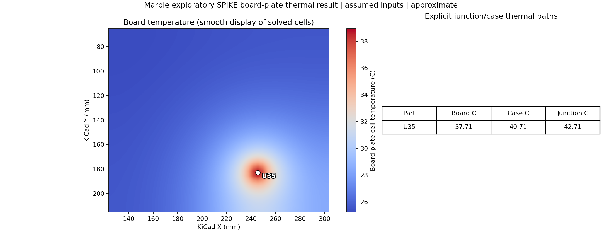
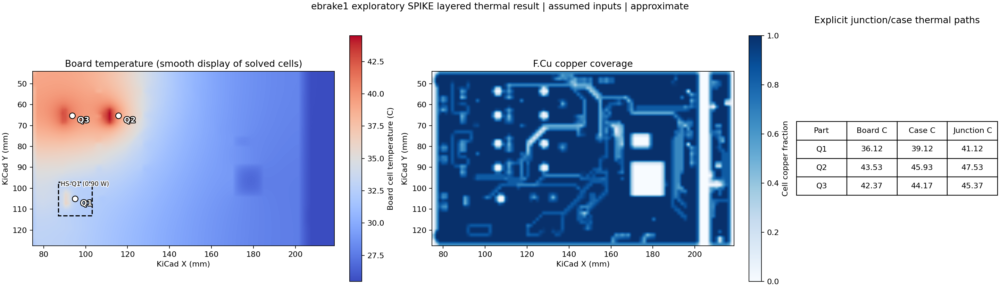
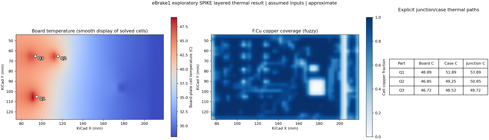
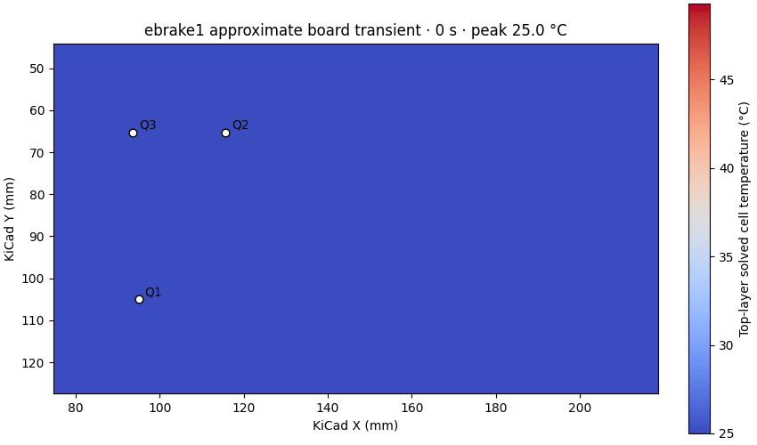

<!-- SPDX-License-Identifier: Apache-2.0 -->

# SPIKE thermal simulation: a practical user guide

This guide takes a KiCad board from import to a saved temperature map and a
component junction-temperature review. The first exercise uses the public,
open-source [Berkeley Lab Marble v1.4.4](https://github.com/BerkeleyLab/Marble/tree/v1.4.4)
board. The second uses SPIKE's bundled eBrake1 development fixture to show
layered copper, pads, vias, and fuzzy coverage. All supplied losses, material
properties, thermal resistances, and cooling coefficients are **illustrative**.
Neither exercise predicts the temperature of a fabricated board.


*The image is a KiCad front-copper export of Marble, not a temperature plot.
Marble's upstream copyright, CERN OHL v1.2 statement, U.S. Government notice,
and image provenance are in [third-party notices](../THIRD_PARTY_NOTICES.md).
The SPIKE-authored plots below are simulation results.*

## Choose the board model

| Model in **Thermal setup → Board thermal** | What it uses | Appropriate first question |
| --- | --- | --- |
| **Uniform 2D plate** | Board bounding rectangle, one effective in-plane conductivity, thickness, convection, and explicit heat contacts | Where does an assumed heat load create a broad board gradient? |
| **Layered 3D stack (approximate)** | Ordered physical stackup, sampled copper on each layer, dielectric, plated via/barrel links, imported pad contacts, and optional transient cell heat capacity | How do the modeled copper distribution and pad/via paths change an exploratory gradient over time? |
| **Component steady/transient** | Lumped part and object thermal RC network | What temperature or cooldown follows explicit power, resistance, and heat capacity inputs? |

The board models run in SPIKE's **local desktop worker**. No openEMS or OpenFOAM
installation is needed for either exercise. The browser-only preview cannot run
the local worker. The component network is a separate model; its colored part
markers are **not** a spatial board temperature field. See the
[thermal workflow](THERMAL_WORKFLOW.md) for that path and the optional OpenFOAM
case flow.

**What “3D” means here:** the layered solver has an X–Y temperature grid for
every physical copper and dielectric row and couples adjacent rows vertically
through two half-cell conduction resistances. Plated via and drilled-pad barrels
add parallel vertical heat paths over their imported spans. Heat can therefore
flow laterally and through the full board thickness. There is **one depth cell
per stackup row**, not a tetrahedral mesh or a resolved copper foil/package
volume. The UI presents selectable layer maps, not a volumetric 3D temperature
rendering.

## 1. Prepare a board and review its physical inputs

1. Start the SPIKE native desktop and choose **Home → Import**. Pick a
   `.kicad_pcb` file. Wait for import to finish and review **Issues** for
   missing or unsupported geometry. Use **Home → Stackup** to inspect physical
   copper/dielectric order and thickness. A layered run needs a complete
   positive-thickness physical stackup; otherwise choose the plate model.
2. Identify the heat-producing reference designators. Assign **dissipated
   power in W** from an operating-point calculation or measurement, not from
   a component's rated power. Record the ambient temperature, board thickness,
   exposed faces, and cooling assumptions separately.
3. Obtain **junction-to-case** and **case-to-board** resistances in K/W for the
   intended package, mounting, solder, and board contact. They are independent
   inputs; a datasheet junction-to-case value alone does not specify the
   board path. For a production estimate, review package orientation and the
   datasheet's definition of the case measurement point.
4. Decide whether heat enters through **Imported pads** or a **Square
   fallback** of a measured width. Imported pad count and dimensions can be
   inspected in the table. For BGA and QFN parts, use a grid fine enough to
   resolve the relevant pads and exposed land, then inspect each pad heat path.
   If the UI reports pads narrower than the grid step, refine before using the
   result. Pad contacts are a lumped case-to-board coupling; solder, die, lead
   frame, and package solids are not resolved.

For a new board, save the source revision, board hash, stackup certificate,
component power calculation, material data, and cooling measurements alongside
the project. These inputs dominate physical uncertainty.

## 2. Open thermal setup and enter the model

Select the **Thermal** ribbon tab and **Thermal setup**. In **Board thermal**:

1. Set **Board model** to *Uniform 2D plate* or *Layered 3D stack
   (approximate)*. A missing physical stackup disables layered mode.
2. Enter **board thickness** and **grid step** in mm, and **top/bottom
   convection** in W/(m²·K). Set the scenario ambient in °C. At least one
   convection coefficient must be positive. A smaller grid step resolves
   contacts more finely but costs more memory and time; the panel reports
   cells per layer and its 8,192-cell-per-layer UI limit.
3. For a plate, enter **Effective board conductivity** in W/(m·K). This is a
   user-supplied effective value, not one extracted from traces. For a layered
   model, enter dielectric/copper conductivity, optional via plating thickness,
   and the geometry switches **Copper layers**, **Vias**, **Tracks**, **Pads**,
   and **Zones**. Review the imported physical thickness shown by the panel;
   the entered thickness must agree within 5%.
4. Tick each powered component's **Use** box. Enter its power, junction–case
   and case–board resistances, and contact mode. *Square fallback* additionally
   needs a positive width in mm. Imported pads require eligible copper pads.
5. Choose **Save board inputs** to keep the setup, then **Run board thermal**.
   A completed run shows `approximate`. A changed input marks the old result
   stale until you rerun. Use **Home → Save** to retain the project and result.

### Optional mathematical heatsink on the layered board

In **Virtual board heatsinks**, choose **Add virtual heatsink**. Enter top or
bottom face, X/Y center and rectangular contact width/height in mm, interface
resistance in K/W (zero is allowed), and positive sink-to-ambient resistance in
K/W. The footprint must lie inside the modeled board rectangle. SPIKE adds one
isothermal sink node; each covered surface cell conducts to it through half its
depth and its area-weighted portion of the interface resistance. The sink node
loses heat to the specified ambient through the sink-to-ambient resistance.
The result table reports its board-contact temperature, sink temperature, and
heat flow to ambient. Total outward heat includes that flow and top/bottom
convection. Compare a run with and without the sink while holding all other
inputs fixed.

This is a **mathematical thermal boundary**, useful when a reviewed heatsink
`RθSA` and contact `RθCS` are known. It does not derive resistance from fin
dimensions or solve 3D fins, thermal-interface thickness variation, fan flow,
or case-to-heatsink mechanics. The separate assembly/CFD **Integrated
heatsinks** entries do not automatically couple to the layered board solver.
Plate mode rejects a virtual board heatsink because it has no resolved surface
depth.

### What the heat-path inputs mean

SPIKE computes a board contact temperature from the solved board field. For a
part whose full dissipation flows through the assigned board contact, the
reported case and junction are

```text
T_case     = T_board_contact + P × R_case_board
T_junction = T_case          + P × R_junction_case
```

`P` is W; both resistances are K/W; each product is a temperature rise in K
(numerically the same difference in °C). This path assumes no separately
modeled case-to-air branch. Do not add another path without checking whether
it represents distinct physical cooling.

## 3. Open-source exercise: Marble uniform board plate

[Marble v1.4.4](https://github.com/BerkeleyLab/Marble/tree/v1.4.4) is an
open-source dual-FMC carrier. Its source README states CERN OHL v1.2 and a
U.S. Government rights notice. SPIKE does **not** bundle this board for the
thermal example. The pinned SHA-256 and checkout instructions are also in the
[Marble provenance record](MARBLE_CLI_QUALIFICATION_PLAN.md). Keep its upstream
README and notices with any redistributed board source.

From the SPIKE repository root, obtain the exact tagged source:

```powershell
git clone --branch v1.4.4 --depth 1 https://github.com/BerkeleyLab/Marble.git `
  build/marble-qualification/sources/Marble-v1.4.4
(Get-FileHash build/marble-qualification/sources/Marble-v1.4.4/design/Marble.kicad_pcb -Algorithm SHA256).Hash
```

The expected hash is
`3304ba37c2bd891849fc36b500cd940934aaf1f2013a95639c03564fb925c512`.
If the checkout already exists, skip the clone and check the hash. The
[example input](../examples/thermal/marble_v144_plate_thermal.json) pins that
hash; its run command rejects a different file. Import that board in SPIKE.

Enter the following **teaching assumptions**, selected to demonstrate the
workflow rather than to describe the actual Marble assembly:

| Input | Value |
| --- | ---: |
| Model, ambient | Uniform 2D plate, 25 °C |
| Effective conductivity, thickness | 20 W/(m·K), 1.6 mm |
| Top and bottom convection | 10 W/(m²·K) each |
| Grid step | 4 mm |
| U35 illustrative loss, square contact | 1 W, 10 mm width |
| U35 junction–case, case–board | 2 K/W, 3 K/W |

Select only **U35** for this exercise. The saved result is a **45 × 38** grid
with 1 W input, about 1 W outward heat, a maximum board cell of 38.94 °C,
37.71 °C at the U35 contact, 40.71 °C case, and 42.71 °C junction. Its energy
balance error is about `6.4×10⁻¹³ W`; this checks the discrete solve, **not**
the assumed physics of Marble. The full [result JSON](validation/marble-v144-plate-thermal-result.json)
and [figure](validation/marble-v144-plate-thermal.png) are saved here.



The blue-to-red map is the solved plate-cell field, with smooth color
interpolation **only for display**. It uses a rectangular board bound; the
hotspot does not establish that U35 is actually Marble's hottest component.
Its other sources, copper, real cooling, and package data were not modeled.

To reproduce and save new artifacts without overwriting the checked-in record:

```powershell
.\.venv\Scripts\python.exe scripts/run_board_thermal_example.py `
  --input examples/thermal/marble_v144_plate_thermal.json `
  --result build/marble-thermal-result.json `
  --figure build/marble-thermal.png
```

Use the project's Python environment and installed dependencies. A changed
power or physical input should be saved as a new input JSON before comparison.

## 4. Layered exercise: bundled eBrake1 fixture

The checked-in [eBrake1 input](../examples/thermal/ebrake1_layered_thermal.json)
and [board](../app/public/demo/ebrake1.kicad_pcb) provide a reproducible
**SPIKE development fixture**. Its upstream open-hardware license has not been
established in this repository, so do not treat it as the open-source example
or redistribute it on the strength of this guide.

Import the bundled board. It has seven physical rows: F.Cu, prepreg, In1.Cu,
core, In2.Cu, prepreg, B.Cu, totaling 1.58 mm. Select the layered model and
enter 1.6 mm thickness, 1.5 mm grid step, 25 °C ambient, 10 W/(m²·K)
convection on both faces, 0.3 W/(m·K) dielectric and 385 W/(m·K) copper.
Keep copper, tracks, pads, zones, and vias enabled; enter 0.025 mm via plating
and **0 mm copper blur sigma**. Select Q1, Q2, and Q3 with *Imported pads*:

| Part | Assumed power | Junction–case | Case–board |
| --- | ---: | ---: | ---: |
| Q1 | 1.0 W | 2 K/W | 3 K/W |
| Q2 | 0.8 W | 2 K/W | 3 K/W |
| Q3 | 0.6 W | 2 K/W | 3 K/W |

The [saved layered result](validation/ebrake1-layered-thermal-exact-result.json)
contains **96 × 56 × 7** cells, 2.4 W input/outward balance, and the
temperature/coverage plot below. The values are hypothetical example results.


| Part | Board contact | Case | Junction |
| --- | ---: | ---: | ---: |
| Q1 | 49.03 °C | 52.03 °C | 54.03 °C |
| Q2 | 47.88 °C | 50.28 °C | 51.88 °C |
| Q3 | 47.67 °C | 49.47 °C | 50.67 °C |

Each has six imported pad-face contacts in the result. Expand **Q1 pad heat
paths** in the UI to inspect per-pad area, contact temperature, and heat W;
the other two parts work the same way. The nonplated mounting holes are
excluded. This still does not solve the package as a 3D solid.

Run the checked-in case from the repository root:

```powershell
.\.venv\Scripts\python.exe scripts/run_board_thermal_example.py `
  --input examples/thermal/ebrake1_layered_thermal.json `
  --result build/ebrake1-layered-result.json `
  --figure build/ebrake1-layered.png
```

See the [numerical record](validation/EBRAKE1_LAYERED_THERMAL_20260928.md)
for conservation checks, refinement results, and the exact limitations.

### Virtual heatsink comparison on the same fixture

The [virtual-heatsink input](../examples/thermal/ebrake1_layered_virtual_heatsink.json)
keeps the same illustrative board and part settings and adds `HS-Q1`: a 16 mm
square top contact near Q1, 1 K/W interface, and 8 K/W sink to ambient. The
[saved result](validation/ebrake1-layered-virtual-heatsink-result.json) sends
about **0.90 W** through this mathematical sink and **1.50 W** through board
convection; the two paths total 2.40 W within solver balance. Q1 junction
changes from **54.03 °C** without the sink to **41.12 °C** with it. Q2 and Q3
also change because board spreading couples their temperatures. This is a
sensitivity example, not a heatsink rating or fabricated-board prediction.
The [virtual-sink numerical record](validation/EBRAKE1_VIRTUAL_HEATSINK_20260928.md)
derives its conductances and shows a three-step grid comparison; part
temperatures are not yet mesh converged.



Reproduce it with the same script and the virtual-heatsink input, writing the
result and figure to distinct files under `build/`.

## 5. Explore layers, copper, and faster approximate previews

After a layered run, choose **Temperature layer** to view the top surface or
any stackup row. Tick **Show copper coverage** to overlay sampled copper on a
selected layer. The white overlay in the desktop is fractional coverage; the
separate figure above shows it in blue for clarity. Hover a cell for the
original numerical value and coordinates. **Smooth thermal display** blends
plotted colors only. It does not change the solution or the JSON values.

For a **fuzzy copper** study, enter a positive **Copper blur sigma** in mm.
This applies Gaussian blur to copper coverage on each layer **before solving**.
It can bridge gaps and alter heat paths, so label the result approximate and
retain an unsmoothed reference. Increasing the **grid step** separately reduces
cell count. The saved eBrake comparison used 3 mm cells and 1.5 mm blur:



The [fuzzy result](validation/ebrake1-layered-thermal-fuzzy-result.json) has
9,408 volume cells versus 37,632 in the 1.5 mm unsmoothed case. Its largest
junction difference from that reference is 1.02 °C. The
[single-run benchmark](validation/ebrake1-layered-fuzzy-benchmark.json)
found no demonstrated speed gain from blur alone at the same grid; the coarse
grid was faster. These differences are diagnostics, **not** error bounds.

## 6. Animate the layered board and inspect transient analytics

In **Thermal setup → Board thermal**, select **Layered 3D stack** and enable
**Solve transient board field**. Enter the end time, time step, saved-frame
stride, and copper/dielectric volumetric heat capacities in J/(m³·K). Run the
board solve. Use the time slider or **Play** to inspect the selected physical
layer. The copper coverage overlay and component locations remain visible;
the temperature colors use a fixed scale across the animation. The peak-board
curve and stored-energy/balance diagnostics describe the solved board cells.
**Show steady** returns to the separately solved steady map. Save the project
to retain the input and result JSON.

The [eBrake1 transient input](../examples/thermal/ebrake1_layered_transient.json)
and [numerical record](validation/EBRAKE1_LAYERED_TRANSIENT_20260928.md)
provide a reproducible 600 s example with a seven-frame animation:



For a separate **component RC transient**, enter part heat capacities in
**Component transient controls** and run **Run transient**. Its overlay colors
the actual part-node temperatures at the selected time and reports each part's
peak, peak time, time to 90% of its steady rise, and final-to-steady gap. These
markers are lumped object temperatures, not a sampled spatial board field.
The layered board animation likewise leaves case and junction resistance-chain
estimates at their steady values; it does not solve package heat capacity.

```powershell
.\.venv\Scripts\python.exe scripts/run_board_thermal_example.py `
  --input examples/thermal/ebrake1_layered_transient.json `
  --result build/ebrake1-transient.json `
  --figure build/ebrake1-transient-final.png `
  --animation build/ebrake1-transient.gif
```

Refine the time step with the same physical inputs before interpreting
rise time. The saved example's 20, 10, and 5 s comparison is in the numerical
record. Its material capacities and constant losses are illustrative.

## 7. Analyze and report the results

1. Confirm `status: completed`, `model_status: approximate`, and
   `provenance.production_qualified: false` in the saved JSON. Review diagnostics before
   quoting any temperature. Confirm total assigned W, outward W, and linear
   residual. A small energy error checks conservation of the **discrete
   model**; it cannot validate unknown cooling or material inputs.
2. Compare **maximum board cell**, **board contact**, **case**, and **junction**
   separately. The hottest cell need not be the contact-weighted part
   temperature. Verify the `P × R` rises: in the Marble example, 1 W through
   3 K/W raises case by 3 °C, then 2 K/W raises junction by 2 °C.
3. Rerun with smaller grid steps while holding **physical** contact size,
   power, material, and cooling fixed. Compare per-part temperatures and peaks;
   the eBrake [refinement table](validation/EBRAKE1_LAYERED_THERMAL_20260928.md#model-and-checks)
   is not fully converged, so a single colorful map is not an accuracy claim.
4. Vary uncertain inputs one at a time, especially heat load, case-to-board
   resistance, convection, effective conductivity, and via plating. Save each
   input/result pair with a distinct name. A sensitivity range is useful, but
   cannot replace measurement correlation.
5. For a design decision, compare against the component's **specified limit
   at the operating condition**, include uncertainty and margin, and measure
   a representative board. Do not use these exploratory examples for thermal
   signoff.

The saved JSON is the machine-readable record; the PNG is a presentation
view. The browser/desktop heatmap and the exported figure may smooth colors,
but neither increases grid resolution. The coordinate frame uses KiCad X to
the right and Y downward.

## Common blocked states

| Symptom | Check |
| --- | --- |
| **Run board thermal** disabled | Open the native desktop, confirm the local worker is available, and import a KiCad board. |
| Layered option disabled | Inspect **Home → Stackup**; every physical copper/dielectric row needs an ordered positive thickness. Use plate mode if those data are unavailable. |
| Missing copper or unfilled zones | Review import diagnostics and obtain source-filled geometry. Do not silently substitute outlines for copper. |
| Pad contact warning | Choose an eligible imported pad or a measured square fallback; refine the grid around small BGA/QFN pads. |
| Grid exceeds 8,192 cells per layer | Increase grid step for an exploratory pass; do a separate refinement check. |
| Result says inputs changed | Rerun after editing the setup. The previous map is stale. |
| Unexpectedly high or low temperatures | Check W versus mW, K/W definitions, exposed-face convection, thickness, material units, and whether all heat sources were included. |
| Virtual heatsink blocked | Select layered mode, keep its rectangular footprint inside the board bounds, and enter nonnegative interface resistance and positive sink-to-ambient resistance. |

## Model boundary and attribution

SPIKE's plate is a rectangular, uniform effective sheet. Its layered option is
a structured board volume with **one depth cell per physical stackup row** and
sampled effective copper. It is not a tetrahedral mesh, does not conform to
board cutouts, and does not represent parts as resolved 3D blocks. It does not
solve solder/lead/die details, anisotropic laminate characterization, airflow,
radiation, or enclosure cooling. Fuzzy copper can create false thermal bridges.
Virtual heatsinks are idealized single nodes with prescribed resistance, not
meshed metal bodies.
Numerical conservation and regression tests do not establish measured-board
accuracy. The [solver status](SOLVER_STATUS.md) records the
current capability boundary; knowledgeable human review of numerical code is
required before release.

Marble is an upstream open-hardware design, copyright 2019–2023 The Regents of
the University of California through Lawrence Berkeley National Laboratory.
The pinned source and its CERN OHL v1.2 and U.S. Government notices remain
upstream. SPIKE's tutorial input and plots are authored in this repository;
this guide does not grant or replace the upstream board license.
