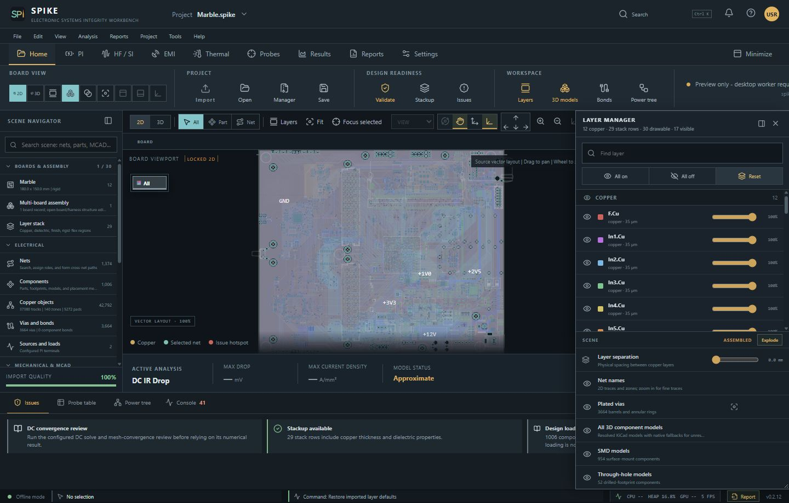
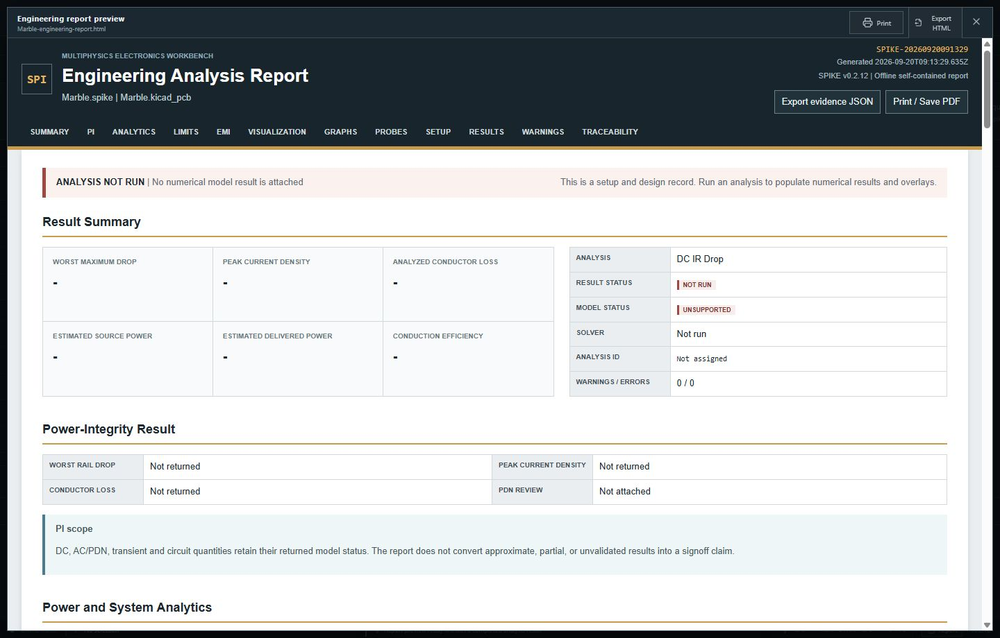

# SPIKE Task Sequences

This guide turns the integrated-help workflows into reviewable task sequences.
It uses only screenshots shipped in `app/public/help/`; captions describe what
is visible and do not claim unshown behavior. Missing screenshots are marked
explicitly so the documentation does not fabricate UI evidence.

Numerical validity notices in SPIKE and the generated report take precedence
over this workflow guidance. For executable capability limits, read
[SOLVER_STATUS.md](SOLVER_STATUS.md).

## Start a DC PI review

1. Start the native desktop. The browser preview does not provide the local
   worker or native file dialogs.
2. Choose **File -> New project** or **Open project**.
3. Import a supported KiCad board and resolve blocking import diagnostics.
   Review Import Quality before treating the normalized design as complete.
4. Save the `.spike` project so the embedded board and setup have an approved
   destination before a long operation starts.
5. Open **PI -> DC drop**, select the power net, and place source, load, and
   return terminals on exact connected copper.
6. Select a compatible installed solver. If none satisfies the request, keep
   the workflow unavailable and review Solver Manager and `SOLVER_STATUS.md`.
7. Run **Preview mesh** and correct terminal, connectivity, time, or memory
   preflight issues. A passing preflight is not convergence evidence.
8. Run DC and wait for a completed or failed operation. Inspect result status,
   model status, provenance, fields, probes, warnings, and convergence evidence.
9. Save the project, then choose **Reports -> Engineering**.

*Evidence: SPIKE 0.2.12 local browser capture after source-importing Marble
v1.4.4. The component bodies are procedural models; this does not demonstrate
the native desktop worker or a completed solver result. See `MARBLE_CLI_QUALIFICATION_PLAN.md` and
`THIRD_PARTY_NOTICES.md` for the pinned revision and provenance.*

## Inspect layout and select electrical objects

1. Switch to 2D for layer-focused inspection or 3D for stackup/model context.
2. Set the selection filter before selecting. Confirm the inspector's object
   ID, layer, connected net, and coordinate before using a terminal/probe anchor.
3. Choose **View -> Show net names** to switch to 2D and label visible copper,
   or use **Layer manager -> Scene -> Net names**. Labels on fine traces appear
   as you zoom in. This visibility setting is saved with the project.
4. In 2D, drag to pan and wheel to zoom. In 3D, left drag orbits, middle/right
   drag pans, and wheel zooms.
5. Middle-click in 3D without dragging to set the orbit center on the surface;
   use the context menu for equivalent or task-specific actions.
6. Cross-check the selected net or component in Design Navigator before using
   it as an analysis anchor.

*Evidence: SPIKE 0.2.12 local browser capture with All copper selected and the
layer manager open. This is imported geometry, not an analysis result.*

*Evidence: F.Cu at 4441% zoom. Fine-trace labels become visible with zoom.*

## Inspect assembled geometry in 3D

1. Select **3D** in the viewport toolbar.
2. Left-drag to orbit, middle/right-drag to pan, and use the wheel to zoom.
3. Middle-click without dragging on a visible surface to set the orbit center.
4. Use Layers and 3D models controls to isolate the geometry under review, and
   use **Fit** to restore framing.
5. Compare model position, board side, rotation, scale, and origin with the
   KiCad source. A loaded model is visual context, not proof that material or
   thermal properties are defined.
6. When result fields exist, toggle scalar overlays and vectors independently
   and retain enough board opacity to verify spatial alignment.

The Marble 3D workspace capture above records source-imported geometry and
procedural models. It does not establish native-worker execution, material
properties, or a solved result.

## Add and inspect probes

1. Open the Probes workflow and select the intended result-bearing net or
   object.
2. Place the probe on mapped conductor geometry, not empty viewport space.
3. Use a universal probe for every available quantity at that mapped location,
   or choose a V, I, P, or Z probe for a narrower display.
4. Select or run a result that actually contains the requested quantity. A
   disabled field means the selected solver did not return it.
5. Check the active layer, result filter, and units before comparing values.
6. Save the project to preserve probes with the analysis and workspace state.

**Screenshot gap:** no shipped asset shows probe placement, mapped mesh
location, or a populated probe table.

## Review mesh, solve, and assess result status

1. Confirm mesh preview is clipped to normalized conductor geometry and that
   terminals map to connected copper.
2. Use a connected-conductor mesh for supported DC/quasi-static paths. A 3D
   conductor-volume preview is geometry inspection, not a full-wave result.
3. Save terminal placement, mesh, limits, and solver choice before running.
4. Read provenance and model status before interpreting a heatmap or probe.
   `Approximate`, `Unsupported`, and `Failed to converge` are distinct states.
5. For publishable DC work, compare at least three mesh sizes and retain the
   convergence comparison with the result.

**Screenshot gap:** no shipped asset shows mesh preview, preflight diagnostics,
solver status, or a convergence comparison.

## Build a reviewed Power Tree and hand off to SPICE

1. Choose **Extract from board**, **Import schematic / netlist**, or add a
   component from the palette.
2. Connect an upstream **OUT** port to a downstream **IN** port. Use Escape to
   cancel a pending wire.
3. Define an explicit model for each selected block and map every required pin
   to a design anchor. SPIKE does not infer nonlinear behavior from a footprint.
4. Use explicit ngspice for a reviewed circuit, or geometry parasitics plus
   ngspice for staged extraction/circuit execution.
5. Set operating cases and choose **Use for analysis**; resolve topology,
   source/load, pin mapping, and model-readiness diagnostics first.

**Screenshot gap:** no shipped asset shows the Power Tree, Model Assistant,
pin mapping, or ngspice handoff.

## Create and review an engineering report

1. Save the project and confirm the selected result has intended provenance,
   warnings, status, and probes.
2. Choose **Reports -> Engineering** to open the integrated preview.
3. Review definition, source/load table, stackup, analytics, fields, warnings,
   solver provenance, validation state, and reproducibility record.
4. If the banner says **ANALYSIS NOT RUN**, use the document only as a setup
   and design record; return to the analysis workflow for numerical output.
5. Use **Print** for the operating-system print/PDF route or **Export HTML**
   for an interactive self-contained report.
6. Open the exported artifact offline and confirm that values, units, warnings,
   model status, and provenance match the preview.
7. For `SPIKE-BE-REPORT-E-0001`, follow
   [report recovery](../TROUBLESHOOTING.md#report-generation-or-export-fails).

*Evidence: the SPIKE 0.2.12 local browser preview explicitly says `ANALYSIS NOT
RUN`, so it is a setup record and not solved evidence.* No shipped screenshot
shows the print dialog, export destination, or rendered external report.

## Diagnose a blocked workflow

1. Copy the exact `SPIKE-...` code and operation ID from console or CLI.
2. Search [ERROR_CODE_CATALOG.md](ERROR_CODE_CATALOG.md) for the complete code
   and follow its canonical first recovery action.
3. Use [TROUBLESHOOTING.md](../TROUBLESHOOTING.md) for the longer symptom and
   domain sequence.
4. Preserve the operation ID, desktop/worker/solver versions, model status,
   input or result sizes, configured limits, and a sanitized reproduction.
5. Preserve solver status separately from error class; removing a software
   error does not validate a result.
6. Retry only after changing the documented input, capability, trust state, or
   resource budget. Critical and security errors are not blind-retry cases.

**Screenshot gap:** no shipped asset shows the status console, error envelope,
or Help Center error-code search result.
