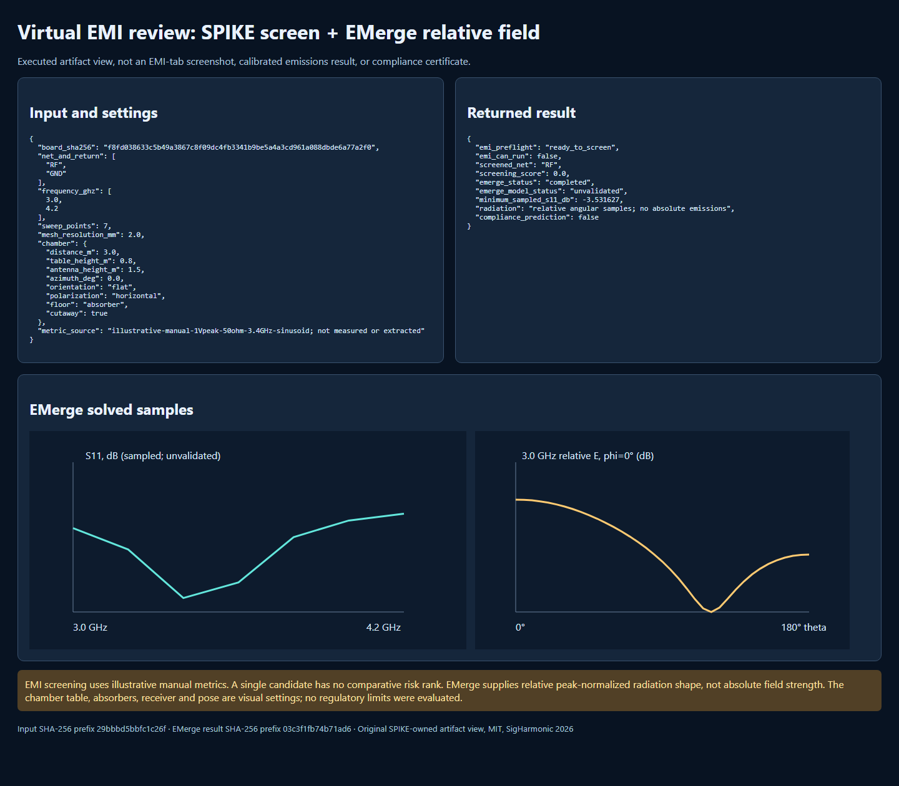

<!-- SPDX-License-Identifier: MIT -->
<!-- Copyright (c) 2026 SigHarmonic -->

# Guided virtual EM review: EM tab + EMerge Suite

This lab executes two **different** computations on the same pinned KiCad
antenna fixture: SPIKE's deterministic EMI *screen* and an EMerge finite-element
port/radiation sweep. The EM chamber can display the returned **relative**
angular pattern. Neither calculation produces calibrated emissions, a chamber
receiver reading, or an EMC pass/fail verdict. The board is an original SPIKE
teaching fixture, not measured hardware. See the [EMI workflow](EMI_WORKFLOW.md),
[EMerge limits](../extensions/emerge_suite/README.md), and
[antenna walkthrough](EMERGE_ANTENNA_WALKTHROUGH.md) before changing the model.



*Executed artifact view captured from generated local HTML. It is not a
desktop EM-tab screenshot. The charts show seven solved S11 samples and one
relative angular cut; the virtual chamber uses the saved angular grids.*

## 1. Bind the board and inputs

Use KiCad 10.0.6 or review any importer differences on another version. The
source is [`antenna_example.kicad_pcb`](../examples/emerge/antenna_example.kicad_pcb),
SHA-256 `f8fd038633c5b49a3867c8f09dc4fb3341b9be5a4a3cd961a088dbde6a77a2f0`.
Its feed is `RF` on F.Cu against `GND` on B.Cu. The aligned J1 pads have IDs
`51d0c420-4c7b-4da5-b9ec-001000000011` and
`51d0c420-4c7b-4da5-b9ec-001000000012`. Do not infer that another board's
same-named nets, pad positions or stackup are equivalent.

The checked-in [EMI setup](../examples/emerge/virtual_emi_setup.json) selects
RF/GND, free space, 3.0–4.2 GHz at seven points, a requested 2 mm mesh,
eight boundary-padding cells and one 50 Ω feed. Its chamber preview uses a
3 m nominal display distance, flat DUT, horizontal receive-antenna graphic,
0.8 m table and 1.5 m mast. These chamber values do **not** modify the EMerge
case. The manually entered `dV/dt`, `dI/dt`, current and 1 mm² loop area are
illustrative assumptions: a hypothetical 1 V-peak sinusoid into 50 Ω at
3.4 GHz gives peak `dV/dt = 2π f V` and `dI/dt = 2π f I`. They were neither
measured nor obtained from the EMerge solve. Replace them with reviewed
waveform/measurement data for a meaningful screen.

## 2. Run the EMI setup and screening stage

From the repository root, use an environment with SPIKE development
dependencies. On the recorded Windows checkout it was
`build/qualification-py311/Scripts/python.exe`:

```powershell
$py = 'build/qualification-py311/Scripts/python.exe'
& $py -m python.spike_core.cli --quiet --output build/tutorial-virtual-emi/emi-preflight.json emi-preflight examples/emerge/antenna_example.kicad_pcb examples/emerge/virtual_emi_setup.json
& $py -m python.spike_core.cli --quiet --output build/tutorial-virtual-emi/emi-screening.json emi-screen examples/emerge/antenna_example.kicad_pcb examples/emerge/virtual_emi_setup.json
```

The recorded preflight returned `can_screen: true`, `can_prepare: true`,
`can_run: false`, with `EMI_SOLVER_UNAVAILABLE`. Here `can_run` refers to the
EM tab's eligible **openEMS field-scan** route, not the EMerge extension. The
screen returned `completed_screening_only`; its provenance says
`field_solver_executed: false` and `compliance_prediction: false`. This board
has only one candidate RF net, so its normalized score is `0`: **there is no
comparative ranking**, and zero does not mean low radiation or safety.

In the desktop, import the same board, open **EM → Net domain**, select RF as
candidate and GND as return, and enter the recorded assumptions in **EM →
Preflight**. Match frequency, port and mesh settings in **EM → Ports** and
**EM → Domain mesh**. Run **Risk screen** and inspect its issues before
preparing anything. The CLI JSON is the exact reproducible input; manually
transcribed desktop fields should be checked against it.

## 3. Execute the EMerge radiation contribution

EMerge is an optional separately installed runtime. In **Settings → Extension
manager → EMerge Suite**, run **Check EMerge runtime**, choose its compatible
Python interpreter, then select **EMerge radiation pattern**. Enter the RF/GND
nets, both pad IDs, 3.0–4.2 GHz, seven points and 2 mm requested resolution
from [`antenna_run.json`](../examples/emerge/antenna_run.json). Click **Run**.
For the exact headless path used in this lab:

```powershell
& $py scripts/run_emerge_antenna_example.py --config examples/emerge/antenna_run.json --python-executable .venv-emerge3/Scripts/python.exe --output-dir build/tutorial-virtual-emi --output-prefix emerge_emi
```

The recorded run with EMerge 3.0.0a19 completed and saved
`emerge_emi_result.json` and `emerge_emi_evidence.json`. Its seven sampled S11
values have a minimum of **−3.531627 dB at 3.4 GHz**. The result includes
seven peak-normalized 13 × 25 angular grids, but no calibrated absolute emitted field,
calibrated gain or chamber receiver spectrum. It reports `model_status:
unvalidated` and `EMERGE_EMI_NOT_COMPLIANCE`. The runner preserves result JSON
when Matplotlib is unavailable and records `plot_status`; plotting is optional.

To regenerate the combined, hash-checked artifact view and screenshot:

```powershell
& $py scripts/render_virtual_emi_tutorial.py --run-dir build/tutorial-virtual-emi --output build/tutorial-virtual-emi/virtual-emi.html
$edge = 'C:/Program Files (x86)/Microsoft/Edge/Application/msedge.exe'
$html = (Resolve-Path -LiteralPath 'build/tutorial-virtual-emi/virtual-emi.html').Path
& $edge --headless --disable-gpu --no-sandbox --hide-scrollbars --window-size=1440,1260 --user-data-dir=build/tutorial-virtual-emi/edge-profile --screenshot=docs/tutorial-assets/virtual-emi-emerge.png ([System.Uri]$html).AbsoluteUri
```

The renderer rejects a board-hash mismatch, disjoint net/frequency
setups, missing radiation samples, or a result lacking the unvalidated and
non-compliance markers. The ignored `build/tutorial-virtual-emi/` files are
local run artifacts; the screenshot and inputs alone are not a field archive.

The recorded input-setup SHA-256 is
`29bbbd5bbfc1c26f4ef6b367126a39d066a3cadcc368e9ddfcd1b0815c968fdb`;
the executed EMerge result SHA-256 is
`03c3f1fb74b71ad60e552015696b57e892863680ba5eb2df827f2e53b2d7b9db`.
KiCad CLI 10.0.6 DRC with in-memory zone refill reported zero violations and
zero unconnected items on the unchanged board. The focused EMI/extension and
renderer Python tests passed 21/21; the EM chamber and extension-result UI
tests passed, and the desktop TypeScript/Vite build completed. These are
integration checks, not mesh-convergence or measurement evidence.

## 4. Review the pattern in the EM chamber

In the desktop EMerge result, use **View radiation on bench** to open the EM
chamber with the saved angular pattern. Select a solved frequency, rotate the
camera, and toggle **Bench display**. In **EM → Chamber**, vary orientation,
turntable azimuth, table and mast height, polarization graphic, absorber/ground
floor and cutaway to review placement. These are **visual settings**; they do
not re-solve the electromagnetic model or simulate chamber reflections,
antenna transfer, receiver detector, LISN, cable coupling, or regulatory
limits. The drawn 5° surface is interpolation of the saved coarse grid.

The chamber's **Run field scan** button is a separate openEMS path. It is not
an EMerge control, and in this recorded setup the EMI preflight did not admit
that scan. For the second solver extension's PI/SI preflight and prepared-case
workflow, use the [openEMS tutorial](PI_SI_OPENEMS_TUTORIAL.md#5-install-and-discover-the-optional-openems-runtime).

## 5. What would make this physical EMI evidence?

At minimum: verify conductor/return and material fidelity, port power and
reference plane; refine mesh and frequency sampling; vary air-boundary
distance; compare fields and S-parameters with an independent solver; then
correlate absolute near/far-field or chamber measurements with a defined
antenna, detector, bandwidth and test standard. None of those gates is
satisfied by this lab. A knowledgeable numerical/EM reviewer must assess any
promotion beyond this executed **virtual preview**.
