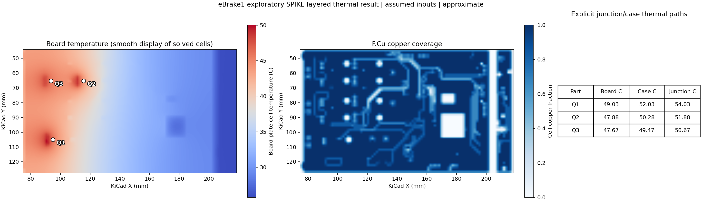

<!-- SPDX-License-Identifier: Apache-2.0 -->

# eBrake1 layered board thermal and fuzzy copper diagnostic

This is an **exploratory, approximate** SPIKE thermal solve of the pinned
`app/public/demo/ebrake1.kicad_pcb` (SHA-256
`d0117300c730688ce2311c2908cec041c537689f59aa4527ffa6bdec68a2edca`).
The [input](../../examples/thermal/ebrake1_layered_thermal.json) assigns three
illustrative TO-220 losses and material/cooling values. The seven physical
stackup rows are F.Cu, prepreg, In1.Cu, core, In2.Cu, prepreg, and B.Cu;
their imported thicknesses total 1.58 mm, within 5% of the 1.6 mm entered
board thickness. The solver uses a structured volume grid with one depth cell
per row. **It does not use tetrahedra or represent parts as 3D blocks.**

The unsmoothed 1.5 mm run has 96 × 56 cells per layer and saves the
[full result](ebrake1-layered-thermal-exact-result.json) and
[temperature/copper figure](ebrake1-layered-thermal-exact.png):



| Part | Imported pad-face contacts | Board contact | Case | Junction |
| --- | ---: | ---: | ---: | ---: |
| Q1 | 6 | 49.03 °C | 52.03 °C | 54.03 °C |
| Q2 | 6 | 47.88 °C | 50.28 °C | 51.88 °C |
| Q3 | 6 | 47.67 °C | 49.47 °C | 50.67 °C |

Q1/Q2/Q3 each have three plated through-hole lead lands on each board face.
The nonplated mounting holes are excluded. The entered 1.0/0.8/0.6 W losses,
2 K/W junction-to-case, and 3 K/W case-to-board paths are **hypothetical**;
they are not inferred from KiCad or measured device properties. Area-weighted
conductances couple a common case node to the pad lands. This is a useful pad
location model, not a resolved lead frame, die attach, solder joint, or package.

## Model and checks

Imported source-filled copper zones, track shapes, pads and via lands are
sampled into a fractional copper occupancy per copper layer; unsupported or
unfilled selected geometry blocks the solve. Each cell's effective thermal
conductivity is `k_dielectric + coverage*(k_copper-k_dielectric)`. This is a
parallel-mixture approximation. Lateral finite-volume links use the harmonic
mean of neighboring conductivities times layer thickness and face-length /
cell-length. Vertical links use the two half-layer conduction resistances in
series. Plated via and drilled-pad barrels add parallel vertical links from an
entered plating thickness; the shell area uses the imported finished bore
diameter. Top and bottom convection include the half-cell solid resistance.
Board side edges are adiabatic.

The seven-layer unsmoothed solve reports 2.4 W input, 2.400000000001347 W
outward heat, `1.35e-12 W` energy-balance error, and `1.63e-13` relative
linear residual. Analytical one-column conduction and convection, a parallel
via-barrel oracle, BGA pad-array and QFN exposed-land heat-flow checks, and
invalid-input cases are retained in the test suite. The numerical method and
oracles were independently derived from conservation; no external solver
source or test data was adapted.

Grid refinement is **not converged** for all part values:

| Requested cell step | Q1 junction | Q2 junction | Q3 junction | Maximum board cell |
| ---: | ---: | ---: | ---: | ---: |
| 3.0 mm, unsmoothed | 54.09 °C | 51.23 °C | 49.92 °C | 49.46 °C |
| 1.5 mm, unsmoothed | 54.03 °C | 51.88 °C | 50.67 °C | 50.06 °C |
| 1.25 mm, unsmoothed | 54.55 °C | 51.82 °C | 50.93 °C | 50.51 °C |

The [3.0 mm](ebrake1-layered-thermal-coarse-exact-result.json) and
[1.25 mm](ebrake1-layered-thermal-refined-result.json) results are retained.
The changing peak and nonmonotone Q1 value prevent an accuracy claim.

## Fuzzy copper option

`fuzzy_sigma_mm > 0` applies a Gaussian blur to **each copper layer's sampled
coverage**. Reflecting boundaries preserve integrated sampled copper coverage
approximately, while local features and electrical isolation are changed.
The physical pad contact locations and via positions are not blurred. Choose a
larger cell step separately to reduce volume cells and solve time. The
[single-run benchmark](ebrake1-layered-fuzzy-benchmark.json) imported the board
once and timed rasterization plus sparse solve, excluding figure rendering:

| Cell step | Blur sigma | Volume cells | Time | Largest junction change vs 1.5 mm unsmoothed |
| ---: | ---: | ---: | ---: | ---: |
| 1.5 mm | 0 | 37,632 | 6.71 s | reference |
| 1.5 mm | 1.5 mm | 37,632 | 6.12 s | 0.71 °C |
| 3.0 mm | 0 | 9,408 | 4.53 s | 0.76 °C |
| 3.0 mm | 1.5 mm | 9,408 | 4.57 s | 1.02 °C |

These times are one local pass, not a stable performance estimate. Blur itself
has no demonstrated speed advantage at the same grid. The coarse grid is
faster in this pass; its temperature differences are **not error bounds**.
The [coarse fuzzy result](ebrake1-layered-thermal-fuzzy-result.json) and
[figure](ebrake1-layered-thermal-fuzzy.png) are saved for inspection.

## Reproduce

From the repository root, with the project's Python environment:

```powershell
.\.venv\Scripts\python.exe scripts/run_board_thermal_example.py `
  --input examples/thermal/ebrake1_layered_thermal.json `
  --result docs/validation/ebrake1-layered-thermal-exact-result.json `
  --figure docs/validation/ebrake1-layered-thermal-exact.png
.\.venv\Scripts\python.exe scripts/compare_board_thermal_fuzzy.py
```

The result remains `model_status: approximate` and
`production_qualified: false`. The model uses the board bounding rectangle,
not the actual outline or cutouts. It assigns one scalar dielectric
conductivity to all dielectric rows, fractional effective copper in each
copper row, and a lumped case-to-pad resistance divided by pad area. It does
not resolve package solids, solder joints, actual multilayer contact
microgeometry, temperature-dependent materials, orthotropic laminate data,
radiation, airflow, or enclosure cooling. A blurred layer may create false
thermal bridges across separated copper. Material, plating, power, package
resistance, and cooling inputs require review and measurement correlation.
Knowledgeable human review of numerical code is required before release.

The desktop layered command sends retained KiCad source text to the local
worker for canonical import. A direct worker dispatch with that source
completed the same eBrake case and returned the same 2.4 W balance and six
pad-face contacts for each of Q1/Q2/Q3. The faster display parser is used for
selection and preview; its unfilled placement zones are not counted as
copper. The figures use bilinear **display interpolation only**; the saved
JSON retains the unsmoothed solver cell temperatures and coverage fractions.
