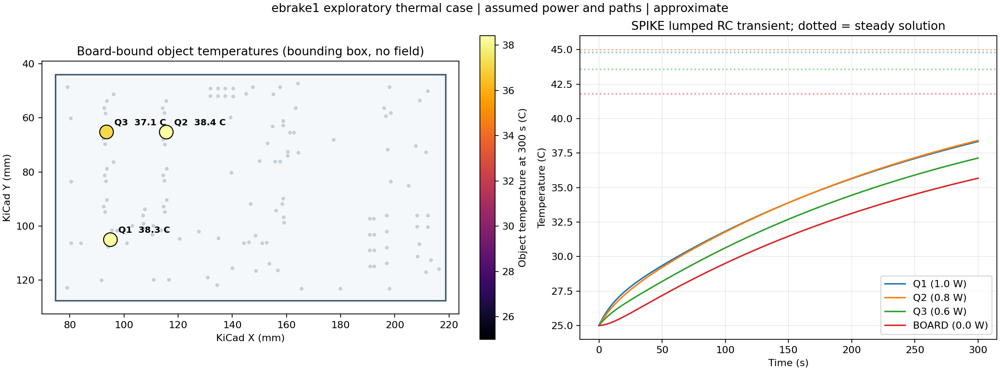

<!-- SPDX-License-Identifier: Apache-2.0 -->

# eBrake1 local SPIKE thermal run (2026-09-28)

## Reproduce

This is an executable board-linked example of SPIKE's **built-in object thermal
network**, not a spatial PCB heat solver. The input board is the checked-in
`app/public/demo/ebrake1.kicad_pcb` with SHA-256
`d0117300c730688ce2311c2908cec041c537689f59aa4527ffa6bdec68a2edca`.
The runner imports the KiCad board through SPIKE's normal adapter, checks the
hash and the Q1/Q2/Q3 references, then calls the same `run_component_thermal`
kernel as the Tauri Thermal setup worker.

From the repository root with the development environment:

```powershell
.\.venv\Scripts\python.exe scripts/run_board_component_thermal.py `
  --request examples/thermal/ebrake1_object_thermal.json `
  --result docs/validation/ebrake1-object-thermal-result.json `
  --figure docs/validation/ebrake1-object-thermal.png
```

The complete [input](../../examples/thermal/ebrake1_object_thermal.json),
[result JSON](ebrake1-object-thermal-result.json), and
[figure](ebrake1-object-thermal.png) are retained here. The figure was
rendered from the returned solver samples. Its board rectangle is the
importer's bounding box, and the component locations are imported footprint
coordinates. The colors belong only to three object nodes; no value is
interpolated over the board.



## Explicit example setup

The following are **illustrative assumptions**, not board measurements,
extracted electrical losses, or package thermal data:

| Node | Power | Heat capacity | Complete path to BOARD |
| --- | ---: | ---: | ---: |
| Q1 | 1.0 W | 5 J/K | 3 K/W |
| Q2 | 0.8 W | 5 J/K | 4 K/W |
| Q3 | 0.6 W | 5 J/K | 3 K/W |
| BOARD (virtual) | 0 W | 25 J/K | 7 K/W from BOARD to 25 C ambient |

The 300 s transient begins at 25 C with a 1 s backward-Euler step. These
resistances are full effective paths between the modeled nodes; they do not
stand for an isolated junction-to-case specification. No top/bottom path is
also entered, so the conduction boundaries are not counted twice.

## Observed result and check

| Node | Temperature at 300 s | Steady solution |
| --- | ---: | ---: |
| Q1 | 38.3374 C | 44.8 C |
| Q2 | 38.4161 C | 45.0 C |
| Q3 | 37.1374 C | 43.6 C |
| BOARD | 35.6757 C | 41.8 C |

Both the 1 s and 0.5 s runs completed with `model_status: approximate`.
At 300 s their maximum difference is 0.005993 K. The maximum transient
step energy residual in the saved 1 s run is `2.25e-14 W` after rounding,
and the steady balance residual is `2.22e-15 W`. The independent steady
network check is: total power is 2.4 W; `BOARD = 25 + 2.4*7 = 41.8 C`;
each Q temperature is the board temperature plus its own `P*R` rise.
This checks numerical execution for the stated network, not physical accuracy.

The existing solver's capability tier remains **approximate**. Heat-flow
resistances, capacities and dissipation need independent data for a useful
engineering estimate. This model has one temperature per object and no PCB
copper/FR-4 spreading, package internal gradient, airflow, radiation exchange,
or spatial temperature field. An imported board and color-coded footprint
markers do not create those missing physics. The
[thermal workflow](../THERMAL_WORKFLOW.md) and
[solver status](../SOLVER_STATUS.md) retain the current qualification boundary.
