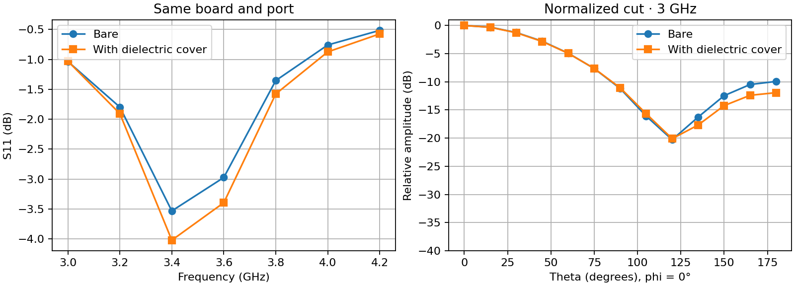
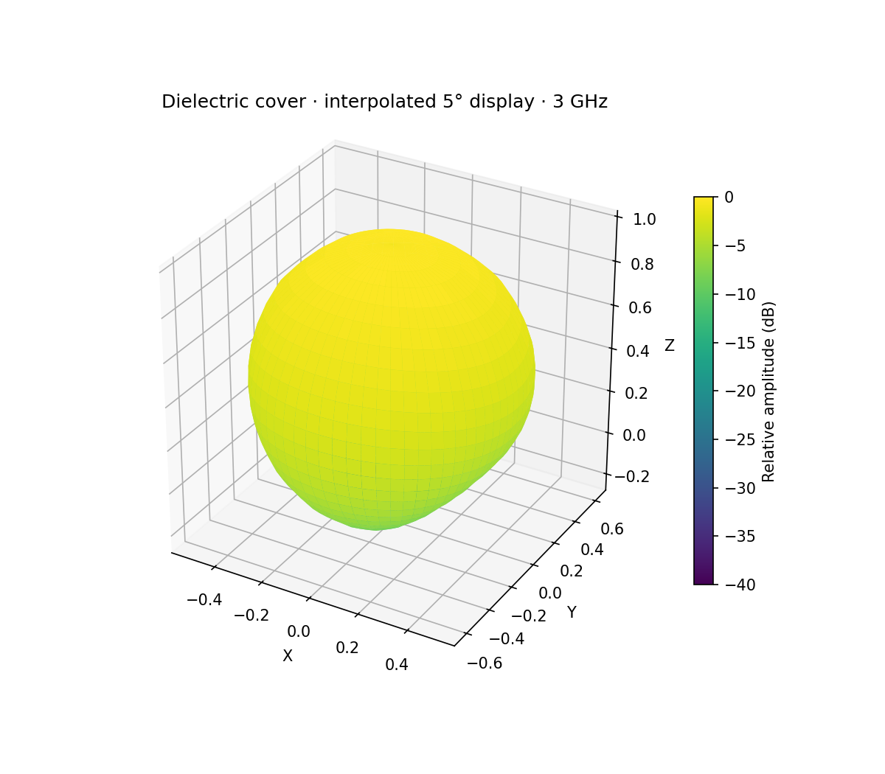

# Patch antenna with planar radome

This fixture pairs a 40 mm x 30 mm two-layer FR-4 patch board with one
explicit external dielectric object. The board copper and stackup are in
`patch_with_radome.kicad_pcb`; the radome is intentionally kept outside the
PCB file in `antenna_with_radome_run.json` so it can be passed as solver input.

`bare_antenna_run.json` and `antenna_with_radome_run.json` define a paired
bare-versus-radome experiment on exactly the same board, feed, frequency sweep,
and requested mesh size. The latter keeps `parameters.surrounding_geometry`
inline with the solver parameters.
For the radome case, its first corner is `(95, 95, 10)` mm and its dimensions
are `(50, 40, 1.5)` mm. The board occupies `x=100..140` mm and `y=100..130` mm.
The solver coordinate system uses the top copper as `z=0`; positive z points
into the air in front of the antenna. The slab therefore begins 10 mm above
the top copper and ends at 11.5 mm.

`epsilon_r: 2.1` is an explicit fixture input. No loss tangent is present
because the current surroundings contract and EMerge adapter do not transfer
external dielectric loss. Do not use a lossless result to make radome
transmission, gain, pattern, or compliance claims.

The object uses the `spike/emerge-surroundings/v1` contract:

```json
{
  "kind": "dielectric_box",
  "name": "Radome slab",
  "origin_mm": [95, 95, 10],
  "size_mm": [50, 40, 1.5],
  "epsilon_r": 2.1
}
```

This is a planar surrogate, not a curved radome or a complete vehicle,
enclosure, bracket, cable, connector, fastener, or ground-plane model. Any
comparison between the bare and radome cases still needs mesh convergence,
boundary checks, material characterization, and measurement correlation.

## Reproduce and inspect the paired result

From the repository root with EMerge 3.0.0a19 installed in `.venv-emerge3`:

```powershell
python scripts/run_emerge_antenna_example.py --config examples/emerge/radome/bare_antenna_run.json --python-executable .venv-emerge3/Scripts/python.exe --output-dir examples/emerge/radome --output-prefix bare
python scripts/run_emerge_antenna_example.py --config examples/emerge/radome/antenna_with_radome_run.json --python-executable .venv-emerge3/Scripts/python.exe --output-dir examples/emerge/radome --output-prefix covered
python scripts/compare_emerge_radome.py
```

Both seven-frequency runs completed through SPIKE's isolated extension host
with `model_status: unvalidated`; their saved results are
[`bare_result.json`](bare_result.json) and
[`covered_result.json`](covered_result.json). The
[`comparison_evidence.json`](comparison_evidence.json) checks identical board,
port, frequency and requested mesh inputs. At 3.4 GHz, S11 was -3.53 dB bare
and -4.02 dB covered. At 3 GHz, the independently peak-normalized relative
field sample at theta 180°, phi 0° changed from -9.94 to -11.93 dB. This
angular difference is a change in normalized pattern shape, not radome
insertion loss or absolute gain.

The paired [S11 and angular-cut figure](radome_comparison.png) and
[interpolated 3D covered pattern](covered_pattern_interpolated.png) are saved
display artifacts. The 3D surface bilinearly interpolates **relative linear
amplitude** from the solver's 13 × 25 angular grid to 5° spacing. SPIKE offers
the same display interpolation, the original solved grid, and a relative
pattern overlay in the EMI chamber. Its bench can be shown, made translucent,
or hidden without changing the FEM case. None of those display choices creates
new solved field values.




