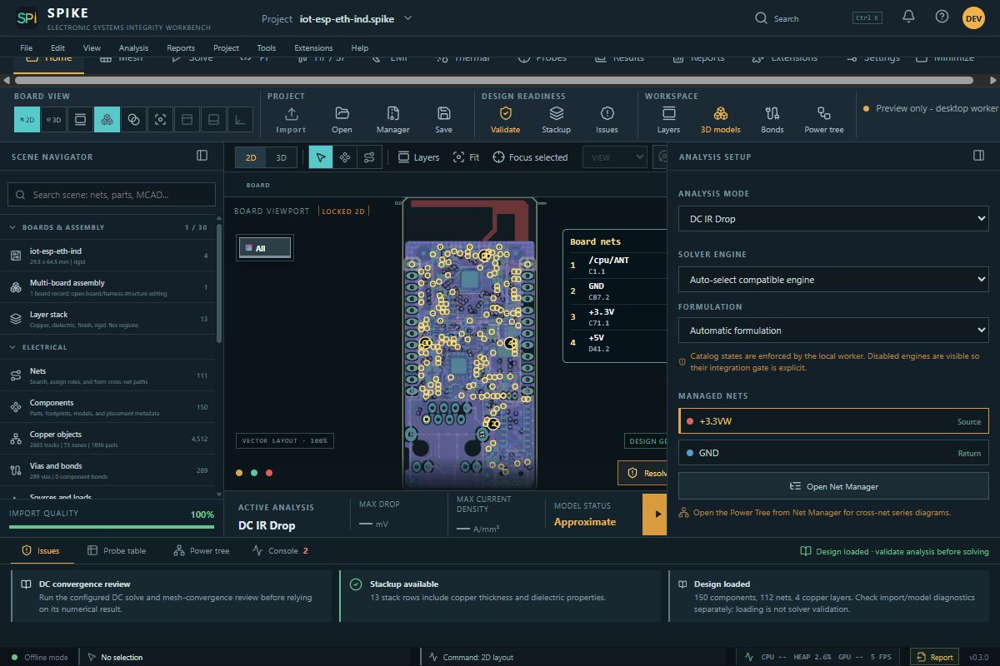
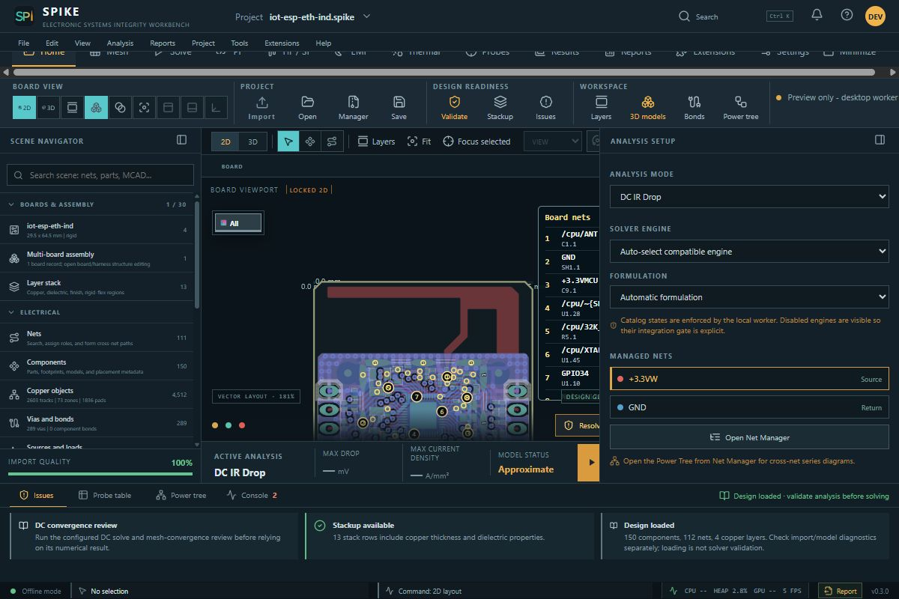
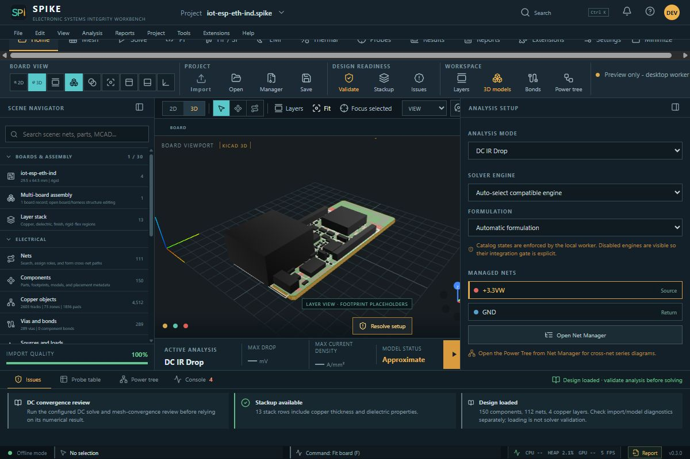
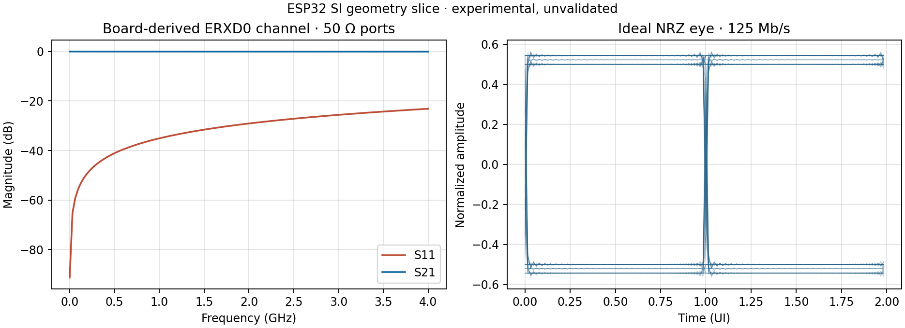
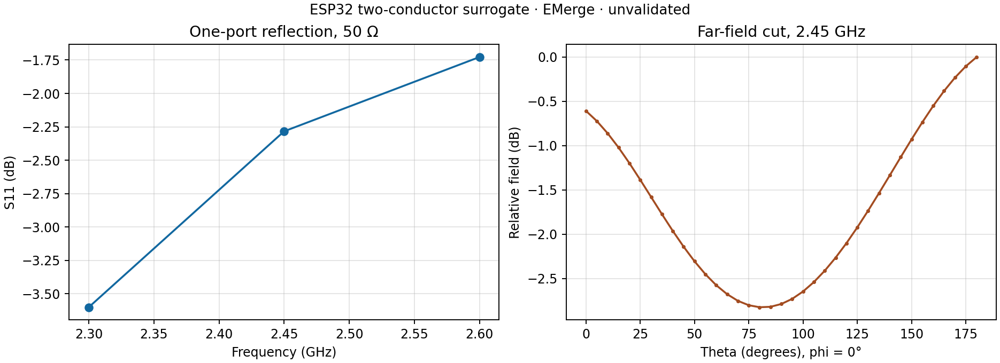

# ESP32 board integration example

This example uses the open [iot-esp-eth-ind board](source/iot-esp-eth-ind.kicad_pcb)
from `uysan/iot-esp-eth`, pinned at upstream commit
`0b9eb3500cd8ccdd6193c81e1406bfe9281d88e6` and board SHA-256
`3199ce0a25f8987020e716d82a4a35d9b6b04541d33b2f2e46406376713eab33`.
The board is licensed under [CERN-OHL-P-2.0](source/LICENSE.md). The source
schematics, KiCad project, upstream openEMS script and measured Touchstone file
are in [`source/`](source/). The board has four copper layers; the antenna is
formed from **filled, unnetted F.Cu graphic polygons**, a short to ground,
and a feed and matching network. Those distinctions matter for both the
viewport and electromagnetic model.

## SPIKE viewport

Import `source/iot-esp-eth-ind.kicad_pcb` in SPIKE. The source layout and
native 3D board viewport now fill KiCad copper graphic polygons, including
the ESP32 antenna. In 2D, net names are on by default for new imports. At
board-fit scale, a side legend lists distinct nets with spaced numbered pad
markers; zooming in restores the detailed on-board labels. The 3D viewport
also lists up to eight nets sourced from actual pads or traces. The Layer Manager
or **View → Hide net names** controls them. The imported antenna graphics have
no KiCad net assignment, so their rendering must not imply a verified net.
Other parts of the RF network retain their source net names, including
`/cpu/ANT` and `/cpu/ANTM`.

The imported PCB retains Edge.Cuts, silkscreen, footprints and courtyards in
the board scene. Many source 3D model paths use unresolved KiCad environment
variables or an upstream absolute path; SPIKE may show placeholders until
those model assignments are resolved. The current source build was visually
checked in the SPIKE browser preview after importing the complete 150-part,
four-copper-layer source board. The installed v0.2.13 desktop GUI predates
these changes; the browser preview has no desktop analysis worker.







These are captures of the SPIKE source viewport. The 3D capture was taken
before the final 3D net-legend and copper-visibility refinements; those
refinements pass source-level checks but await a new native GUI capture. The
3D view shows placeholder component solids where source model paths did not
resolve.

## Thermal example

[`thermal_run.json`](thermal_run.json) is an illustrative uniform board plate.
[`layered_thermal_run.json`](layered_thermal_run.json) uses the imported stack
and tracks, pads and vias, with source-filled zones excluded because this
import does not provide trustworthy filled copper to that solver. The
assumed heat sources are U1 0.60 W, U41 0.50 W and U61 0.25 W; material,
convection and package resistance values are also assumptions. The layered
15 × 33 cell run returned 34.66–80.62 °C board temperature, 86.93 °C maximum
junction, and −5.4e−13 W energy balance error in
[`layered_thermal_result.json`](evidence/layered_thermal_result.json). These
figures are approximate, not measured ESP32 operating temperatures.

[`thermal_environment_comparison.json`](evidence/thermal_environment_comparison.json)
applies the Thermal tab's explicit open-air, sealed-box, and forced-air boundary
screens to the imported 29.464 x 64.516 mm board bounds at 25 deg C and the same
aggregate 1.35 W assumption. It records the prescribed coefficients, derived
top/bottom K/W paths, assumptions, and approximate temperature for each case.
This algebraic comparison is not CFD or a spatial board solve. The separately
calculated U41 AZ1117 loss is 0.255 W for 5 V to 3.3 V at an assumed 0.15 A;
it is not added to the existing 1.35 W total because that total already contains
an illustrative 0.50 W U41 entry. Replace the per-device loss distribution
before using the 0.255 W value, rather than counting both. Reproduce the compact
evidence with `node scripts/run_esp32_thermal_environment_example.mjs`.

After a board thermal run in the current source UI, SPIKE overlays the exact
solved cells translucently on the **2D and 3D board viewports**, retaining
visible outlines, markings and pads. In the 3D board view, turn on **Field**
and click a cell to read its saved temperature, layer, physical depth and X/Y
cell center; repeated clicks at one point cycle the visible stack layers.
The raised layer spacing is for inspection and does not change the reported
physical depth. Thermal Setup also shows horizontal X,
vertical Y and through-stack Z temperature cuts at each selected part. The
Z chart uses layer-center depth from the top face. These are temperature
profiles, **not** directional thermal resistance: the result lacks a local
heat-flow field needed to calculate one. The older
[`thermal_board.png`](evidence/thermal_board.png) is a solver-only plate plot
and does not show imported geometry.

To inspect the saved run directly in SPIKE, import
[`source/iot-esp-eth-ind.kicad_pcb`](source/iot-esp-eth-ind.kicad_pcb), choose
**Thermal → 3D → Open saved**, and select
[`evidence/thermal_view_bundle.json`](evidence/thermal_view_bundle.json).
Use **Field** to show and probe the board cells, then **Plots** for the
temperature grid, per-layer selection, and horizontal X, vertical Y and
through-stack Z cuts. The bundle binds the existing layered result to the
source board hash; regenerate it with
`python scripts/build_esp32_thermal_view_bundle.py` after updating the result.
In a source browser preview, loading the saved bundle works without the
desktop worker; new solver runs still require the desktop worker.

To reproduce the layered numeric result from the repo root:

```powershell
python scripts/run_board_thermal_example.py --input examples/esp32/layered_thermal_run.json --result examples/esp32/evidence/layered_thermal_result.json --figure examples/esp32/evidence/layered_thermal_basic.png
```

## PI example

[`pi_request.json`](pi_request.json) drives an assumed 0.15 A on `+3.3VMCU`.
The approximate result reports 6.46 mV maximum load drop on the coarse
network and 6.38 mV on the finer run, a 1.25% difference. The return path
and source-filled zones were not included. See
[`pi_result.json`](evidence/pi_result.json) and
[`pi_result_fine.json`](evidence/pi_result_fine.json); these are not a full
PDN qualification.

The [converter budget example](evidence/pi_converter_budget.json) uses the
imported U41 `AZ1117-3.3` LDO on `+5V` to `+3.3V`, with an illustrative
0.15 A load on that rail. SPIKE's Power Tree computes 0.495 W output,
0.750 W input, and **0.255 W LDO loss** from the 1.7 V drop. A separate,
clearly hypothetical 90% buck substitution gives 0.055 W conversion loss
at the same load. Run `node scripts/run_esp32_pi_converter_example.mjs` from
the repository root to regenerate the evidence. In the GUI, open PI → Power
Tree, select a regulator in the series path, choose **LDO voltage drop** or
**Buck / SMPS efficiency block**, then enter its output voltage or output/input
ratio. Buck also needs a measured or assumed efficiency. The budget shows
input/output current and stage loss. These are power-flow estimates; neither
scenario resolves U41 dropout/quiescent current, switching ripple, or the
converter's physical heat spreading. The separate `+3.3VMCU` IR drop run
uses a different net and load assumption, so its power must not be added
to this example as if it were the same measured operating point.

The imported board was also submitted to SPIKE's experimental AC and
transient PEEC paths at the `+3.3VMCU` pads used above. Both runs **failed
admission**. [`pi_ac_result.json`](evidence/pi_ac_result.json) records
`PEEC_INDUCTANCE_NONPASSIVE` (22 negative-energy modes), and
[`pi_transient_result.json`](evidence/pi_transient_result.json) records
`PEEC_INDUCTANCE_GEOMETRY_UNSUPPORTED` during matrix extraction. No AC
impedance, ripple, or transient waveform is claimed for this full board.
These are solver limitations on this geometry, not zero-valued results.

## SI geometry-channel example

[`si_geometry_request.json`](si_geometry_request.json) selects the source
`/network/ERXD0` receive trace against an In1.Cu GND polygon. The
[`SI runner`](../../scripts/run_esp32_si_geometry_example.py) checks the pinned
board hash, imports the full board, then extracts a **separate bounded slice**
containing four 0.254 mm F.Cu segments and that reference polygon. Since the
source stackup lacks conductivity, the slice assumes 5.8e7 S/m for copper.
The [generated design](evidence/si_geometry_design.json),
[admitted result](evidence/si_geometry_result.json), and
[assumptions and limits](evidence/si_geometry_evidence.json) are saved.

SPIKE's experimental geometry channel reports 1.3966 mm centerline length,
69.70 Ω lossless characteristic impedance, 1.939 Ω/m DC conductor resistance,
and a 0.9980 normalized ideal 125 Mb/s NRZ eye height. The generated network
passes its internal passivity and reciprocity checks; causality was not
evaluated. Three bends retain their path length but omit bend discontinuities.
The quasi-static single-section channel excludes launches, package, IBIS,
skin effect, jitter, noise, and protocol qualification. The eye number is a
model output, not a measured board eye.



Reproduce it with the project virtual environment:

```powershell
.venv\Scripts\python.exe scripts/run_esp32_si_geometry_example.py
.venv\Scripts\python.exe scripts/plot_esp32_si_geometry.py
```

### Bounded ERXD0 / ERXD1 NEXT/FEXT

[`si_crosstalk_request.json`](si_crosstalk_request.json) drives the exact
0.7874 mm parallel overlap of `/network/ERXD0` and `/network/ERXD1` above the
same In1.Cu GND zone. The runner clips the longer ERXD0 source segment to the
shared overlap and excludes both routes after they bend apart. With a 3.3 V
Thevenin pulse and four 50 ohm terminations, the experimental result reports
2.592 mV peak loaded NEXT, 1.559 mV peak loaded FEXT, -45.67 dB worst matched
NEXT, and -49.94 dB worst matched FEXT over DC to 2 GHz. These are bounded
quasi-TEM model outputs, without launches, packages, remaining route geometry,
full-wave validation, or measured correlation.

The [generated slice](evidence/si_crosstalk_design.json),
[result](evidence/si_crosstalk_result.json), and
[evidence summary](evidence/si_crosstalk_evidence.json) preserve the exact
selection and limitations. Reproduce them with:

```powershell
.venv\Scripts\python.exe scripts/run_esp32_si_crosstalk_example.py
```

## Two-conductor RF surrogate

The source board itself is four-layer, while the current EMerge adapter
accepts two conductor planes. [`run_esp32_rf_surrogate.py`](../../scripts/run_esp32_rf_surrogate.py)
creates a **separate, disclosed approximation** from the pinned import:

| Model item | Choice |
| --- | --- |
| Top conductor | Imported F.Cu antenna and `/cpu/ANT` feed. Two unnetted source F.Cu radiator polygons are explicitly attributed to `/cpu/ANT` for this model. |
| Reference conductor | Ideal rectangular B.Cu ground over the source-filled GND extents; source voids are omitted. |
| Internal layers | In1.Cu and In2.Cu are replaced by dielectric of the adjacent permittivities. Equivalent slab thickness is 1.5162 mm; permittivity is computed using the series-capacitance rule. |
| Feed | A synthetic 0.5 mm B.Cu marker inside source GND copper directly below the imported F.Cu feed pad forms a vertical 50 Ω port. This is not the original matching network. |
| Short | One pinned source GND via at (78.232, 123.317) mm becomes a solid PEC short; barrel, drill and antipad details are omitted. |
| Other omissions | Matching components, other nets and vias, internal ground copper, shield, solder mask, finite copper loss, dielectric loss and actual ground-plane voids. |

The dielectric reduction uses the series-capacitance relation
`epsilon_eff = d_total / Σ(d_i / epsilon_i)`, with all `d_i` in mm. Internal
copper sheet thickness is replaced by dielectric whose permittivity is the
mean of the adjacent source slabs. This preserves a simple perpendicular
electrostatic capacitance approximation; it does **not** preserve lateral
fields, dispersion or the removed conductors' shielding. This transformation
and its fixtures were independently authored for SPIKE; no EMerge numerical
implementation was copied. EMerge remains an optional external solver.

The exact generated [DesignIR](evidence/rf_surrogate_design.json),
[EMerge case](evidence/rf_surrogate_case.json), and
[assumptions](evidence/rf_surrogate_assumptions.json) are saved. EMerge
3.0.0a19 completed a three-point 2.30–2.60 GHz solve through SPIKE's
extension path. The admitted [native SPIKE result](evidence/rf_surrogate_result.json)
contains 2D far-field cuts and three sampled 3D angular grids (13 × 25 each).
The 50 Ω S11 values were −3.60, −2.28 and −1.73 dB at 2.30, 2.45 and
2.60 GHz respectively. These are **unvalidated surrogate results**; they do
not establish the actual ESP32 board's match, gain, efficiency or radiation
performance. [`rf_surrogate_evidence.json`](evidence/rf_surrogate_evidence.json)
records the solver and limitation codes.

The 2026-09-29 rerun completed through the same SPIKE EMerge extension with
the same admitted radiation grids and S-parameter samples; its separate
[`result`](evidence/rf_surrogate_rerun_result.json) and
[`run evidence`](evidence/rf_surrogate_rerun_evidence.json) preserve this
execution. The EM workspace reads these sampled grids for its 3D chamber,
interactive surface, and 2D cut.
With the source board imported in the desktop GUI, use **EM → EMerge → Open
saved radiation result** and select `evidence/rf_surrogate_rerun_result.json`
to preview the solved two-conductor surrogate in SPIKE's native 3D **board
viewport**. The EM toolbar's frequency selector changes the solved angular
grid, and **Chamber** opens the separate bench view. The in-board pattern is
a directional visualization anchored beside the imported board, with angular
probe values in relative dB; its radial distance is a display scale, not a
distance from the board at which the field was solved. The preview is labeled
unvalidated and retains the simplified-geometry warning; opening it does not
rerun the external solver or make it a full-board prediction.

A completed EMerge radiation run opens SPIKE's **EM (electromagnetics)** workspace with the
relative pattern in the board viewport and the interactive 3D surface, angular
cut, and S-parameters in its results pane. **EM → Board + pattern** returns
to the board view after visiting the chamber. This wiring has source-level verification;
the captured ESP32 RF figures below remain renders of saved solver samples.

A second [1.0 mm mesh run](evidence/rf_surrogate_fine_result.json) used 1,901
planar preflight cells versus 845 at 1.5 mm. Across the three frequencies,
S11 changed by −0.047, −0.016 and +0.002 dB; the largest pointwise change
in the 2.45 GHz normalized phi=0° cut was 0.222 dB. This is a limited mesh
check on an idealized model, not a full air-boundary/geometry convergence or
measurement correlation study. The [fine-run setup](evidence/rf_surrogate_fine_case.json)
and [evidence](evidence/rf_surrogate_fine_evidence.json) are saved.




Rebuild the case, run the extension and render saved solver samples from the
repo root with the project-local EMerge 3 interpreter:

```powershell
python scripts/run_esp32_rf_surrogate.py --run --python-executable .venv-emerge3/Scripts/python.exe
python scripts/run_esp32_rf_surrogate.py --run --python-executable .venv-emerge3/Scripts/python.exe --mesh-resolution-mm 1.0 --output-prefix rf_surrogate_fine
python scripts/plot_esp32_rf_surrogate.py
```

The first attempt to use all source B.Cu filled fragments failed during
EMerge polygon construction; the idealized reference plane is recorded as
part of the model rather than presented as exact board geometry. The saved
images are rendered from admitted solver samples, not GUI screenshots. The
native SPIKE RF pattern and plot views still need a desktop-worker GUI
verification; this source browser preview cannot run that worker.

The upstream project contains an openEMS pattern, openEMS S11 plot, and
measured S11 plot at the pinned revision above. Those upstream images are
reference material and are omitted from this community source release pending
image-specific redistribution review; they are not results of SPIKE's
surrogate run.
[`openems_readiness.json`](evidence/openems_readiness.json) records that
SPIKE can prepare the imported antenna geometry but needs explicit ports
before an openEMS solve. No SPIKE openEMS radiation solve is claimed here.

## GUI verification boundary

The complete board was imported and captured in the current source browser
UI. PI, SI, thermal and EMerge RF runs were executed through SPIKE's local
solver/extension paths and their inputs and results are saved above. The
rebuilt v0.3 desktop development app compiled and launched, but the solver
runs and saved RF/thermal result views were not exercised through that native
window in this session. The browser preview has no desktop worker. Thus the
saved solver plots demonstrate numerical output, while the viewport captures
demonstrate board import and geometry display; they are not screenshots of a
single end-to-end GUI analysis run.
