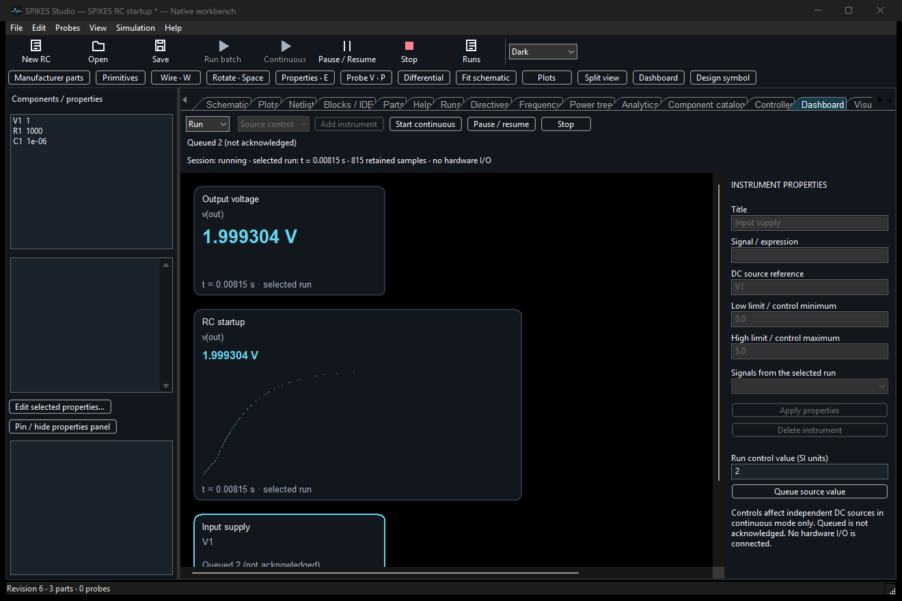
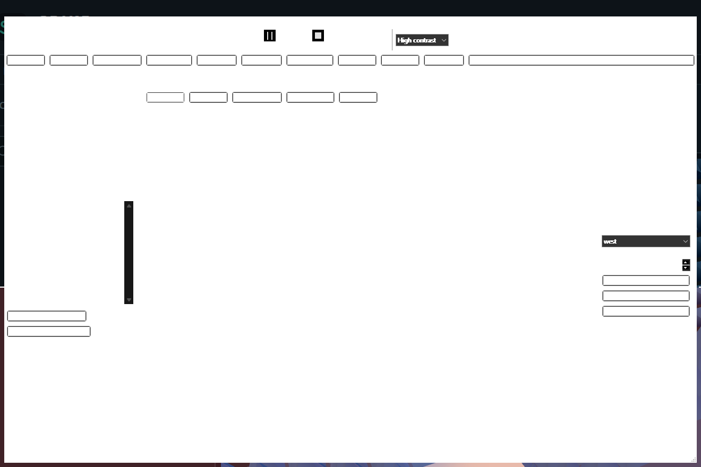

# Visual workspaces: dashboard, symbols and manufacturer models

These are implemented workspaces in the native app, not GUI mockups. They remain
an engineering preview; no MATLAB/LabVIEW or SPICE compatibility parity is claimed.

## Create a dashboard

1. Choose **Dashboard** in the workflow bar. Keep **Design** selected.
2. Choose Meter, Scope, Indicator or Source control, then **Add instrument**.
3. Click the instrument. Enter a title and signal expression, such as `v(out)`,
   or choose a signal from an acquired run. **Apply properties** stores the binding.
4. Drag to position. Drag the lower-right handle to resize. Changes snap to a
   20-pixel grid and use project Undo/Redo. Save the project to persist the layout.
5. Switch to **Run**. Meters and scopes show the selected recorded run. An empty
   or invalid binding displays an explanation, not synthetic values.
6. For live control, add a Source control with the exact independent DC source
   reference, e.g. `V1`, and finite minimum/maximum values. Start Continuous,
   select the control, enter an SI value and **Queue source value**.

Commands are queued to the native solver; the UI does not claim an acknowledgement.
Observe the bound voltage/current signal to see the result. Pause/Resume and Stop
operate the real session. Continuous capture is bounded; this dashboard does not
connect to physical hardware. Mini scopes use actual time positions and preserve
per-bin extrema; the Plots workspace provides fuller measurement/navigation tools.

## Draw a custom IC symbol without code

Choose **Design symbol → New IC**. Edit the part name and library ID in the form.
Use **Add pin**, then enter its number and name and choose a side. Drag terminal
circles to move pins between edges. The lower-right body handle resizes a
rectangular IC body. Mouse wheel zooms; Undo restores the preceding edit.

**Save symbol** writes a reusable symbol-library JSON file without requiring you
to edit JSON. **Open** loads it. **Add to library** publishes it into the current
session's symbol library; save the library to persist that session collection.
Geometry is not an electrical model. Arbitrary artwork editing and automatic
model-to-symbol execution binding remain unfinished.

## Use actual manufacturer models

**Manufacturer parts** opens the project-local model review shelf. It is separate
from **Primitives**, which contains generic recipes and parameter presets.
Import a manufacturer-provided SPICE file and record its exact part number,
manufacturer and HTTPS source. The shelf retains source and pin/dependency
inventories with project Undo and Save. Search matches provenance and subcircuits.

Imported does not mean executable. The current tested TI LM358 model fails the
native parser; it must not be substituted with a generic amplifier and called
qualified. See [manufacturer evidence](manufacturer-library.md). Review the
model's licensing before sharing a project containing its source.
