# SPIKES Studio workbench guide

This guide describes the runnable wxPython/wxWidgets workbench. It uses the
owned C++ solver through the C ABI and Matplotlib for plots. The earlier HTML
preview is a design reference; its canned values are not used in this application.
The planned C++/VTK editor remains a separate implementation milestone.
The frequency workspace is an explicitly labeled exception: it currently uses
the existing Python/SciPy linear AC and descriptor pole-zero analysis backend.

## Connect, rotate and enter passive values

Select a component, then **Rotate** on the toolbar, **Edit → Rotate**, or **Space**
to turn it 90 degrees. The angle is saved with the project and undoable. Text stays
upright. **Wire** on the toolbar or **W** enters terminal-to-terminal wiring: click
one terminal marker, then the other. **Escape** cancels. This is an electrical
net merge, not a decorative line: the destination net is renamed to the first net,
except that ground wins. Undo restores both the drawing and source in one step.

The initial wire editor supports the two primary terminals of top-level components.
It does not yet provide arbitrary junctions, user-routed waypoints or multi-pin
subcircuit editing. Hierarchical/model-library source and dependent expressions
that cannot be rewritten safely are rejected instead of silently changing behavior.
Wire crossings are not automatic junctions. Existing equal node names remain
electrically connected even when no drawn wire joins them.

Press **E** for properties. Enter the value manually using SPICE engineering
suffixes. For R/C/L, choose E6, E12 or E24 and use **Nearest standard value…** to
review the lower, nearest and upper values. Confirming changes the draft only;
**Apply** commits it. Preferred values are suggestions, not manufacturer stock or
rating guarantees. Limits and descriptive properties do not add missing physical
effects to an ideal device model.

## Appearance and stacked waveform panes

Use the toolbar theme selector or **View → Theme** for **Dark**, **Light**,
**Midnight**, or **High contrast**. Dark uses a genuinely black schematic/plot
background. Palettes cover workbench controls, property/setup editors, source
editors, grids, canvas annotations, figures, text and contrast-aware vector icons.
Text/muted/accent palette combinations are tested at a minimum 4.5:1 contrast
against the main surfaces. Appearance is saved separately from circuit data in
`%LOCALAPPDATA%/SPIKES Studio/appearance.json`. OS-owned message/file dialogs,
titlebars and some native control chrome may retain Windows styling, particularly
after a live switch; these are not all custom-drawn surfaces. Native Windows dark
support was exercised on wxPython 4.3.1 / wxWidgets 3.3.3; older wx builds provide
less native theming. See the [wxPython appearance limitations](https://www.wxpython.org/Phoenix/docs/html/wx.PyApp.html).

In **Plots → Stack / arrange panes**, choose grouping by unit, one pane per
trace, or custom pane assignments. Like-unit traces can share a pane; unlike
units cannot share a single Y axis. Up to 16 panes have independent Y ranges,
relative height weights, shared time zoom and shared A/B cursors. Pane numbers
define vertical order. Layout is saved with `.spksch` and is undoable. It is a
pane-allocation editor, not yet LTspice-style drag-and-drop pane rearrangement.
Display decimation remains separate from full-sample measurements. The shortened
workspace tabs and their overflow menu provide access without reordering pages.

Use the mouse wheel over a plot to zoom time around the pointer, or Shift-wheel
to zoom its Y axis. **Fit all** resets the display; **Fit Y in view** scales visible
signals to the current time window, ignoring hidden traces and cursor lines.
Display samples are selected again from the original capture when zoom changes;
zooming no longer stays restricted to the initial overview's reduced samples.
The original recorded values remain the inputs to signal math and measurements.

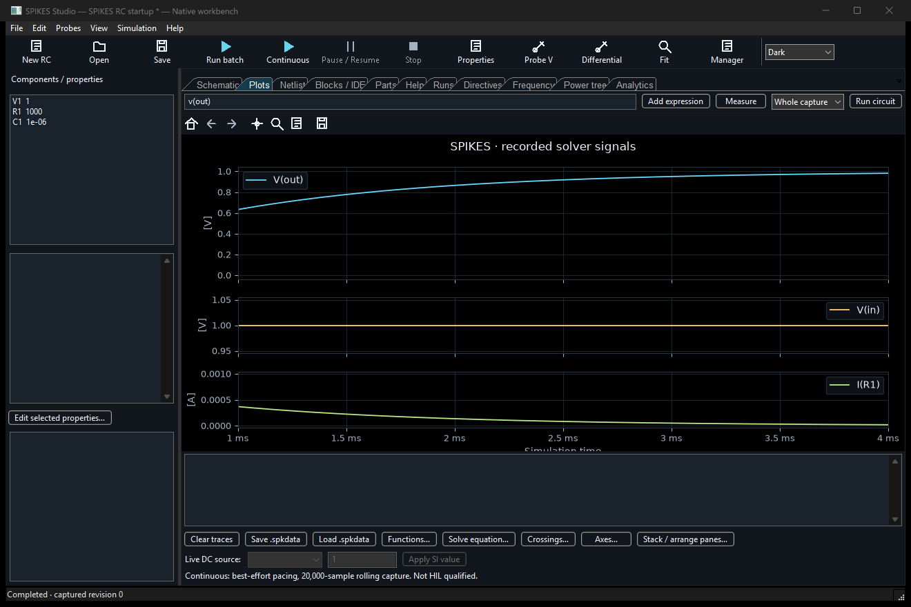

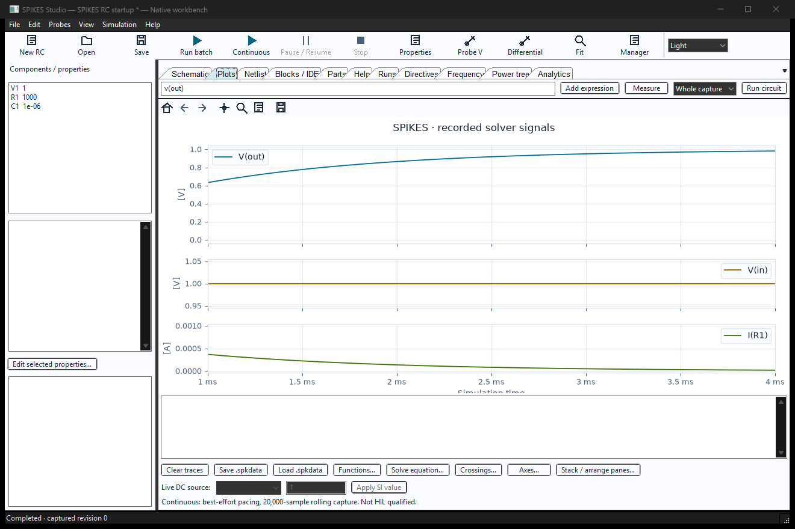

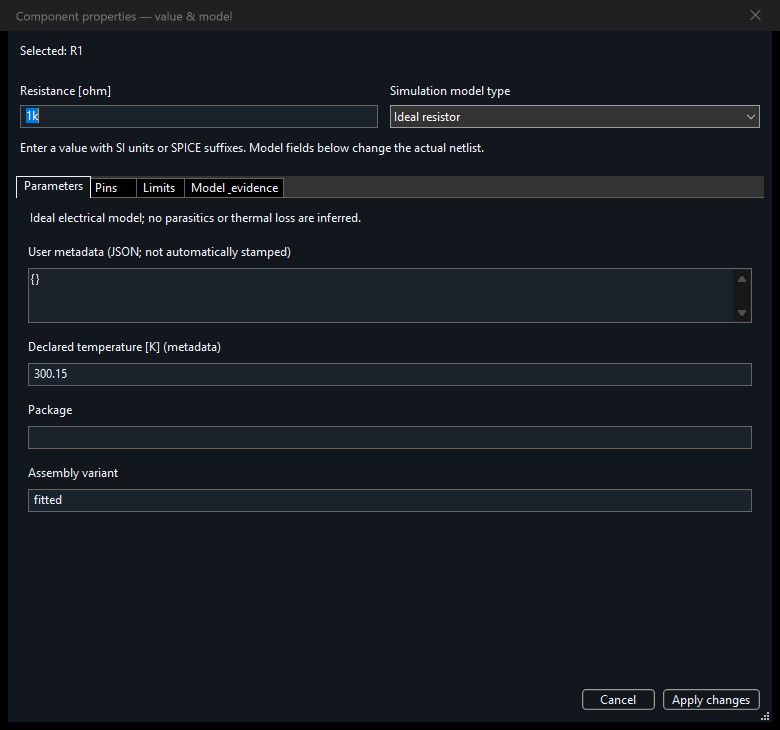

## Power-tree planning and real subcircuit stages

Open **Power tree** (`Ctrl+Shift+P`). Add root supplies, then select a supply or
converter and add downstream converters/loads. Select blocks on the diagram or
with the stage selector. Edit nominal voltage, load typical/maximum current,
fixed efficiency, input quiescent current and output current limit. Fields not
used by that stage kind are disabled. Reparent with the upstream selector; cycles
and children of loads are rejected. Delete children or reparent them before
deleting their parent. Wheel zoom, middle-button pan and **Fit tree** manage the
diagram. Typical/maximum budgets propagate downstream power demand upstream and
report conversion loss and current-limit warnings. These are **declared planning
assumptions**, not voltages or efficiencies measured by the solver. Maximum
demand changes the budget report, not the generated SPICE load values.

Any stage may attach a real, self-contained `.SUBCKT` file. The project embeds
the source snapshot, original path, SHA-256 and ordered port bindings. Known
IN/INPUT/VIN, OUT/OUTPUT/VOUT and GND/GROUND/0 names receive suggested bindings;
unknown pins remain blank and must be assigned. **Review every binding before
Apply**: `{in}` is the upstream rail, `{out}` the stage's output rail, `{gnd}`
global node 0. Explicit additional net names are supported. No file watcher
silently reloads a changed vendor file—reattach to replace the snapshot.

**Compile to circuit** validates the tree, presents a replacement confirmation,
and produces actual X instances with the attached subcircuit definitions. The
change is undoable and retains the tree. An unmodeled supply becomes an ideal DC
voltage source; an unmodeled load becomes an ideal **typical-current** load.
Converters without models cannot compile: an efficiency percentage is not a
switching model. Compilation starts with `.op`; set an appropriate `.tran` and
model drive signals explicitly for switching studies, then run the existing
native solver. The attached model's behavior, not the budget's nominal output
voltage, determines simulated results. The included `series-loss.cir` is a
verified two-ohm interconnect example, **not a converter model**.

This first implementation supports up to 256 stages and one self-contained
subcircuit definition per attachment. External includes, control scripts and
unrelated top-level statements are rejected; different files cannot silently
reuse a conflicting subcircuit name. Only the owned parser/solver's supported
devices execute. Model synthesis, converter sizing/compensation, efficiency
surfaces, simulation-to-budget back-annotation, sequencing and automatic
electrothermal qualification are not implemented here. It is an initial
power-tree/model-composition workflow, not full feature parity with
[PTree](https://github.com/smariel/PTree).

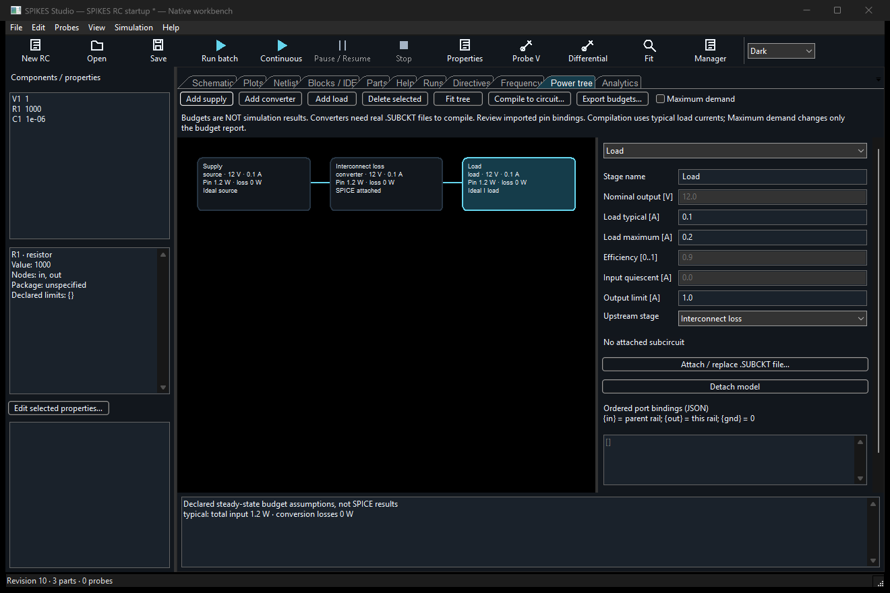

## Integrated analytics and user extensions

Open **Analytics** (`Ctrl+Shift+A`) after a transient run or loading `.spkdata`.
Statistics include time-weighted mean/RMS/standard deviation, extrema, ripple,
integral, finite-difference slew and sampling intervals, with source provenance.
The amplitude spectrum and PSD use a Hann window with coherent-gain/energy
normalization respectively. They accept 8–262144 real samples. Nonuniform data
requires the explicit linear-resampling checkbox; the report marks resampling,
which can alter high-frequency content. No silent detrending or automatic
anti-aliasing is claimed. Plots use the active theme and standard plot toolbar.

**Export extension template** creates an editable `.spkanalytics` JSON file.
Extensions use `spikes/analytics-extension/v1`, with an ID/name, scalar
measurement expressions, and plotted trace expressions. `x` denotes the selected
signal. For example, `pp(x)` measures ripple and `x-mean(x)` plots the AC
component. **Load analytics extension** only registers its recipes in the
project; **Run selected extension** explicitly evaluates them on recorded data.
Up to 32 extensions can be stored in a project, with up to 32 measurements and
32 traces each, subject to the existing bounded expression interpreter. Remove
an extension before replacing its ID. Exported reports retain numeric values
and units; the example `ripple-analytics.json` is included in the library.

This is integrated **Python/NumPy analytics and declarative expression
extension support**, not a C++ analytics kernel or an arbitrary executable plugin
host. Python/C/C++/HDL entrypoints are not accepted or loaded by this interface.
The repository's separate process-extension SDK is not yet wired into Studio's
analytics tab; hostile-code sandboxing and general UI-contribution plugins remain
separate work. Loading a model or extension never executes arbitrary host code.

## Native run controls

The toolbar in the native workbench is executable. The old dark ribbon preview
shown in conversation is not connected to a solver and must not be used as the
application. Start `spikes-studio.cmd` in the repository.

- **Run batch / F5** validates and applies the current circuit text, then runs
  the unchanged C++ batch solver in a separate cancellable process. **Stop /
  Shift+F5** terminates that process. Pause is disabled for batch execution.
- **Continuous / Ctrl+F5** creates persistent C++ transient state and follows
  `.tran` TSTEP until Stop (TSTOP does not end continuous mode). **F6** pauses
  at a native step boundary and resumes the same state. This is best-effort
  software pacing, not a hard-real-time/HIL guarantee. A difficult native step
  can delay pause/stop acknowledgement.
- The plot's **Live DC source** control queues an independent constant source
  value in SI units for the next step. Changes made while paused apply on resume.
  Recorded events have simulation timestamps; the saved circuit is not changed.
- Continuous mode keeps the latest **20,000 accepted samples**, with explicit
  dropped/total counts. Old history is overwritten, not written to an unlimited
  file. Exporting `.spkdata` saves the retained window, not earlier history.
- The full-history batch limit remains **1,000,000 output points**. Over-limit
  requests produce a non-blocking error bar; they do not allocate the history or
  silently coarsen the timestep. Those sources remain editable and can be run in
  bounded continuous mode. Batch streaming beyond this limit remains future work.
- Source edits survive refreshes; Run, Save and property editing apply pending
  text after validation. Reconciliation retains IDs, layout, probes and metadata
  for matching component references and kinds. Invalid edits remain in the editor.
- Drag components on a 10-unit grid; one drag is one undoable transaction. Save
  clears the dirty state. Open/New/Close ask whether to save unsaved work.
- `V(...)`, `I(...)`, `P(...)` and lowercase forms work in graph expressions.
  Runs restore saved probes/expressions. Cursor placement retains the current
  plot zoom. Display decimation preserves bin extrema; measurements use all
  retained samples, not the reduced display vertices.

The 20 real GUI event-handler checks and native control traces are recorded in
`media/reliability/evidence.json`. These complement numerical tests; they are
not evidence that every requested editor, device or external format is complete.

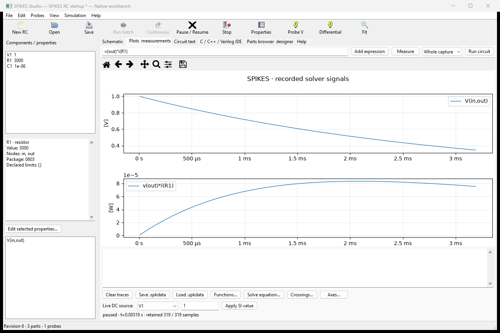

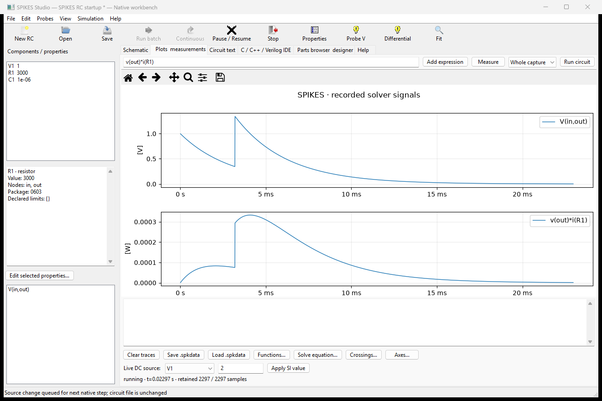

## Startup performance evidence

The same nine-case, three-repetition cold-process benchmark was run before and
after making optional public-API and CLI imports lazy. SPIKES' median of per-case
median elapsed times changed from **728.76 ms to 203.74 ms**. The after-run values
were **53.10 ms for ngspice** and **530.14 ms for LTspice**. All three passed the
nine shared-subset accuracy checks. Reports retain individual measurements,
executable/library identities, hashes, deck hashes and limitations.

This measures process startup, execution and result parsing together. It does
not isolate numerical-kernel performance, nor establish full solver or UI
superiority. The fixtures include idealized converter/RF/motor electrical
surrogates, not production semiconductor or multiphysics qualification. PSIM,
PLECS and QucsStudio were not measured. See
`media/reliability/performance-before.json` and `performance-after.json`.

## Launch

In the integration checkout:

```powershell
python scripts/launch_spikes_studio.py
```

The development launcher finds the existing native DLL and the workspace's
Matplotlib dependencies. In a generated standalone source package:

```powershell
python -m pip install ".[studio]"
spikes-studio --library path/to/spikes_c_api.dll
```

The default circuit is a 1 kΩ / 1 µF RC network driven by 1 V, initialized with
UIC and run for 5 ms with 10 µs output steps. Press F5. The documented run produced
501 samples with a maximum error of 49.18 µV against 1 − exp(−t/RC). The actual
result, source hash and screenshots are in `media/evidence.json` and neighboring
files. These are local validation results, not cross-engine performance claims.


## Plot expressions and units

Enter an expression in Plots & measurements, then choose Add expression. Scalars
can be plotted as constant traces. Traces of different dimensions occupy separate
panels with linked time axes. No unit conversion or resampling is inferred.

| Purpose | Expression |
|---|---|
| Node voltage | `v(out)` |
| Differential voltage | `v(in,out)` |
| Component current | `i(R1)` |
| Recorded component power | `p(R1)` |
| Derived resistor power | `v(in,out)*i(R1)` |
| Energy dissipated | `integral(v(in,out)*i(R1))` |
| Slew rate | `derivative(v(out))` |
| Mean voltage | `mean(v(out))` |
| RMS current | `rms(i(R1))` |
| Ripple | `pp(v(out))` |
| Voltage magnitude in dBV | `20*log10(abs(v(out)/V))` |
| Trigonometric identity | `sin(v(out)/V)**2+cos(v(out)/V)**2` |
| Conditional trace | `where(v(out)>0.5*V,v(out),0*V)` |
| General recorded trace | `signal("v(out)")` |

Addition, subtraction and comparisons require equal dimensions. Multiply/divide
combine dimensions, and scalar powers transform them. Transcendental functions
require dimensionless inputs. `sin(v(out))` is rejected; use `sin(v(out)/V)` if
that normalization is intended. Trigonometric inputs are radians.

Available functions include sine/cosine/tangent and inverses, hyperbolic and
inverse hyperbolic functions, exp/expm1, log/log10/log2/log1p, erf/erfc, square
root, absolute value, real/imaginary/conjugate/phase, unwrap, degree/radian
conversion, atan2, hypot, minimum/maximum, clip and where. Constants include pi,
e and j; unit literals include V, A, s, K, Hz, ohm and W.

Integrals use trapezoidal accumulation over the recorded timestamps; derivatives
use timestamp-aware finite differences. Mean and RMS are time weighted. These
are numerical reductions, not symbolic identities. In particular, a sparse
capture cannot reconstruct a switching edge that was never recorded.

The expression evaluator interprets a restricted syntax tree. Attribute access,
imports, comprehensions and arbitrary Python calls are not expressions. Domain
errors and nonfinite results produce messages instead of silently drawing gaps.

## Measurements, cursors and equation solving

Measure evaluates min, max, peak-to-peak, mean and RMS of the expression on the
entire loaded capture, or select A/B window for reductions between the cursors.
Window endpoints use explicit linear interpolation. Click twice in the plot for
A/B cursors, delta time, delta value and slope. Further clicks add cursors C–P;
use **Cursors / relative math** to edit or delete them. A/B window reductions
use the first two cursors and the currently selected run.

Hover reports interpolated values at the pointer time. Click a legend label to
hide/show its trace. The Matplotlib toolbar provides zoom rectangles, pan,
home/back/forward view history, subplot configuration and PNG/SVG/PDF export.
Axes chooses linear, log or symlog scaling. Crossings reports threshold times
for rising/falling/either edges. Plot expression recipes are saved in `.spksch`.

Solve equation accepts an expression equal to zero and a scalar bracket:

```text
cos(x)-x; 0; 1
```

It uses bounded bisection and returns approximately 0.7390851332. A root must be
bracketed. This is a numerical scalar root finder, not a general symbolic CAS or
an arbitrary coupled nonlinear equation-system solver. The Python API also
provides interpolated rising/falling/either-edge threshold crossings.

## Probes on the schematic

P arms voltage probing: click a terminal connection circle. Shift+P arms a
differential probe: click positive, then negative. I and Shift+I arm component
current and power probes. The probe expression is saved in the document and
shown beside the anchored component. Double-click its entry in the left list to
plot it after a run. Unknown nodes or components are rejected.

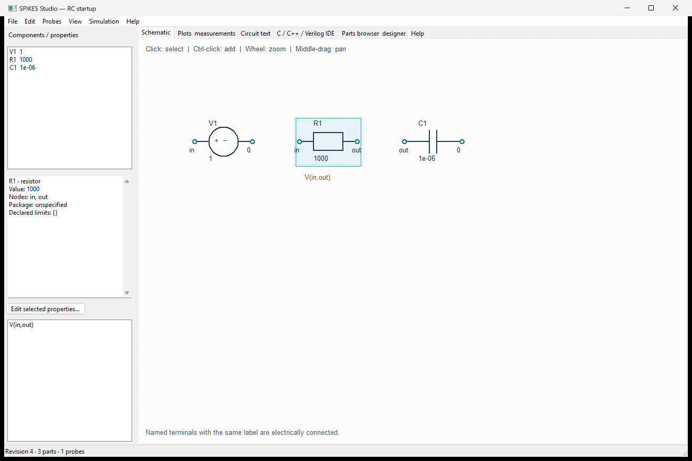

The initial canvas uses named terminals: equal labels mean an electrical
connection. It is not a complete orthogonal-wire authoring tool. Mouse wheel
zooms around the pointer; middle-drag pans. Click selects a part and Ctrl-click
adds/removes it from the selection. E or double-click opens properties.

## Complete property transactions

Select a component and press **E** (or double-click). The top of the dialog now
has a unit-labelled **Value** input and **Simulation model type** selector.
Use engineering values such as `4.7k`, `220u` or `10n`; SPICE `m` means milli,
while `Meg` means mega. Restart an already-running workbench after updating code.

The selector offers only the models currently connected to the native workbench:
ideal R/C/L with C/L initial conditions, DC/PULSE/PWL independent sources, existing
`.MODEL D` references or private custom Shockley diode cards, and the smooth
voltage-controlled switch. Selecting a type reveals its actual parameter fields.
PULSE/PWL replace the source's DC/AC definition; AC attributes are available in DC
mode. Switching a resistor to an unrelated semiconductor family is not supported.

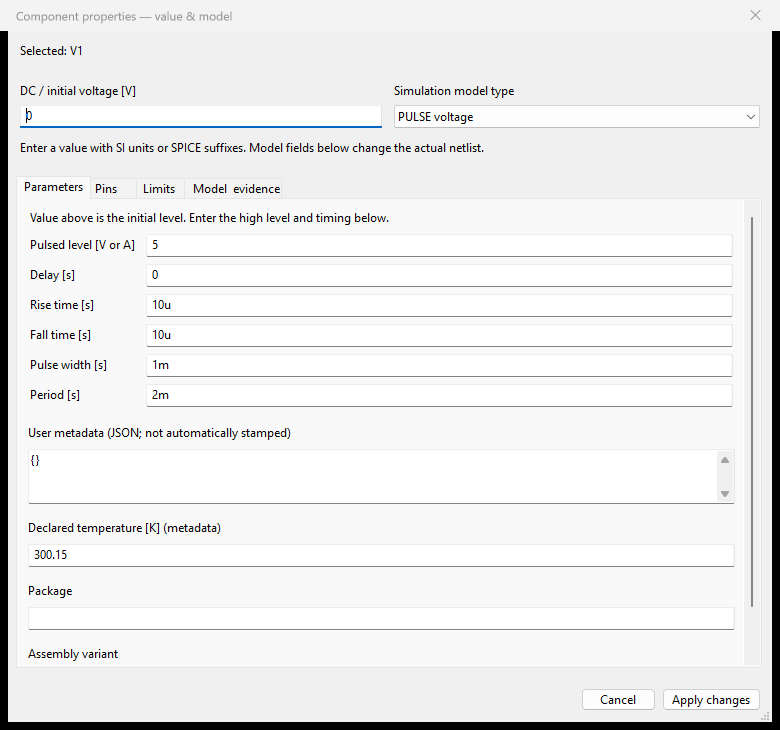
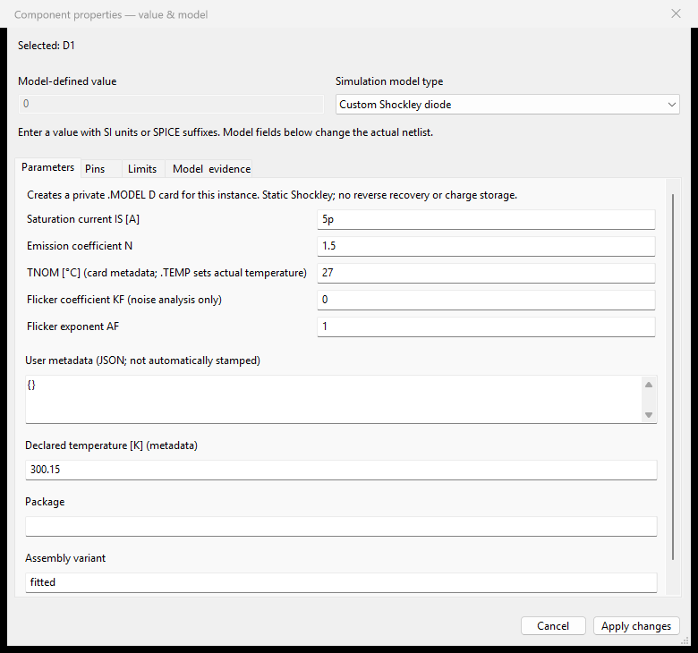

Custom diode edits create a separate model card rather than modifying another
part's shared model. Existing model references are checked. Unchanged parameter
expressions remain expressions, not frozen elaborated numbers. Unsupported
hierarchical/source-defined model edits are explicitly directed to Circuit text.
The Shockley editor does not imply charge storage or reverse-recovery support.
TNOM is stored on the card; this path uses circuit `.TEMP` for actual temperature.

The four pages have separate fields:

- Parameters: model-specific electrical fields, user metadata, declared temperature, package,
  assembly variant.
- Pins: ordered node names.
- Limits: positive finite limits expressed in SI units.
- Model & evidence: source text and datasheet/qualification notes.

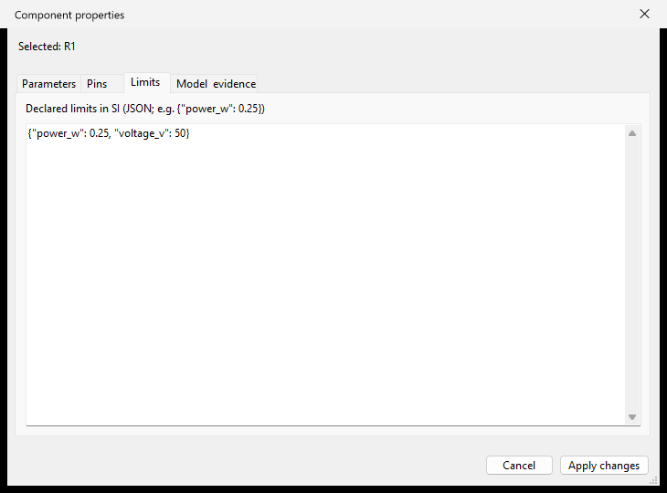
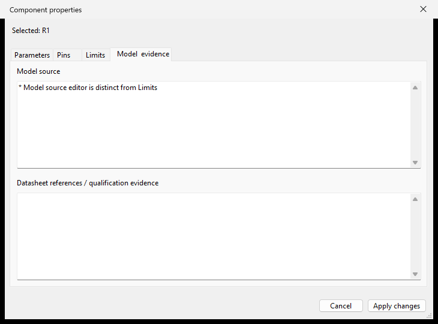

Apply validates all changes before committing one undoable transaction. Reopening
shows stored values. Ctrl+Z and Ctrl+Y operate on document history; text editors
keep their own editing shortcuts. In bulk selection, unchanged mixed fields are
left untouched. Any invalid change aborts the whole transaction.

Value, node and model-field edits update the supported top-level netlist records
and are validated before committing. General model-source notes, user metadata,
declared temperature and limits do not automatically stamp a device or generate
failure warnings. Run applies edited circuit text and captures that revision.

File > Bill of materials groups current parts by kind, value, package and variant
and exports a real CSV. It does not fabricate supplier or qualification data.

## C/C++ and Verilog IDE

The editor has line numbers, syntax highlighting, source open/save and actual
compiler logs. Check / compile invokes Icarus for Verilog and Clang or MSVC for
C/C++ syntax analysis. Compiler discovery checks PATH, the repository's installed
HDL tool directory, and installed Visual Studio for MSVC. These are user-managed
toolchains, not downloaded or bundled by opening a project.

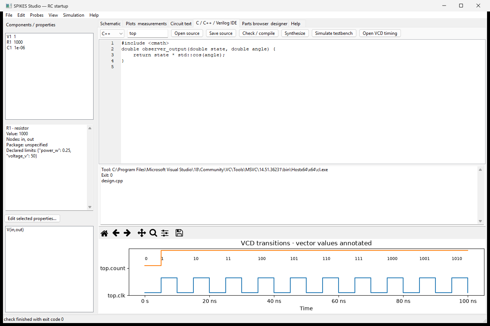

Verilog synthesis runs Yosys hierarchy checks, synthesis, statistics and JSON
netlist output. It checks the selected top module and reports the tool's actual
exit status. The built-in initial AND-gate example synthesized successfully on
this host.

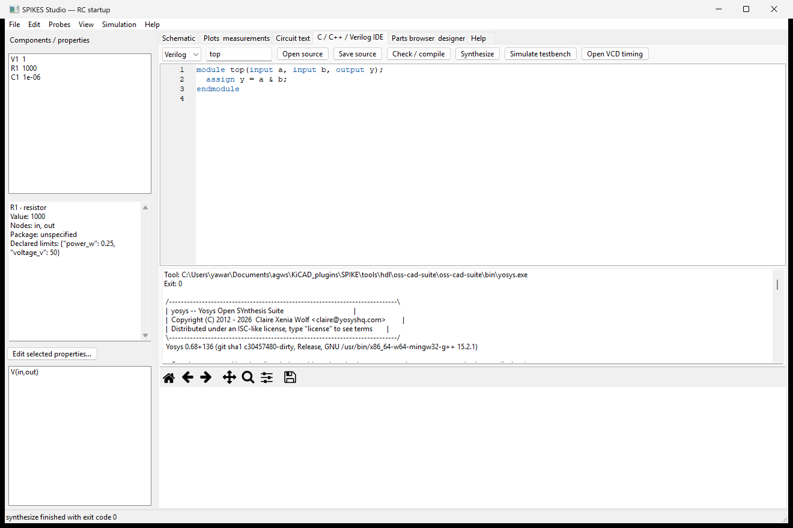

Simulate testbench compiles with Icarus, invokes VVP and plots a generated VCD.
Use a terminating testbench with `$finish` and `$dumpfile("wave.vcd")`:

```verilog
`timescale 1ns/1ps
module top;
  reg clk=0;
  reg [3:0] count=0;
  always #5 clk=~clk;
  always @(posedge clk) count<=count+1;
  initial begin
    $dumpfile("wave.vcd"); $dumpvars(0,top);
    #100; $finish;
  end
endmodule
```

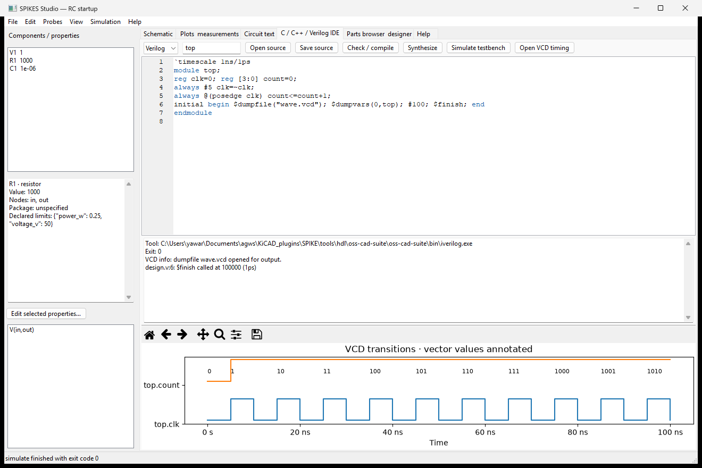

Open VCD also accepts existing simulation captures. Hierarchical scalar and vector
signals, timescale, X/Z and value transitions are retained. Nonzero vector levels
are drawn high and exact vector values are annotated. This is not an analog
value plot. Technology-specific timing closure, STA constraints, place-and-route,
language-server completion and debugging are not yet integrated. Generated/native
code must be trusted; this IDE does not claim an OS hostile-code sandbox.

## Parts browser and designer

Search filters library IDs and names. Open library reads the toolkit-neutral
symbol format. The JSON editor and live drawing share terminal positions,
terminal legs, circles/arcs/polygons and body bounds. Save symbol edits validates
the record; Save library persists the current library. New symbol creates an
editable generic two-pin block. No nominal electrical behavior is invented.

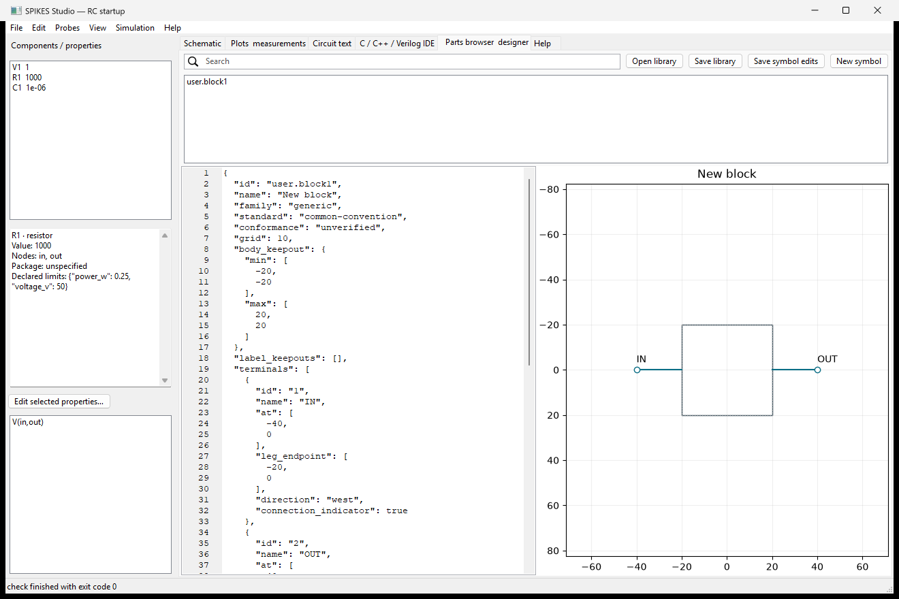

This is a geometry/source designer. Direct manipulation of pins/shapes, package
wizards and automatic executable-model binding are further work.

## Shortcuts

Edit > Keyboard shortcuts edits command-to-key JSON, detects duplicate key
combinations and loads/saves `.spkkeys`. Profiles are SPIKES, KiCad-inspired and
LTspice-inspired. They cover implemented actions, not every shortcut in those
applications. Single-letter shortcuts are scoped away from text entry fields.

Default keys: Ctrl+O open, Ctrl+S save, Ctrl+I import, Ctrl+E export, Ctrl+Z/Y
undo/redo, Ctrl+V paste, E properties, P/Shift+P voltage/differential probes,
I/Shift+I current/power probes, Home fit, F5 run, A parts, Ctrl+M plots, Ctrl+K IDE,
and F1 help.

## Interchange and clipboard

File import and paste use the same detector and review dialog. A valid supported
SPICE netlist becomes an editable electrical document. A `.MODEL` statement
becomes an unreviewed part record. Unknown syntax reports an error rather than
silently dropping circuitry.

Modern KiCad s-expression drawings and LTspice ASC text can be read as component
inventories with their original text preserved. They do not
yet become electrically translated drawings. QSPICE drawing geometry is not
decoded. Export a SPICE netlist from the originating application for simulation
exchange, subject to the owned engine's supported grammar. Source export writes
the actual netlist. There is no claim of full ASC/QSCH/KiCad schematic round-trip.

KiCad format work follows its [official schematic specification](https://dev-docs.kicad.org/en/file-formats/sexpr-schematic/).
Yosys synthesis follows the [official synthesis command documentation](https://yosyshq.readthedocs.io/projects/yosys/en/v0.52/using_yosys/synthesis/synth.html).

## Project thermal setup and simulation manager

Open **Simulation → Thermal setup** (`Ctrl+Shift+T`), or use **Board / thermal
setup** in the **Simulation manager** tab (`Ctrl+J`, also on the toolbar).
Setup is saved inside the `.spksch` project and supports undo/redo:

- Board length, width, total thickness, material and orientation.
- 1–64 copper layers, each with thickness and coverage percentage.
- Open-air, ventilated or sealed enclosure, dimensions, material, wall thickness
  and vent area.
- Ambient temperature, still/natural/forced airflow, speed and direction,
  altitude, an optional known convection coefficient, and mounting/heatsink notes.

Initial values are explicitly **authoring assumptions**, not measured defaults.
These inputs do not yet calculate board or junction temperatures, heat flow or
convection. They are marked `not_coupled`. Ambient does **not** silently set the
electrical `.TEMP` directive. Invalid geometry, inconsistent airflow and nonfinite
values are rejected without changing the document.

The manager has one editable project run profile, with `.spkrun` import/export
for reusable profiles. Choose the owned C++ `native` backend or explicit
`ngspice` compatibility backend, batch or continuous execution, analysis from the
netlist or an explicit transient/operating-point override, integration method,
continuous capture size and best-effort simulation/wall-time ratio. Timestep,
stop and UIC override only apply when Transient is selected; continuous execution
ignores the finite stop time. Optional electrical `.TEMP` is a separate explicit
override. Applying a profile saves settings but does not rewrite the circuit text.
The main toolbar's Batch/Continuous commands choose that execution mode using the
saved profile; **Run profile** first applies the manager's current fields.

The ngspice selection runs a self-contained deck in the existing isolated
process adapter. It never silently substitutes for the owned solver. External
`.include`/`.lib` files and executable control directives are rejected; selected
model-tier or parasitic rewrites that cannot be honored are blocked. ngspice
continuous pause/step/control is unavailable. Completed real transient voltage
vectors can be plotted; currents, power and temperature are not inferred from
backend vectors, and unprojected vectors remain in the result for inspection.
The run record preserves the requested backend and source hash. Older profiles
retain their original native behavior when opened.
The self-closing development GUI check for this flow is
`python scripts/verify_workbench_stage_a.py --backend-only` from the integration
checkout, using the pinned Python 3.11 Studio dependencies and native library.

Run and stop operate the selected backend. Pause/resume is native continuous only.
This is not a parallel queue or hard-real-time scheduler. The last 50 run records
retain status, timing, sample count, source hash and copies of the profile and
thermal assumptions. Later project edits cannot change those recorded copies.
History is session-local metadata, not 50 retained waveforms. Export a selected
JSON report and the latest `.spkdata` capture to retain evidence; capture provenance
also contains the setup/profile and run ID. Exporting a report does not itself
save waveform samples. New project defaults are inserted on loading older files.

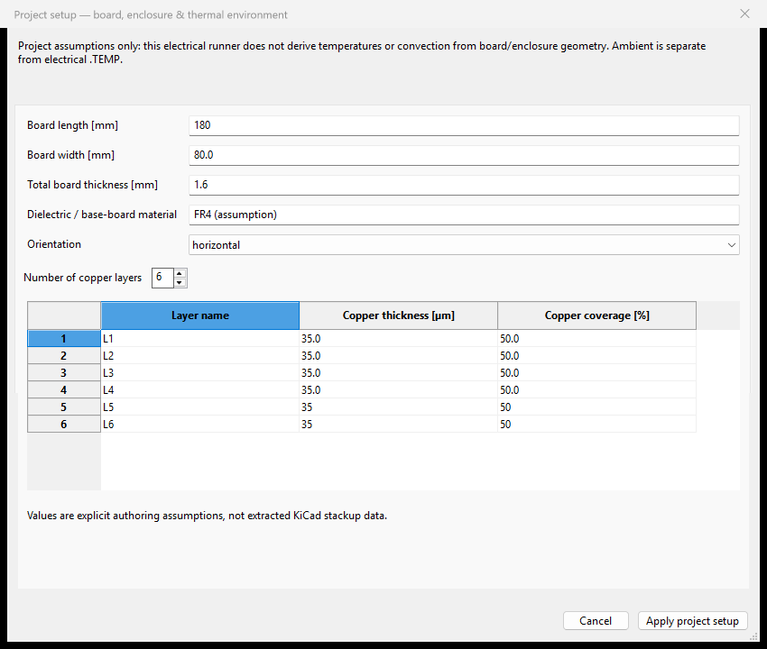

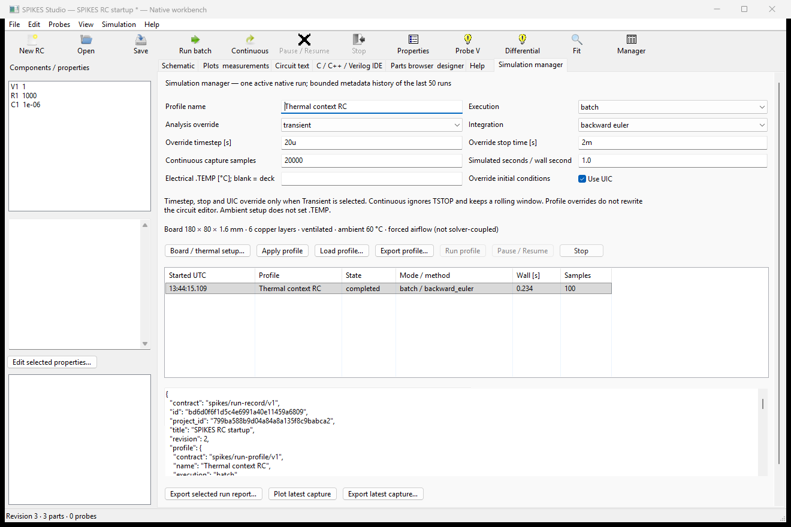

## SPICE directives on the canvas and in the manager

Press **S** (outside text fields) to add a directive, or right-click the canvas
and choose **Add SPICE directive here**. The dialog includes templates, a SPICE
text editor, an optional annotation title, an editable group, **Enabled in
netlist**, and **Show on canvas**. Paste a statement directly into its editor;
continuation lines must begin with `+`. Each annotation represents one directive.
Double-click an annotation, or select it and press **E**, to edit it. Drag to
position it; Ctrl+Z/Ctrl+Y undo/redo source and annotation changes.

Open the **SPICE directives** tab using **Ctrl+D** or View → Directives. Existing
top-level directives are discovered automatically. Search by text/title/group;
filter by group. Built-in groups are Simulation, Observations, Processing,
Models & libraries, Initial conditions and Other. You can type your own group
names. Select multiple rows to group, enable/disable, show/hide or delete them.
**Locate on canvas** reveals and centers one selected annotation. Hiding an
annotation does not disable execution. Group changes do not reorder the netlist
or turn a label such as “Processing” into a new scripting language.

Enabled edits are validated against the currently supported owned parser.
Rejected edits retain the previous source and document. If Circuit text contains
unapplied edits, apply those first; the directive editor will not overwrite the
draft. Parameter edits re-elaborate affected component values while preserving
component identity, layout and user metadata. Disabled drafts use the ordinary
SPICE comment prefix `* @spikes-off `, so exported netlists cannot execute them.
Source remains authoritative; `.spksch` also retains groups, titles, visibility
and canvas coordinates. Structural `.subckt`, `.control`, `.lib` and `.end`
blocks remain in Circuit text. Their bodies are not flattened into this editor.

Batch `.measure` supports the parser's OP/DC/transient MIN, MAX, AVG, RMS and
FIND subset. The C++ solver produces the electrical samples, then Python reduces
those samples. AVG/RMS are **sample-weighted**, not adaptive-time-weighted
integrals; FIND uses linear interpolation. Measurements appear in the plot's
measurement panel, run report and capture provenance. A failed measurement is
reported separately from a successful circuit solve. Full arbitrary SPICE
post-processing is not implied: batch `.step` and continuous `.measure`/`.step`
remain unsupported by this workbench. Run-profile overrides may supersede the
deck's analysis and `.TEMP`; inspect the simulation manager's recorded profile.

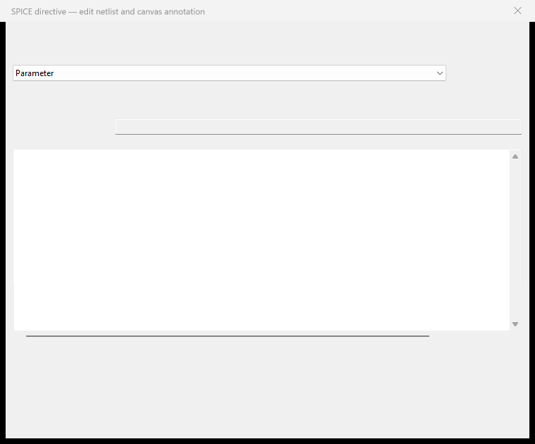

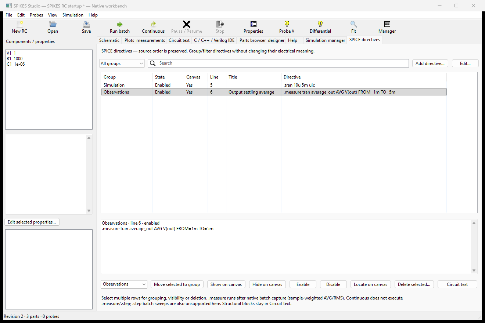

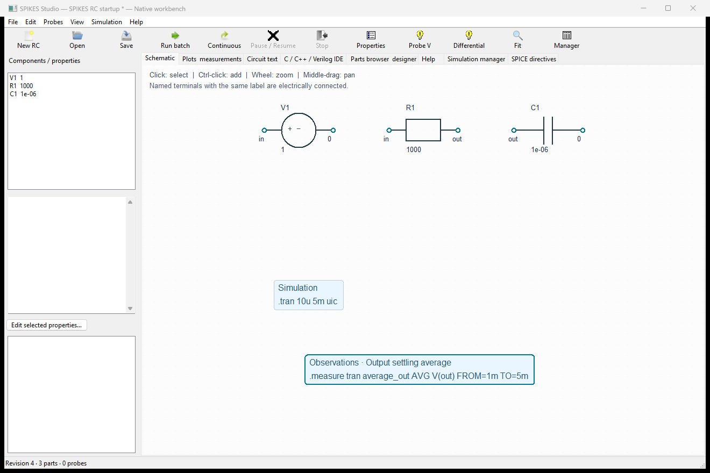

## Frequency-domain and pole-zero workspace

Open **View → Frequency** or press **Ctrl+Shift+F**. This separate tab keeps
complex phasors and frequency axes distinct from transient samples; it never
relabels time samples as a frequency response. Select an independent source,
start/stop frequencies, point count, log/linear sweep, and a voltage output for
pole-zero calculation, then press **Run AC / PZ**. `1Meg` and `1MHz` both mean
one megahertz; bare SPICE `1m` means one millihertz. The selected source has a
unit AC phasor and other independent AC sources are zero. DC source levels,
transient settings, `.measure`, and run-profile transient overrides do not define
this explicit frequency sweep. Waveform sources and nonlinear devices are
rejected, not silently linearized. `.step` is unsupported here.

Available views:

- Bode dB/phase and linear-magnitude/phase; real/imaginary versus frequency.
- Nyquist complex-plane locus, polar magnitude/phase, and Nichols gain/phase.
- Group delay from the sampled unwrapped phase derivative.
- Smith impedance and admittance grids; return loss and VSWR.
- Calculated descriptor poles and SISO transmission zeros, with a numeric table.

Use complex expressions such as `V(out)/V(in)`, `V(in)/(-I(V1))`,
`I(R1)/V(in)`, or `exp(-j*2*pi*f*1e-3*s)`. `f` has hertz units; `t` and
time-weighted integral/derivative/mean/RMS functions are rejected on frequency
data. dB gain and Nichols require dimensionless expressions. **Transfer preset**
uses the captured output and source voltage; **Input impedance preset** uses
source-terminal voltage divided by current delivered into the circuit. For a
current-source excitation, this voltage ratio is still a voltage ratio—not a
transimpedance transfer definition. The pole-zero transfer is instead from the
configured excitation to the configured output voltage.

For Smith/return-loss/VSWR, explicitly select **Impedance**, **Admittance**, or
**Reflection coefficient** input and a positive real reference impedance `Z₀`
(initially 50 Ω). Impedance/admittance expressions have unit checks. A
dimensionless expression is accepted as reflection data only when you select
that interpretation; an arbitrary voltage transfer is not automatically S11.
Grids are normalized and traces are drawn in reflection-coefficient coordinates,
following the [scikit-rf Smith chart convention](https://scikit-rf.readthedocs.io/en/latest/api/generated/skrf.plotting.plot_smith.html).
Negative-resistance results outside the unit circle remain visible. Singular
`Z = −Z₀` conversion is rejected. VSWR samples with `|Γ| ≥ 1` are undefined and
masked (an all-invalid trace is rejected); negative return loss may describe an
active load. dB magnitude has a −300 dB display floor / return-loss 300 dB ceiling.

Nyquist plots show the positive-frequency sampled locus. Optional conjugate
mirroring assumes a real LTI system; it is not a computed closed contour or an
encirclement/stability certificate. Group delay is a numerical derivative and
requires adequate frequency resolution; it is rejected at transfer zeros.
Pole-zero calculation uses the existing linear MNA descriptor pencil and a
[generalized eigenvalue solve](https://docs.scipy.org/doc/scipy/reference/generated/scipy.linalg.eigvals.html),
not a fit to the displayed trace. Infinite descriptor eigenvalues are counted
but omitted. No pole-zero cancellation reduction, nonlinear bias linearization,
MIMO zeros or production semiconductor small-signal models are implied.

The current workspace is limited to 256 MNA unknowns and 2–10,000 frequency
points, with additional backend output budgets. It uses Python/SciPy linear MNA,
**not the owned C++ AC engine**. Runs execute in a cancellable process and appear
in the simulation manager with their frequency settings and backend label.
Thermal setup is retained in provenance but remains uncoupled.

Use the Matplotlib toolbar to zoom, pan, set axes, and export PNG/SVG/PDF. Click
near a trace for its actual frequency, complex value, magnitude and phase.
Circle/square markers indicate sweep start/end. **Export expression CSV** writes
the evaluated complex values; **Pole-zero table** shows finite values in rad/s.
**Save frequency archive** writes a new lossless gzip JSON `.spkfreq` file,
contract `spikes/studio-frequency/v1`, containing complex samples, pole/zero
results, source hash, backend/settings, and the current plot recipe/reference
impedance. Loading enforces a 64 MiB expanded budget and validates frequency
ordering and finite complex arrays. It does not run circuit code. These archives
are separate from time-domain `.spkdata`; this is not a Touchstone importer or a
multiport calibration/de-embedding implementation.

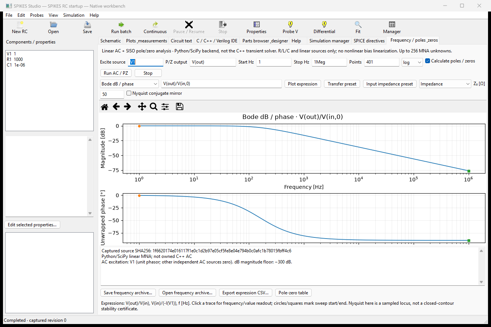

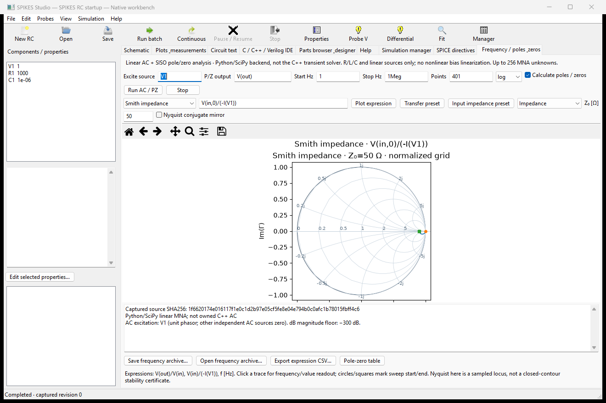

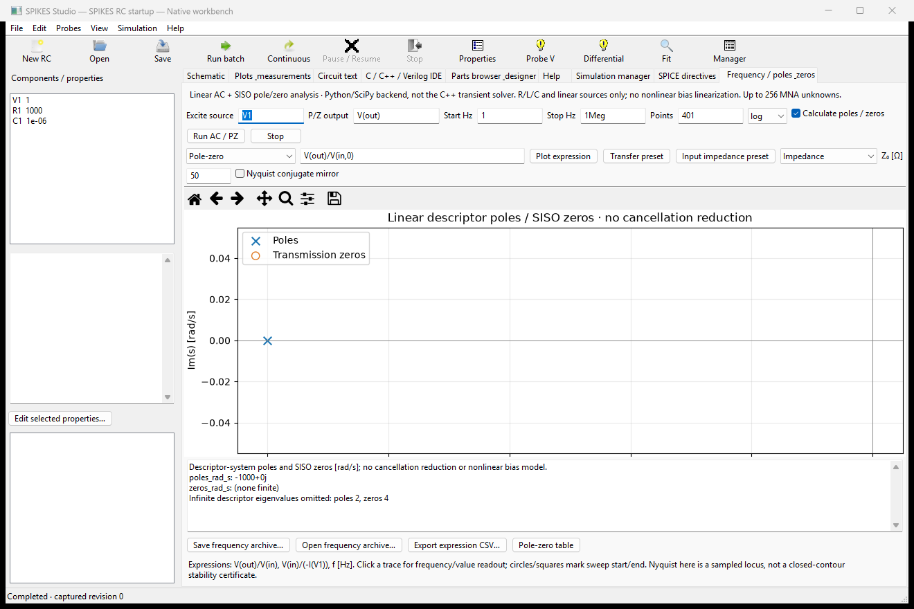

## Split views, stepped runs and schematic instruments

The new **Component catalog** and **Controller** tabs are documented in the
[component library and controller guide](COMPONENT_LIBRARY.md), including exact
preset/native counts, model limitations, code trust and measured alert semantics.

The catalog now includes a virtualized searchable table, category/family tree,
numeric filters, sorting, favorites, symbol/pin previews and 1–100-copy native
insertion with explicit node mapping. **Pin browser to side** keeps it beside the
canvas; **View → Pin properties** exposes the full editable component form as a
resizable, dockable panel. Drafts survive selection changes until applied or
explicitly reloaded. **R/C/L/D** open part placement; **Edit → Enable
part-placement shortcuts** turns those bindings off. Right-click a native preset
to assign its own key, and save/load the bindings in Keyboard shortcuts.

In **Plots**, select **Split canvas / plots** to put the actual editable schematic
above the graphs. Drag the divider to resize. **Tools / readout** expands the
measurement output, archive controls and continuous-source controls; these are
collapsed initially in split mode to leave room for graphs. Toggle split again
to return the editor to its Schematic tab. **Plot grid** and **View → Canvas grid**
toggle independently. **Stack / arrange panes** overlays same-unit traces or
assigns them to separate, height-weighted panels sharing time zoom/pan.

Batch F5 now executes each parameter variant through the owned C++ solver:

```spice
Stepped RC startup
.param resistance=1k
.step param resistance list 1k 2k 4k
V1 in 0 1
R1 in out {resistance}
C1 out 0 1u
.tran 10u 5m uic
.end
```

Linear `.step param resistance 1k 4k 1k` and nested parameter axes also work.
Declare parameters before their use. These are sequential native solves, not
parallel solves or reference-engine substitutions. Sweeps are limited to 128
variants and an estimated 2,000,000 retained scalar values across all channels,
in addition to parser limits. Continuous mode still rejects `.step`.

The run selector changes the active capture. **Overlay step runs** adds the
others; **Select overlays** filters individual runs. Legend clicks hide traces.
Measurements, expression additions and `.spkdata` export operate on the selected
run, retaining its step parameters in provenance. The latest step collection is
session-local; exporting an entire collection in one archive is not implemented.

Click a plot to add up to 16 linked cursors across its panes. Open **Cursors /
relative math** to select each cursor's run, signal expression and exact time;
add, update or delete cursors; and choose any two for comparison. Example math:
`b-a`, `b/a`, `(b-a)/dt`, `atan2(b,a)`. Units are checked, incompatible subtraction
is rejected, and each cursor is interpolated on its own run's original grid.
Changing the active run does not reassign existing cursors. Outside-capture
coordinates are rejected; expired continuous-window cursors show unavailable.
Cursor positions/visibility and split layout are session state, not saved recipes.

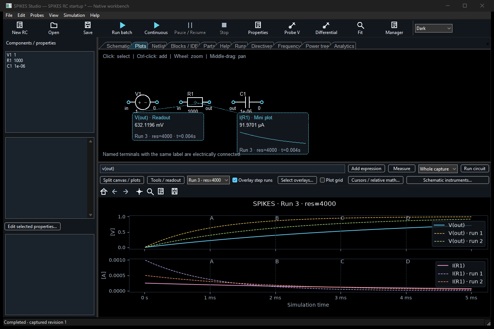

Use **Schematic instruments** from View, the plot controls, or the canvas context
menu. Attach a **Readout** or **Mini plot** to a component and enter `V(out)`,
`V(out,ref)`, `I(R1)`, `P(R1)` or a signal-math expression. Instruments are saved
in `.spksch`; drag their cards with undo/redo or edit their canvas coordinates in
the manager. Double-click a card to reopen the manager. Voltage attachment lines
terminate at the matching component terminal when identifiable; other expressions
attach to the component body. No extra electrical connection is created.

Selected-run readouts use the last sample, or the newest linked cursor's time
on the selected run. `.op` readouts use actual scalar operating-point results,
never generated waveforms. **AC frequency** uses the separately calculated
linear-frequency result at the entered Hz, with engineering, rectangular complex
or magnitude/phase notation. On canvas, `@` separates magnitude from phase in
degrees for reliable font rendering. Complex-power expressions such as
`V(out)*conj(I(R1))` preserve the excitation convention; no RMS factor is inferred.
Mini plots need real-valued expressions, e.g. `abs(V(out))` for frequency data.
They are decimated previews; use the main plot for axes and measurements.

Missing signals, detached parts, expired cursor times and OP mini-waveforms show
**Unavailable**, not zero. Source changes mark known mismatched results stale.
Temperature/failure readouts require actual solver channels and are not invented.
AC remains the bounded linear Python/SciPy backend, not native nonlinear AC.

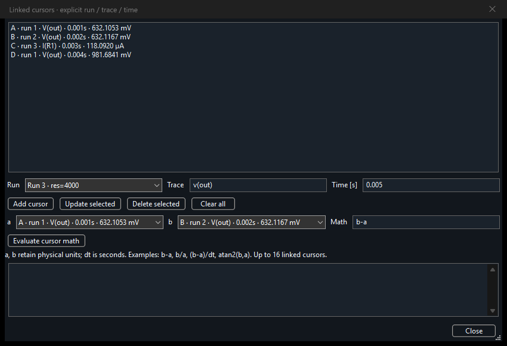

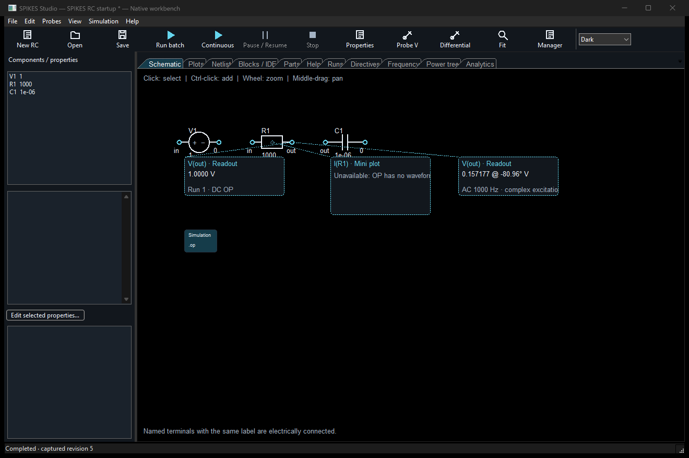

### Schematic and waveform contracts

`.spksch`: UTF-8 versioned JSON, contract `spikes/schematic/v1`, with source,
semantic components, layout, probes, expression recipes and metadata. Saves use a
same-directory temporary file followed by replacement. Future major contracts are
rejected. Opening a file never runs its circuit/model source.

`.spkdata`: ZIP container, contract `spikes/result-archive/v1`. A manifest stores
signal names/dimensions, run provenance and sample count. Each 4096-sample block
contains independent compressed NumPy arrays, including explicit timestamps.
Float/complex values round-trip exactly; pickle is forbidden. ZIP CRCs detect
damaged entries and uncompressed-size budgets apply on load. It is a completed
capture export, not a crash-recoverable live writer; the engine's existing
`SPKWF1` streaming store supplies live rings and triggered capture separately.

`.spkkeys`: versioned JSON shortcut profile. Symbol libraries use the existing
`spikes/studio-symbol-library/v1` JSON contract.

## Recorded walkthrough and evidence

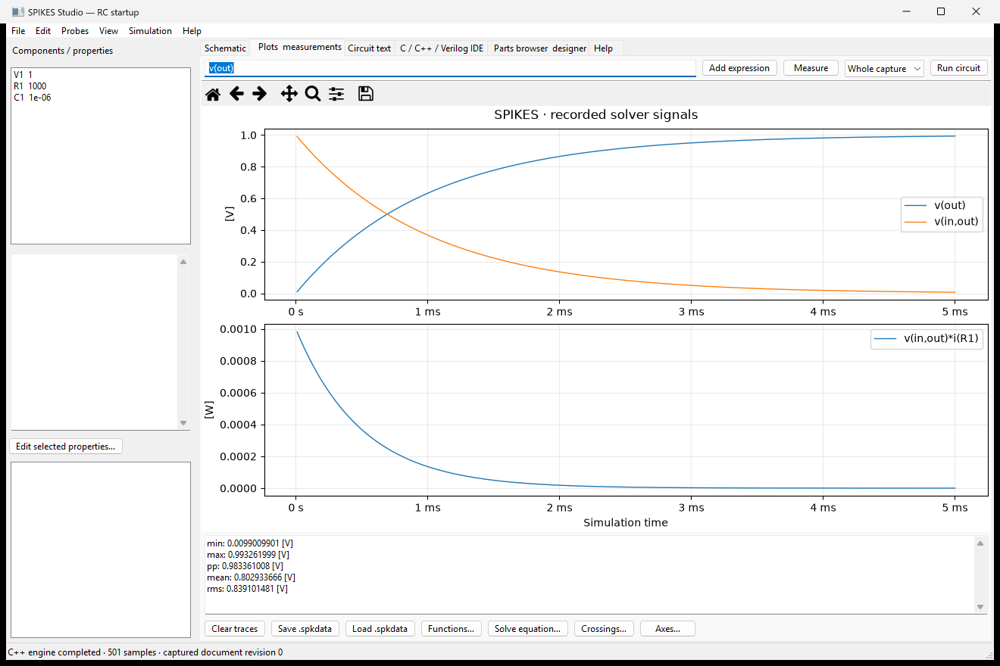

The walkthrough consists of actual window captures after running the C++ RC
solver, placing a differential probe, applying/reopening properties, synthesizing
with Yosys, and simulating a counter with Icarus/VVP. The capture helper asks only
SPIKES' own windows to paint; it does not substitute mockups or sampled formulas.
All screenshot hashes and run provenance are saved in `media/evidence.json`.
